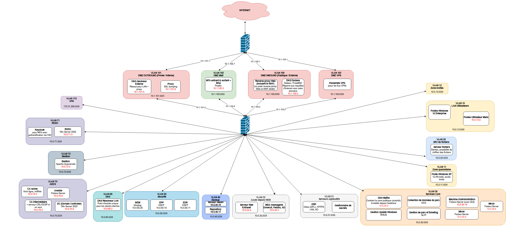

# Cercueil.fun, système d'information sécurisé (Projet P@8, EFREI Paris)

Ce dépôt présente le système d'information construit dans le cadre du projet transverse sécurité du semestre 8 (P@8) du cursus ingénieur de l'EFREI Paris. Le sujet place l'équipe dans le rôle d'une SSII appelée par une PME qui vient de perdre l'ensemble de son SI à la suite d'un grave incident de sécurité : il s'agit de concevoir puis de monter intégralement une nouvelle infrastructure sécurisée (réseau, services, administration centralisée, supervision), sous contraintes de coût (solutions libres privilégiées), de systèmes imposés (Fedora pour la messagerie et le web, Debian ou FreeBSD pour le DNS exposé, Windows Server pour l'Active Directory) et de démonstration complète en soutenance.

L'entreprise fictive retenue est Cercueil.fun, PME parisienne de 30 employés spécialisée dans la fabrication et la personnalisation artistique de cercueils d'inspiration ghanéenne, vendus aux particuliers et en B2B. Son SI couvre la production, la bureautique, la messagerie, un site public, un ERP et l'administration de l'ensemble.

L'infrastructure est entièrement virtualisée sur un hyperviseur ESXi mutualisé (163.172.53.88). Le domaine public est cercueil.fun, le domaine Active Directory cercueil.local. La soutenance a eu lieu : ce dépôt documente l'infrastructure telle qu'elle a été réalisée, une brique par dossier. Il ne constitue pas un guide d'installation.

Équipe de huit : Adèle, Gabriel, Ilyan, Maxime, Nicolas, Paul, Sacha, Tiphaine.

## Architecture réseau

L'architecture suit un modèle à double pare-feu. RTR_BORDER (pfSense) porte l'adresse publique et filtre les flux entre Internet et les DMZ ; FW_2 (OPNsense) sépare les DMZ du LAN et raccorde en étoile tous les VLAN internes via un trunk, aucun VLAN n'étant connecté directement à un autre. Les quatre DMZ sont placées entre les deux pare-feux et séparent strictement les flux entrants et sortants :

- VLAN 100, DMZ entrante : reverse proxy avec fonction WAF et DNS esclave, seuls services exposés à Internet ;
- VLAN 101, DMZ sortante : proxy Squid et résolveur DNS externe, par lesquels transite toute la sortie du SI vers Internet ;
- VLAN 102, DMZ mail : passerelle SMTP ;
- VLAN 103, DMZ VPN : publication de l'accès distant OpenVPN.

Le LAN est segmenté par usage : postes de travail Windows (VLAN 13), services core dont le DNS maître et la machine d'administration (VLAN 30), zone accessible depuis le web avec le serveur web et les boîtes mail (VLAN 32), sauvegardes (VLAN 40), sécurité avec le SIEM et l'EPP (VLAN 50), résolveur DNS interne (VLAN 60), Active Directory, PKI et Ansible (VLAN 70), bastion d'administration (VLAN 72). Le filtrage repose sur un blocage par défaut ; les flux web sont renvoyés de force vers le proxy et un alias des réseaux RFC 1918 limite les autorisations de sortie aux seules destinations Internet.

## Plan d'adressage

| Machine | IP | VLAN | Zone |
|---|---|---|---|
| ESXi (hyperviseur) | 163.172.53.88 | | Accès public Scaleway |
| RTR_BORDER (pfSense) | 10.1.101.1 | DMZ 100 à 103 | Pare-feu périmétrique |
| FW_2 (OPNsense) | 10.0.30.1 | DMZ 100 à 103, trunk LAN | Pare-feu interne |
| DNS esclave | 10.1.100.3 | 100 | DMZ entrante |
| Reverse proxy / WAF | 10.1.100.4 | 100 | DMZ entrante |
| DNS résolveur externe | 10.1.101.5 | 101 | DMZ sortante |
| Proxy | 10.1.101.6 | 101 | DMZ sortante |
| Passerelle mail | 10.1.102.3 | 102 | DMZ mail |
| Parc Windows | 10.0.13.x | 13 | LAN utilisateurs |
| DNS maître | 10.0.30.2 | 30 | LAN services core |
| Miroir Fedora | 10.0.30.5 | 30 | LAN services core |
| Machine d'administration | 10.0.30.19 | 30 | LAN services core |
| Serveur de boîtes mail | 10.0.32.3 | 32 | LAN accès web |
| Serveur web | 10.0.32.5 | 32 | LAN accès web |
| Veeam | 10.0.40.10 | 40 | LAN backup |
| Dépôt de sauvegarde | 10.0.40.11 | 40 | LAN backup |
| ESET Protect (EPP) | 10.0.50.10 | 50 | LAN sécurité |
| ESET (EDR) | 10.0.50.11 | 50 | LAN sécurité |
| SIEM Graylog | 10.0.50.20 | 50 | LAN sécurité |
| DNS résolveur interne | 10.0.60.2 | 60 | LAN DNS interne |
| CA racine | 10.0.70.3 | 70 | LAN ADDS |
| CA intermédiaire | 10.0.70.4 | 70 | LAN ADDS |
| Contrôleur de domaine | 10.0.70.5 | 70 | LAN ADDS |
| Ansible | 10.0.70.6 | 70 | LAN ADDS |
| RODC (succursale) | 10.0.71.5 | 71 | LAN RODC |
| Bastion | 10.0.72.2 | 72 | LAN bastion |

## Briques du SI

Chaque dossier documente une brique : architecture, choix techniques, configuration et limites constatées.

| Brique | Description |
|---|---|
| [Pare-feux](pare-feux/) | RTR_BORDER (pfSense 2.8.1), pare-feu périmétrique portant l'adresse publique et durci selon le benchmark CIS, et FW_2 (OPNsense 26.1.6), pare-feu interne raccordant en étoile les VLAN du LAN, encadrent les quatre DMZ avec un blocage par défaut et le renvoi forcé des flux web vers le proxy. |
| [DNS](dns/) | Paire autoritaire Bind9 (maître 10.0.30.2 non exposé, esclave 10.1.100.3 en DMZ entrante) faisant autorité sur la zone cercueil.fun signée en DNSSEC, et paire de résolveurs Unbound (interne 10.0.60.2, externe 10.1.101.5) assurant la résolution du LAN en split-horizon. |
| [Proxy](proxy/) | Passerelle web unique du SI, le proxy Squid (10.1.101.6) concentre toute la sortie HTTP/HTTPS avec authentification Kerberos SSO, filtrage par liste noire de 5,4 millions de domaines, inspection TLS par SSL bumping adossée à la PKI interne et journalisation nominative. |
| [Reverse proxy / WAF](reverse-proxy/) | Point d'entrée HTTP/HTTPS unique du SI, le reverse proxy nginx (10.1.100.4) termine le TLS Let's Encrypt pour cercueil.fun, injecte les en-têtes de sécurité (CSP, HSTS, X-Frame-Options) et protège la mire de connexion du site contre le brute force via fail2ban. |
| [Messagerie](mail/) | Passerelle Postfix en DMZ (10.1.102.3) filtrant le SMTP avec Amavis, ClamAV et SpamAssassin, et serveur de boîtes interne Postfix/Dovecot (10.0.32.3) en IMAPS, avec authentification AD en LDAPS, SSO Kerberos et protection SPF, DKIM, DMARC en politique reject. |
| [Serveur web et ERP](web/) | Site vitrine cercueil.fun (frontend Vue.js servi par Nginx, API Node.js, base MySQL) sur 10.0.32.5, publié exclusivement via le reverse proxy, authentification admin en LDAPS, SELinux enforcing, et volet ERP sur l'image Docker officielle odoo:18 validée par un scan Trivy. |
| [PKI](pki/) | Hiérarchie de certification à deux niveaux : AC racine OpenSSL hors ligne (10.0.70.3, disque chiffré) et AC intermédiaire Dogtag (10.0.70.4) assurant émission, révocation et publication des CRL, la confiance étant diffusée sur le parc par des playbooks Ansible. |
| [Active Directory](active-directory/) | Domaine cercueil.local (DC01, Windows Server 2022, 10.0.70.5) centralisant Kerberos, comptes et GPO pour les postes Windows comme pour les machines Linux via sssd, structuré en tiers T0/T1/T2, durci selon le benchmark CIS, avec forêt séparée pour le poste Windows XP legacy. |
| [VPN](vpn/) | Accès distant client-to-site OpenVPN porté par FW_2 et publié sur vpn.cercueil.fun (UDP 46742), avec double authentification par certificat client émis par la PKI Dogtag et credentials AD vérifiés en LDAPS, sous condition d'appartenance au groupe vpn_users. |
| [Bastion](bastion/) | Bastion Apache Guacamole (10.0.72.2) relayant les sessions SSH, RDP et VNC des administrateurs vers les machines cibles, ce qui confine les protocoles d'administration derrière un point de passage unique filtré par OPNsense. |
| [Postes Windows](postes-windows/) | Parc de postes du VLAN 13 joints au domaine, chiffrés par BitLocker via GPO avec séquestre des clés de récupération dans l'annuaire, le client Thunderbird validant la chaîne de messagerie de bout en bout en IMAPS et SMTPS. |
| [Serveur de fichiers](serveur-de-fichiers/) | Serveur Samba membre du domaine exposant un partage Bureautique ouvert aux utilisateurs du domaine et un partage Confidentiel réservé au groupe AD metier_confidentiel avec chiffrement SMB obligatoire, sans aucun compte local. |
| [Ansible](ansible/) | Serveur Ansible (10.0.70.6) pilotant le parc Linux via SSH et un inventaire hiérarchique : durcissement CIS généré par OpenSCAP, distribution de la chaîne de certification, configuration du miroir de paquets et préparation des hôtes pour l'agent Veeam. |
| [Miroir Fedora](miroir-fedora/) | Miroir local des dépôts Fedora (~164 Go, synchronisation nocturne reposync) servi en HTTP au parc, abandonné après un problème de flux retour vers les DMZ au profit de dépôts épinglés sur dl.fedoraproject.org accédés via le proxy en liste blanche. |
| [Sauvegardes](backup/) | Veeam Backup & Replication 13 sur Windows Server 2025 (10.0.40.10) et dépôt Debian durci à sauvegardes immuables 7 jours (10.0.40.11), agents Windows déployés par GPO, agent no-snap sur Fedora, restauration au niveau fichier et bare metal. |
| [EPP / EDR](epp/) | Serveur ESET Protect en VLAN 50 administrant les agents des postes et serveurs Windows et Debian et poussant les modules EPP et EDR depuis sa console web, les mises à jour transitant par le proxy via une liste blanche du domaine eset.com. |
| [Supervision / SIEM](supervision/) | SIEM Graylog (10.0.50.20) centralisant les journaux du parc via syslog pour les serveurs Linux, Beats (Sidecar et winlogbeat) pour les postes Windows et GELF en canal alternatif, l'enrôlement des postes étant automatisé par GPO. |
| [Durcissement](hardening/) | Durcissement de l'ensemble du parc : boucle audit OpenSCAP et remédiation Ansible sur Linux (conformité CIS portée de 69,78 % à 90,3 %), protection de GRUB par mot de passe, blocage du stockage USB, et GPO Windows en baselines imposant BitLocker, Device Guard, la signature SMB, NTLMv2 seul et LAPS. |

Le dossier [offensive/](offensive/) regroupe les travaux de la machine d'attaque montée pour le challenge inter-équipes prévu par le sujet.

## Matrice RACI

Répartition des responsabilités par brique au sein de l'équipe de huit. Les rôles sont reconstitués à partir du tableau de suivi des tâches techniques du projet (colonnes Responsable et Personnes intéressées).

Conventions retenues :

- R/A : responsable de la réalisation de la brique, rend compte de son avancement ;
- C : consulté, a contribué à la brique.

Une cellule vide indique une absence d'implication directe sur la brique.

| Activité | Adèle | Gabriel | Ilyan | Maxime | Nicolas | Paul | Sacha | Tiphaine |
|---|:---:|:---:|:---:|:---:|:---:|:---:|:---:|:---:|
| Premier pare-feu | | | C | C | C | R/A | | C |
| Second pare-feu | C | | C | | C | R/A | | C |
| DNS autoritaires (maître, esclave) | C | R/A | | C | | C | C | C |
| Résolveurs DNS (interne, externe) | C | R/A | | C | | C | C | |
| PKI (AC racine, AC intermédiaire, CRL/OCSP) | R/A | C | C | | C | | R/A | C |
| Active Directory | | C | | | C | C | R/A | C |
| Messagerie (MTA, MSA, MDA) | R/A | C | | | | | C | |
| Serveur web et ERP | R/A | | | C | C | | | |
| Gestion de parc Windows (WSUS) | | R/A | | C | | | | |
| VPN | | C | | C | C | | R/A | C |
| Bastion | | R/A | | | | C | R/A | C |
| Proxy LAN | | C | R/A | C | | | | C |
| Reverse proxy / WAF | C | | | C | R/A | | | |
| Sécurité (SIEM, EDR, EPP) | R/A | | C | | | R/A | C | C |
| Sauvegardes (Veeam) | | C | | C | | R/A | | |
| Gestion de parc Linux (Ansible) | C | C | R/A | C | | | C | |
| Miroir Fedora | | C | R/A | C | | | | C |
| Durcissement Windows | | R/A | | C | | | R/A | |
| Durcissement Linux | C | C | | R/A | | | R/A | |
| Serveur de fichiers | | | | | R/A | | | |
| Authentification DMZ, SSO, MFA (Keycloak) | | C | R/A | | | | C | |
| ERP (Odoo) | | | | | C | | | R/A |
| Machine d'attaque | R/A | | | | C | | | |
