# Active Directory

## Role dans l'infrastructure

Active Directory Domain Services (AD DS) constitue le referentiel d'identites du SI de cercueil.fun. Le domaine interne `cercueil.local` centralise l'authentification des utilisateurs et des machines (Kerberos), la gestion des comptes, groupes et unites d'organisation, ainsi que l'application des politiques de securite via GPO. Les autres briques du SI s'appuient dessus : le proxy et la messagerie authentifient les utilisateurs aupres de l'AD, le pare-feu OPNsense effectue des binds LDAP, la PKI diffuse ses autorites de certification par GPO et Veeam utilise un compte de service dedie pour les sauvegardes.

Une seconde foret, `legacy.cercueil.local`, portee par un DC dedie (DC-LEGACY), heberge volontairement un poste Windows XP dans une zone isolee. Elle materialise le scenario "legacy" du projet sans exposer la foret principale aux protocoles obsoletes (SMBv1, NTLMv1).

## VM, adressage et VLAN

| VM | Role | IP | VLAN |
|---|---|---|---|
| T0_DC01 (DC01) | Controleur de domaine `cercueil.local`, DNS interne | 10.0.70.5/24 (gw 10.0.70.1) | 70 |
| RODC01 | Controleur de domaine en lecture seule | non documentee | VLAN RODC dedie |
| DC-LEGACY | Controleur de la foret `legacy.cercueil.local` (poste XP) | VLAN legacy dedie | isole |
| Postes Windows | Clients du domaine | 10.0.13.x | 13 |

DC01 est une VM Windows Server 2022 sur ESXi 8.0 U2 (2 vCPU, 4 Go RAM, 60 Go, VBS active), raccordee au port group PG_ADDS. Le DC n'a jamais d'acces internet ; les mises a jour passent par le WSUS interne.

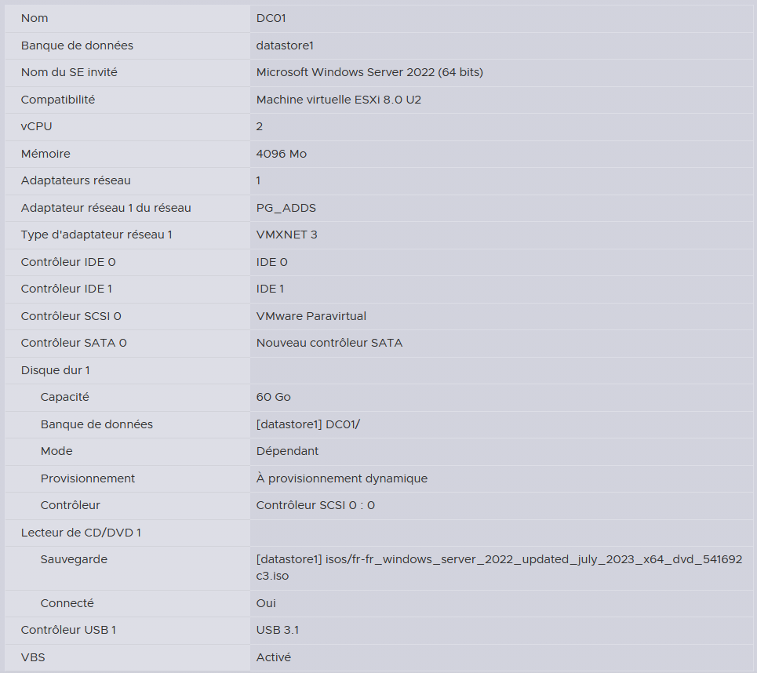
*Fiche de la VM DC01 : Windows Server 2022, 2 vCPU, 4 Go de RAM, VBS active.*

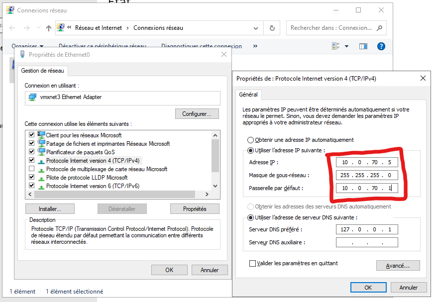
*Adressage statique du DC : 10.0.70.5/24, passerelle 10.0.70.1, DNS local (127.0.0.1).*

## Architecture et fonctionnement

### Modele en tiers

L'annuaire est organise selon le modele d'administration en tiers de l'ANSSI/Microsoft : T0 (controleurs de domaine, PKI, administration de l'identite), T1 (serveurs de production) et T2 (postes et utilisateurs). Un compte d'un tier ne se connecte pas aux machines d'un autre tier.

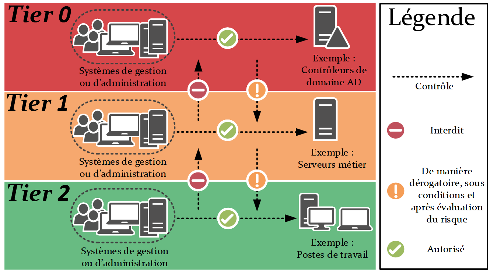
*Rappel du modele en tiers : les controles inter-tiers descendants sont derogatoires, les remontees sont interdites.*

L'arborescence d'OU reflete ce decoupage : `TieredAdministration` contient T0, T1 et T2, chacun avec Accounts, Computers, Groups et ServiceAccounts. Les comptes suivent une convention de nommage stricte : `M#####` pour les comptes utilisateurs (T2), `A#####` pour les comptes d'administration (T1), `svc_service_utilisation` pour les comptes de service. Chaque compte est place dans le groupe de son tier (`accounts_t0/t1/t2`), les comptes T0 etant en plus membres de Protected Users (blocage NTLM, pas de delegation ni de credentials en cache, TGT court).

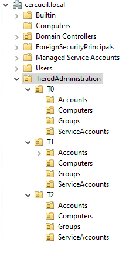
*OU TieredAdministration : T0, T1, T2 avec sous-OU Accounts, Computers, Groups et ServiceAccounts.*

### DNS et flux reseau

Le DC porte la zone DNS interne, avec delegation depuis le DNS master autoritaire et redirecteurs conditionnels ; la recursion est reservee aux resolveurs (10.0.60.2 pour les clients). Les flux AD ouverts sur les pare-feux se limitent aux ports necessaires.

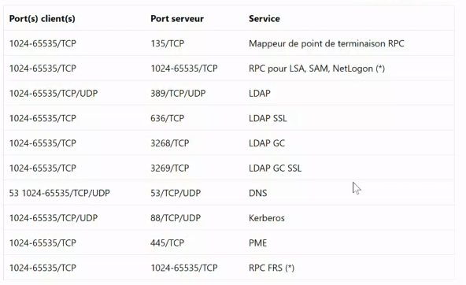
*Flux ouverts vers les DC : DNS 53, Kerberos 88, LDAP 389/636, GC 3268/3269, SMB 445, RPC 135 et ports hauts.*

### Integration des machines

Les postes Windows rejoignent le domaine de facon classique puis sont deplaces dans l'OU Computers du tier adequat. Les machines Linux sont integrees via sssd/realmd/adcli avec le compte `svc_domain_join`, qui dispose d'une delegation de controle limitee a l'OU `T1 > Computers` (creation de comptes ordinateur, reset password, ecriture validee des SPN et noms DNS, pas de Full Control).

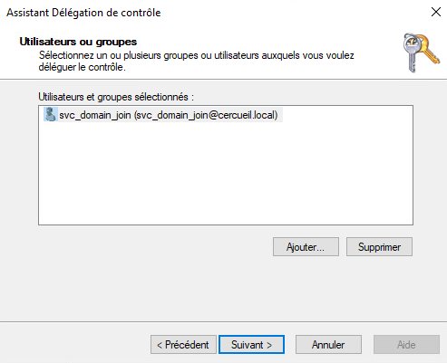
*Assistant Delegation de controle : le controle est confie au seul compte svc_domain_join@cercueil.local.*

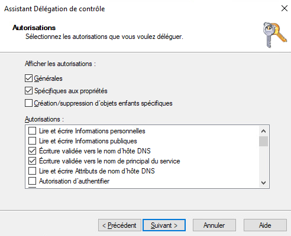
*Droits delegues a svc_domain_join : creation et maintenance des objets ordinateur dans une seule OU.*


*Sortie realm list sur un client Linux : domaine cercueil.local configure en kerberos-member via sssd.*

## Configuration notable

### GPO et durcissement

Le durcissement suit le benchmark CIS niveau 1, decline en GPO par perimetre : baseline domaine (politiques de comptes, Kerberos, signature SMB), baseline ordinateurs (BitLocker, Device Guard, chemins UNC durcis, restrictions de peripheriques), baseline serveurs et baseline controleurs de domaine (signature LDAP, politique d'audit, spouleur d'impression desactive contre PrintNightmare). Les audits sont completes par HardeningKitty, PingCastle et Purple Knight.

```powershell
# Blocage de l'ajout de machines au domaine par n'importe quel utilisateur authentifie
Set-ADDomain -Identity "DC=cercueil,DC=local" -Replace @{"ms-DS-MachineAccountQuota"="0"}
```


*Verification de ms-DS-MachineAccountQuota, positionne a 0 pour bloquer les attaques par ajout de comptes machine (noPac).*

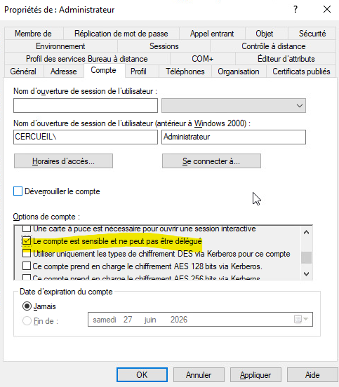
*Compte Administrateur marque sensible et non delegable ; le groupe Schema Admins est vide hors operation ponctuelle.*

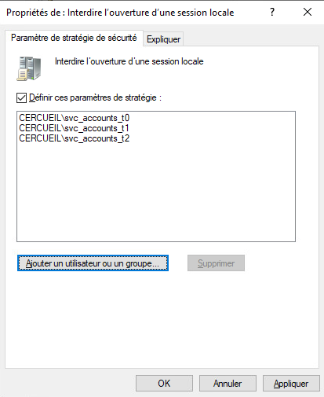
*Interdire l'ouverture d'une session locale applique aux groupes svc_accounts_t0, t1 et t2 : les comptes de service n'ouvrent pas de session interactive.*

La signature LDAP est imposee cote clients (Require signing) et cote DC (Domain controller: LDAP server signing requirements), les evenements 2886 a 2889 servant a reperer les binds non signes avant et apres enforcement. Kerberos n'accepte que AES128/AES256, NTLM est limite a NTLMv2 et les chemins UNC vers SYSVOL et NETLOGON exigent authentification mutuelle et integrite.

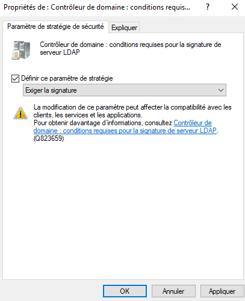
*GPO exigeant la signature LDAP cote serveur sur les controleurs de domaine.*

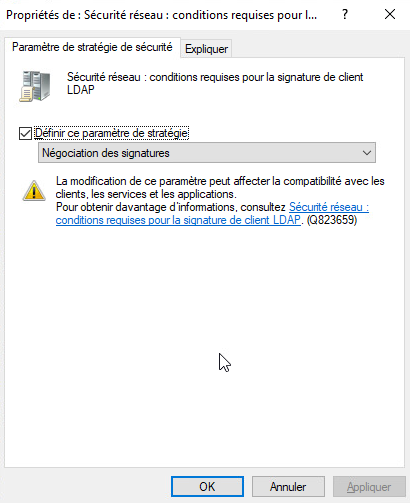
*Parametre LDAP client signing requirements en negociation des signatures, etape prealable au passage en exigence apres analyse des evenements 2886 a 2889.*

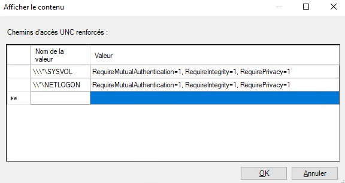
*Hardened UNC Paths sur NETLOGON et SYSVOL : RequireMutualAuthentication et RequireIntegrity actives ; RequirePrivacy ecarte pour compatibilite.*

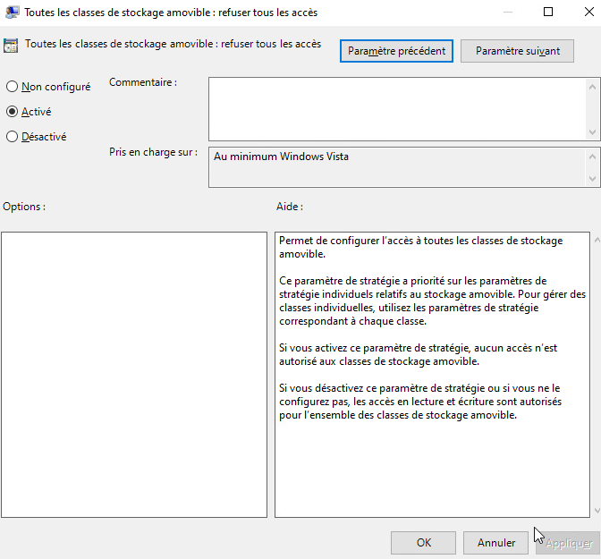
*GPO Removable Storage Access : blocage des cles USB sur les postes du domaine.*


*GPO Device Guard : VBS avec demarrage securise et protection DMA, integrite du code et Credential Guard actives avec verrouillage UEFI.*

### Politiques de mots de passe

La politique par defaut du domaine (12 caracteres minimum, complexite, verrouillage) est completee par des FGPP (Password Settings Objects) par population : PSO T1 (16 caracteres, 90 jours, verrouillage 5 tentatives / 30 min) applique au groupe `accounts_t1`, PSO T0 plus stricte, comptes de service a mots de passe longs sans expiration controlee.

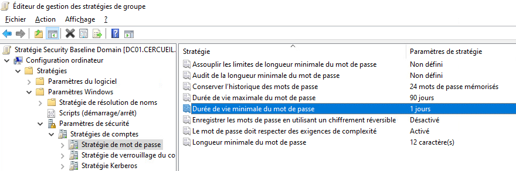
*Password Policy de la GPO domaine, socle applique a tous les utilisateurs sans FGPP.*

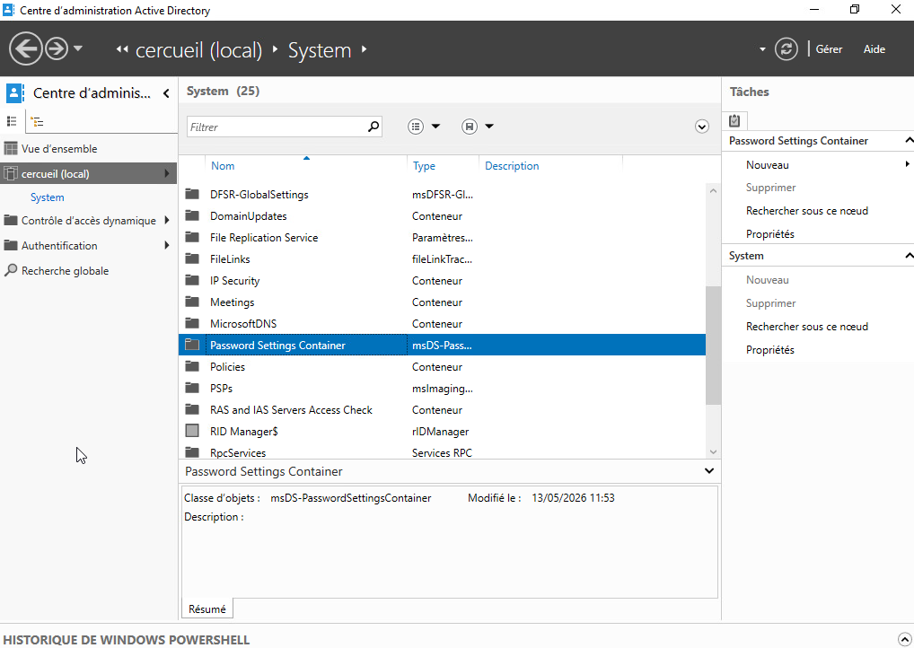
*Les PSO sont crees dans le Password Settings Container du conteneur System, via le Centre d'administration Active Directory.*

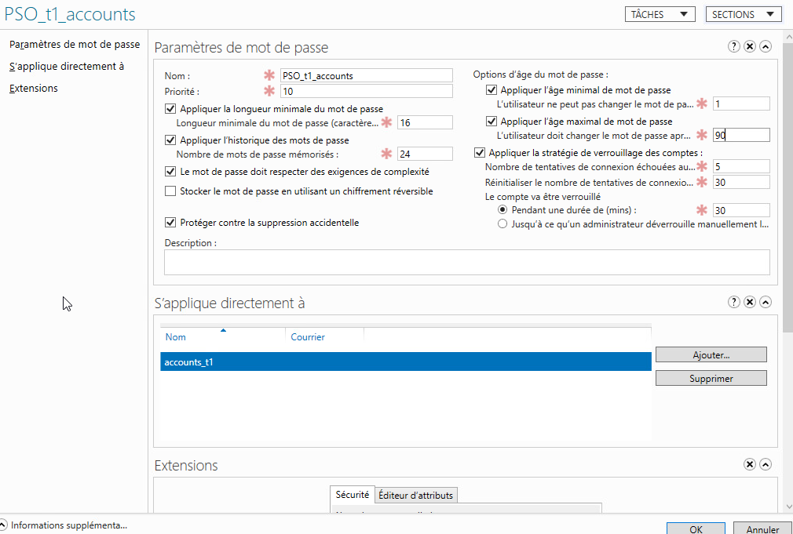
*FGPP PSO_t1_accounts : 16 caracteres, historique 24, age maximal 90 jours, verrouillage 5/30 min, appliquee a accounts_t1.*

### Audit et journalisation

Une GPO dediee configure la strategie d'audit avancee des DC (baseline Microsoft) : connexions de comptes, gestion des comptes, acces DS, changements de strategie, utilisation de privileges. Les tailles des journaux sont augmentees selon les recommandations CIS.

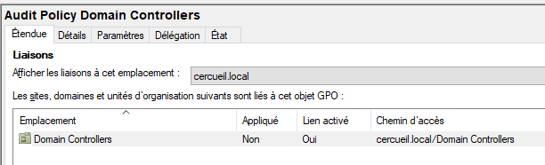
*GPO Audit Policy Domain Controllers liee a l'OU Domain Controllers.*

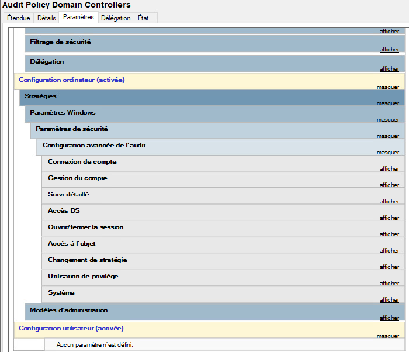
*Categories d'audit avancees configurees sur les controleurs de domaine.*

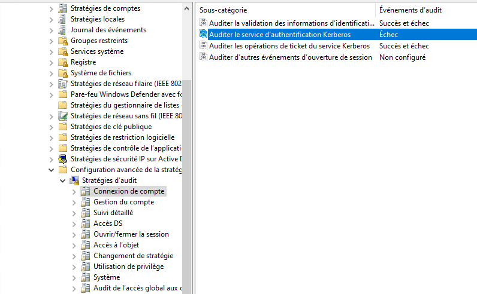
*Sous-categories Connexion de compte : validation des informations d'identification et operations de ticket Kerberos auditees en succes et echec.*

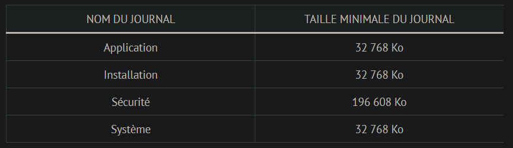
*Dimensionnement des journaux d'evenements selon le benchmark CIS.*

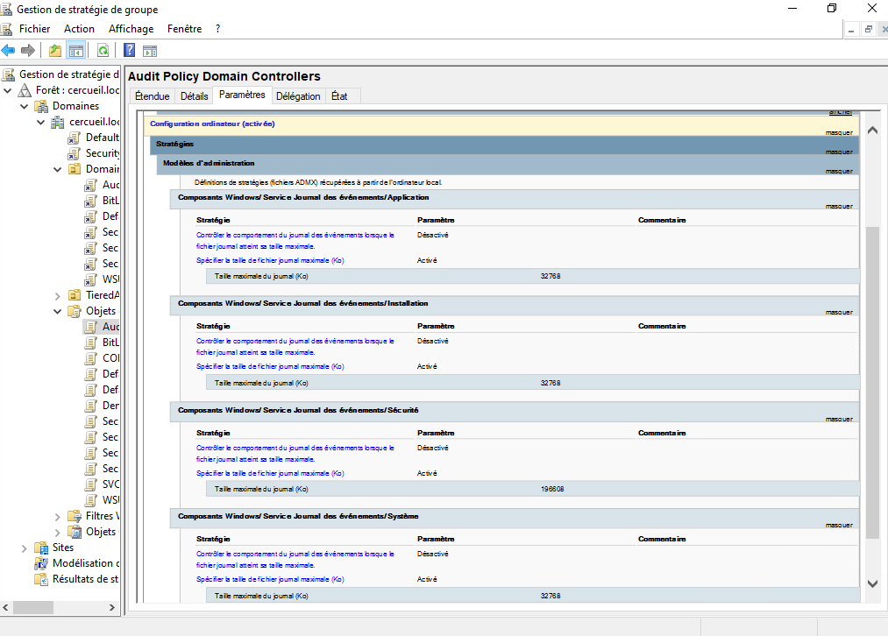
*Rapport de la GPO d'audit : journal Securite porte a 196 608 Ko, journaux Application, Installation et Systeme a 32 768 Ko.*

### BitLocker et corbeille AD

BitLocker est deploye par GPO sur les serveurs (DC01, RODC01, WSUS) et les postes, avec sequestre automatique des cles de recuperation dans l'annuaire. L'exigence de TPM n'est pas imposee, certaines machines n'en disposant pas. La corbeille Active Directory est activee pour permettre la restauration d'objets supprimes.


*Parametre BitLocker autorisant le chiffrement sans TPM compatible, conformement au choix retenu pour le parc.*


*GPO BitLocker : les cles de recuperation sont sauvegardees automatiquement dans Active Directory.*


*Activation de la corbeille dans le Centre d'administration Active Directory.*

## Interactions avec les autres briques

| Brique | Compte / mecanisme | Usage |
|---|---|---|
| PKI (Dogtag) | GPO "Ajout des CA dans le Trust Store" | Diffusion des CA internes dans le magasin des machines |
| Proxy | `svc_proxy_kerberos` | Authentification Kerberos des utilisateurs |
| Pare-feu OPNsense | `svc_opnsense_ldap` | Bind LDAP pour authentifier les utilisateurs |
| Messagerie (Dovecot) | `svc_dovecot_ldap` | Verification d'identite des boites mail |
| Sauvegarde (Veeam) | `svc_veeam_auth` (T0) | Lecture AD et acces aux machines Windows |
| VPN | groupe `vpn_users` | Autorisation d'acces VPN des comptes T2 |
| WSUS | GPO de mise a jour | Patching des DC et du parc sans acces internet |

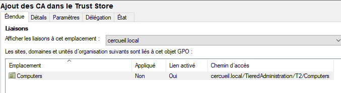
*Etendue de la GPO PKI : trust store des ordinateurs T2.*

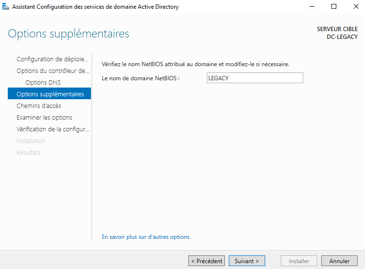
*Creation du DC-LEGACY de la foret legacy.cercueil.local, isolee de la foret principale.*

## Etat et limites

Le domaine principal est operationnel : tiering en place, comptes et machines integres (Windows et Linux), GPO de durcissement CIS niveau 1 deployees, FGPP, audit, LDAP signing, BitLocker et corbeille AD actives. Restent documentes comme non aboutis : le niveau 2 du CIS (environ 63 GPO supplementaires), les Authentication Policy Silos et les PAW par tier, la rotation planifiee du krbtgt, ainsi que les procedures de sauvegarde et de restauration de l'annuaire, dont les sections restent vides dans la documentation. L'option RequirePrivacy (chiffrement SMB des chemins UNC) et l'exigence de TPM pour BitLocker ont ete ecartees pour des raisons de compatibilite du parc.
