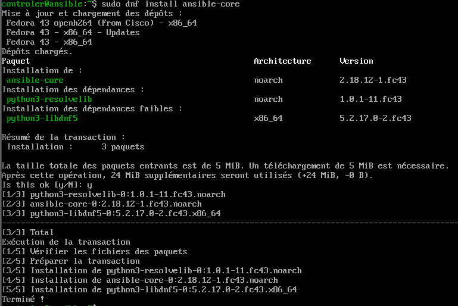
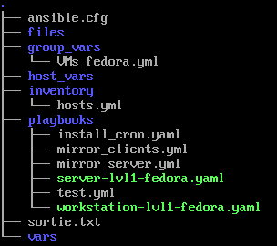
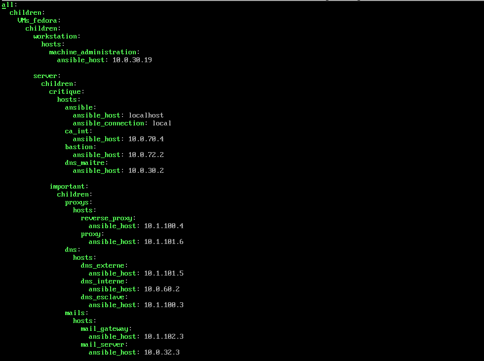
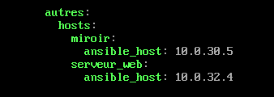
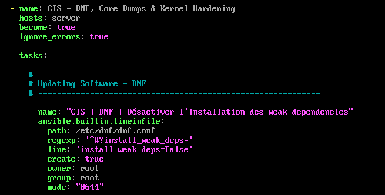

# Gestion de parc Linux avec Ansible

## Role dans l'infrastructure

Le serveur Ansible (10.0.70.6, VLAN 70) est le control node du parc Linux de l'entreprise cercueil.fun. Il centralise la configuration des machines Fedora et Debian de l'infrastructure : durcissement CIS genere par OpenSCAP, distribution de la chaine de certification interne, configuration du miroir de paquets et de ses clients, et preparation des hotes pour l'agent de sauvegarde Veeam. Toutes les actions passent par SSH avec un compte de service dedie, sans mot de passe en clair dans les playbooks.

| VM | IP | VLAN | Role |
|---|---|---|---|
| ansible | 10.0.70.6 | 70 (administration) | Control node Ansible, execution des playbooks |

Le parc gere par l'inventaire couvre notamment : machine_administration (10.0.30.19), ca_int (10.0.70.4), bastion (10.0.72.2), dns_maitre (10.0.30.2), dns_esclave (10.1.100.3), dns_interne (10.0.60.2), dns_externe (10.1.101.5), reverse_proxy (10.1.100.4), proxy (10.1.101.6), mail_gateway (10.1.102.3), mail_server (10.0.32.3), miroir (10.0.30.5) et serveur_web (10.0.32.4).

## Architecture et fonctionnement

Le control node tourne sous Fedora 43 avec ansible-core 2.18. Un utilisateur systeme `ansible` heberge l'arborescence de travail et la paire de cles Ed25519 ; la cle privee ne quitte jamais la VM, la cle publique est deposee sur chaque machine cible. Sur les cibles, un compte `ansible` dispose de sudo sans mot de passe (`ansible ALL=(ALL) NOPASSWD: ALL` dans `/etc/sudoers.d/ansible`, edite via visudo), condition necessaire a l'automatisation.



*Installation d'ansible-core 2.18 via dnf sur le control node Fedora 43.*

L'arborescence `~/ansible/` separe la configuration (`ansible.cfg`), l'inventaire (`inventory/hosts.yml`), les variables (`group_vars/`, `host_vars/`), les fichiers a distribuer (`files/`) et les playbooks (`playbooks/`).



*Arborescence reelle du control node : playbooks miroir, cron et remediations CIS server/workstation.*

L'inventaire `hosts.yml` classe d'abord les machines par OS (VMs_fedora, VMs_debian), puis par usage (workstation ou server, en correspondance avec les profils OpenSCAP), et enfin par criticite (critique, important, autres) avec un sous-groupement par service (proxys, dns, mails). Ce decoupage permet de cibler finement un playbook avec `--limit` sur un groupe ou une machine.



*Inventaire hierarchique : VMs_fedora divise en workstation et server, serveurs classes par criticite puis par service.*



*Fin de l'inventaire : groupe autres avec le miroir de paquets et le serveur web.*

Les identifiants necessaires aux playbooks sont stockes dans des fichiers chiffres avec Ansible Vault ; les playbooks referencent des noms de variables et jamais les valeurs. Le mot de passe Vault reside dans `~/.vault_pass` (permissions 400) et est reference par la configuration globale :

```ini
[defaults]
inventory = inventory/hosts.yml        ; inventaire par defaut
host_key_checking = False
remote_user = ansible                  ; compte de service sur les cibles
private_key_file = ~/.ssh/id_ed25519   ; cle Ed25519 du control node
vault_password_file = ~/.vault_pass    ; secrets chiffres via Ansible Vault
```

## Durcissement CIS via OpenSCAP

Le durcissement des machines Fedora s'appuie sur des audits OpenSCAP (guide `ssg-fedora-ds.xml`, profils CIS Benchmark niveau 1, variantes Server et Workstation). L'audit est execute sur une machine representative de chaque categorie ; le rapport identifie les regles en echec et `oscap xccdf generate fix --fix-type ansible` produit un playbook de remediation limite a ces regles. Appliquer le benchmark complet desactiverait des fonctions necessaires, d'ou ce filtrage par resultats d'audit.


*Profils du guide SCAP Fedora : les profils CIS Server et Workstation niveau 1 sont retenus.*


*Audit initial de la machine d'administration (profil CIS Workstation L1) : 123 regles en echec, score 69,78 %.*


*Section Compliance and Scoring du fichier de resultats lu en console : 295 regles evaluees, 160 conformes, 135 en echec, dont 6 de severite haute.*

Les playbooks generes (`server-lvl1-fedora.yaml`, `workstation-lvl1-fedora.yaml`) sont rapatries sur le control node et executes avec `--limit` sur le groupe correspondant. Ils portent `ignore_errors: true` afin qu'une tache en echec n'interrompe pas la remediation complete ; le recap final liste les taches passees, modifiees, ignorees et echouees.



*Extrait d'un playbook de remediation CIS : cible le groupe server, become et ignore_errors actives.*


*Execution de la remediation sur la machine d'administration : 576 taches ok, 42 changements, 0 echec bloquant.*


*Nouvel audit apres passage du playbook : 25 regles en echec restantes, score 90,3 %.*

## Playbooks en production

Les playbooks epures sont disponibles dans [config/](config/).

| Playbook | Cible | Fonction |
|---|---|---|
| [mirror-server.yml](config/mirror-server.yml) | miroir (10.0.30.5) | Installe httpd et createrepo_c, publie `/var/www/html/mirror`, timer systemd quotidien de reposync du depot updates |
| [mirror-clients.yml](config/mirror-clients.yml) | clients | Depots local-fedora et local-updates pointant sur http://10.0.30.5, desactivation des depots publics par override DNF5, timer de mise a jour quotidien a 04h00 |
| [veeam-prerequis-fedora.yml](config/veeam-prerequis-fedora.yml) | fedora_targets | Dependances dkms et kernel-devel alignees sur le noyau actif, compte de service svc_veeam, ouverture firewalld des ports 22, 10001 et 6162 restreinte a 10.0.40.10, entree /etc/hosts pour VEEAM01.cercueil.local |
| [deploy_ca_truststore_fedora.yml](config/deploy_ca_truststore_fedora.yml) | VMs_fedora | Depose la CA racine et la CA intermediaire dans `/etc/pki/ca-trust/source/anchors/` puis `update-ca-trust extract`, verification par `trust list` |
| [deploy_ca_truststore_debian.yml](config/deploy_ca_truststore_debian.yml) | VMs_debian | Meme distribution via `/usr/local/share/ca-certificates/` (extension .crt obligatoire) et `update-ca-certificates`, verification openssl de la chaine |
| server-lvl1-fedora.yaml, workstation-lvl1-fedora.yaml | server, workstation | Remediations CIS niveau 1 generees par OpenSCAP |

Le verrouillage du perimetre reseau des taches sensibles se fait au niveau du playbook, par exemple pour Veeam :

```yaml
- name: "3.2 | Ouvrir les ports Veeam depuis {{ veeam_server_ip }} uniquement"
  ansible.posix.firewalld:
    rich_rule: >-                       # regle limitee a la source 10.0.40.10
      rule family="ipv4"
      source address="{{ veeam_server_ip }}"
      port port="{{ item.port }}" protocol="{{ item.proto }}"
      accept
    permanent: true
    state: enabled
```

## Interactions avec les autres briques

- Pare-feu OPNsense : regles dediees autorisant le TCP/22 depuis 10.0.70.6 vers les VLANs des cibles (dont le VLAN USERS 10.0.13.0) ; un flux TCP/5986 (WinRM HTTPS) est deja ouvert en prevision de la gestion des postes Windows.
- PKI (Dogtag) : Ansible distribue la CA racine et la CA intermediaire de cercueil.fun dans les magasins de confiance de tout le parc, avec un mecanisme distinct pour Fedora et Debian.
- Miroir de paquets : le serveur miroir (10.0.30.5) et ses clients sont entierement configures par Ansible ; les clients ne consomment plus que le miroir interne (`proxy=_none_`, depots publics desactives).
- Sauvegarde Veeam : les prerequis de l'agent Linux sont deployes en masse, avec des flux restreints au serveur VEEAM01 (10.0.40.10).
- DNS, proxys, mails, bastion, CA : ces serveurs figurent dans l'inventaire et recoivent les remediations CIS de la categorie server.

## Etat et limites

- Le parc Linux (Fedora et Debian) est enrole et gere ; l'integration des machines Windows via WinRM etait prevue (flux ouverts sur le pare-feu) mais n'a pas ete realisee.
- La remediation CIS a ete validee sur la workstation d'administration (score de 69,78 % a 90,3 %) ; 25 regles restent en echec, certaines etant volontairement non appliquees pour ne pas casser de fonctions.
- Les playbooks de remediation utilisent `ignore_errors: true` : les echecs sont visibles dans le recap mais ne sont pas traites automatiquement.
- Le mot de passe Vault est stocke en clair dans `~/.vault_pass` sur le control node, protege uniquement par les permissions du fichier.
