# Sauvegardes : Veeam Backup & Replication et depot immuable

## Role dans l'infrastructure

La brique de sauvegarde protege les donnees du SI cercueil.fun contre la perte et la destruction, y compris en cas de compromission de type ransomware. Elle repose sur deux machines dediees du VLAN 40 : un serveur Windows executant Veeam Backup & Replication 13 Community Edition, qui orchestre les travaux de sauvegarde et de restauration, et un serveur Debian faisant office de depot durci (Linux Hardened Repository). Les sauvegardes ecrites sur ce depot sont immuables pendant 7 jours : elles ne peuvent etre ni modifiees ni supprimees pendant cette periode, meme depuis le serveur Veeam.

## Machines

| VM | Role | OS | IP | VLAN |
|----|------|----|----|------|
| VEEAM (WIN-H94F33K7R3Q) | Serveur de sauvegarde et console d'administration | Windows Server 2025 | 10.0.40.10 | 40 |
| Repo-backup (repo-backup) | Depot de sauvegarde durci, stockage des points de restauration | Debian | 10.0.40.11 | 40 |

## Architecture et fonctionnement

### Serveur Veeam

Le serveur Windows heberge l'ensemble des composants Veeam : console, services de sauvegarde (ports 9392, 9393, 9401, 9419) et base PostgreSQL locale `VeeamBackup` qui contient la configuration et l'historique des travaux. La gestion se fait exclusivement depuis la console installee sur le bureau du serveur. Au demarrage de la machine, les services Veeam mettent plusieurs minutes a devenir disponibles.

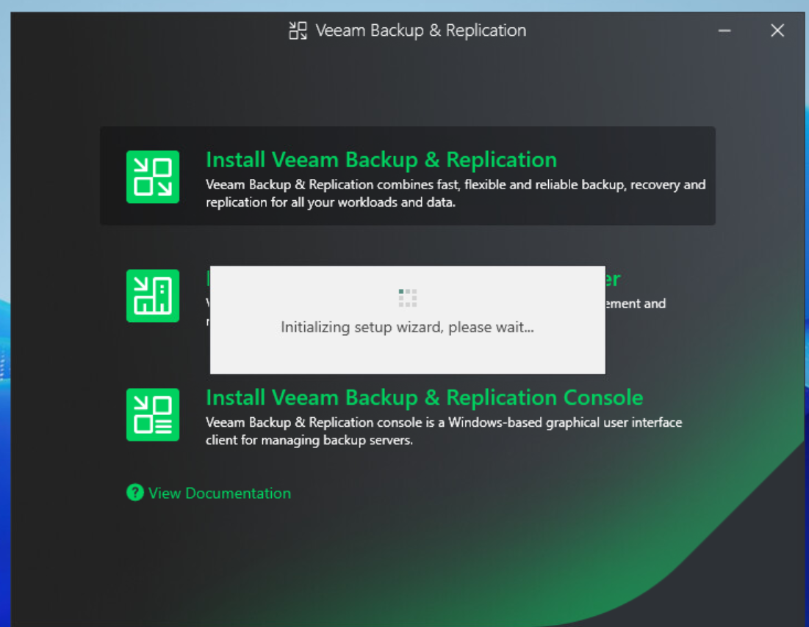
*Installateur de Veeam Backup & Replication Community Edition sur le serveur Windows.*

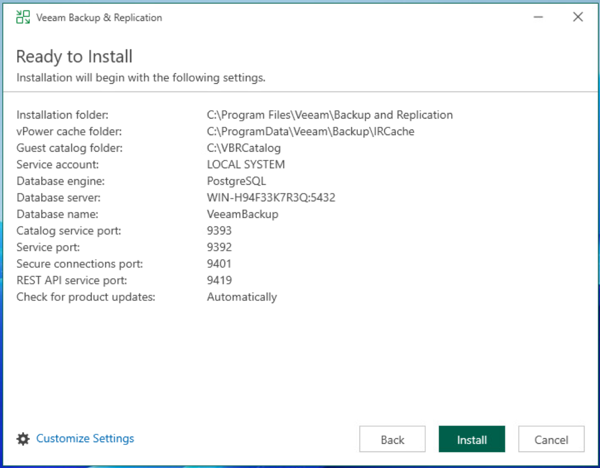
*Parametres retenus : base PostgreSQL locale, compte de service LOCAL SYSTEM, ports des services Veeam.*

### Depot de sauvegarde durci

Le serveur Debian est volontairement separe du serveur Veeam : la compromission de ce dernier ne permet pas d'alterer les sauvegardes existantes. Un disque dedie de 150 Go est formate en XFS avec reflink, prerequis du fast cloning utilise par les sauvegardes synthetiques, et monte de facon permanente sous `/mnt/veeam_repo`.

```bash
# Formatage du disque dedie (sdb, 150 Go) en XFS avec reflink,
# pour beneficier du fast cloning des sauvegardes synthetiques
mkfs.xfs -b size=4096 -m reflink=1 /dev/sdb
```

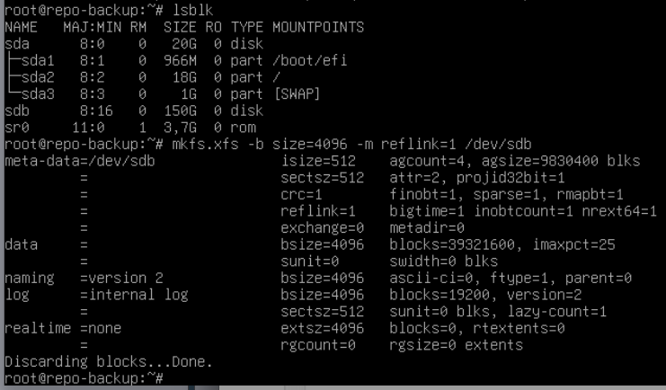
*Preparation du volume de 150 Go du depot : formatage XFS avec reflink sur repo-backup.*

Le serveur est declare dans Veeam en SSH avec des identifiants a usage unique (compte local `veeamuser`) : Veeam deploie son composant Data Mover (port 6162) puis ne conserve aucun identifiant permanent, ce qui est la caracteristique du mode durci. Le depot `Repo_immuable` est ensuite cree en type Direct Attached Storage, Linux (Hardened Repository), avec une immutabilite de 7 jours, le fast cloning XFS actif et une limite de 2 taches paralleles.

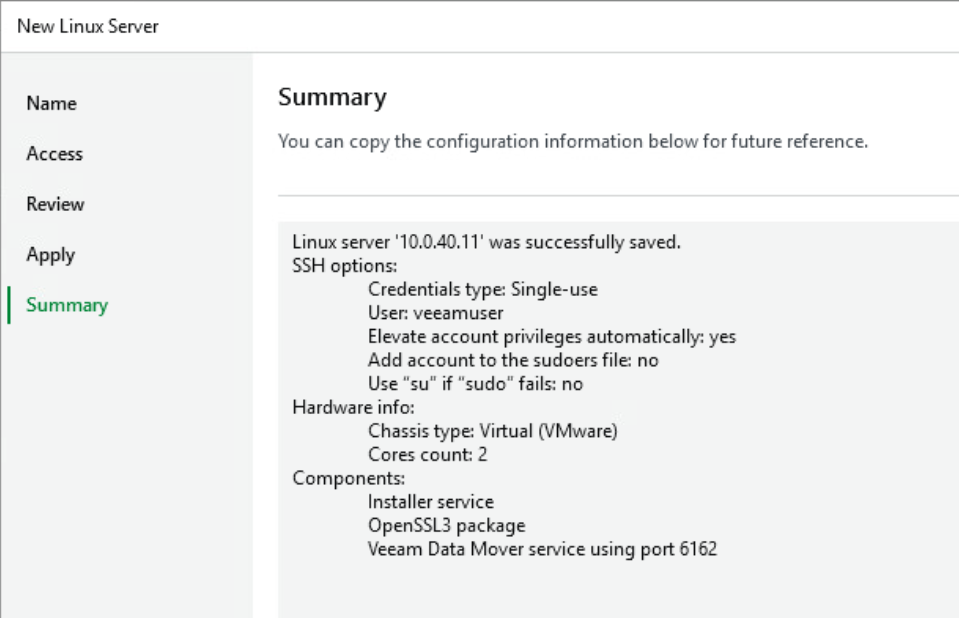
*Declaration de repo-backup (10.0.40.11) dans Veeam avec identifiants SSH a usage unique.*

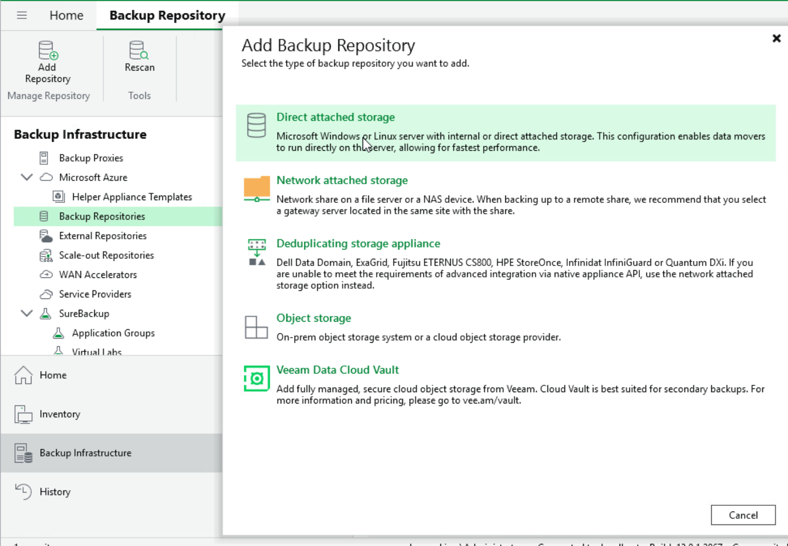
*Creation du depot dans Backup Infrastructure : type Direct Attached Storage.*

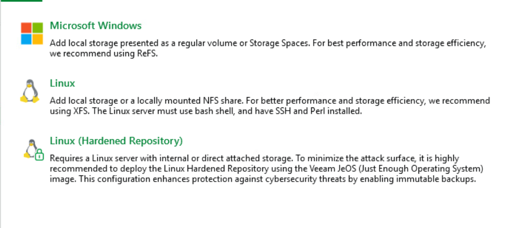
*Selection du mode Linux (Hardened Repository), qui active les sauvegardes immuables.*

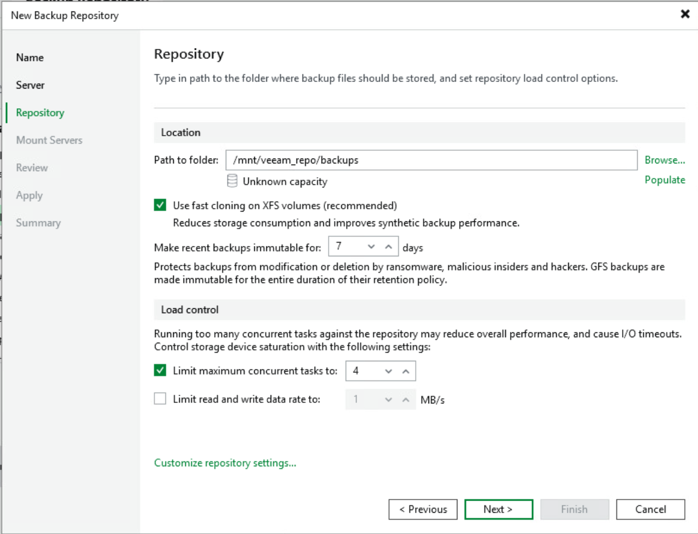
*Parametres du depot : chemin /mnt/veeam_repo/backups, fast cloning XFS, immutabilite des sauvegardes recentes.*

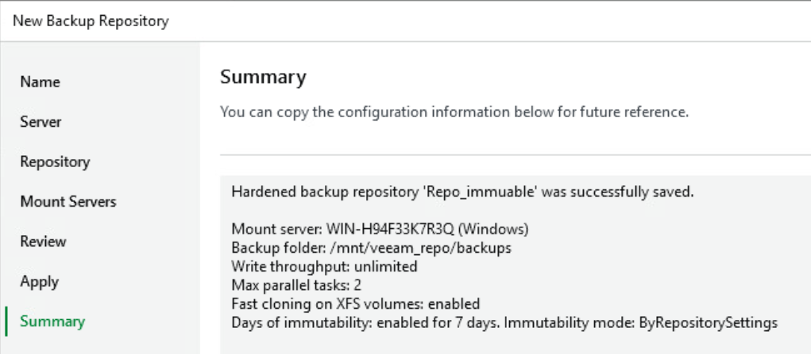
*Recapitulatif du depot Repo_immuable : immutabilite de 7 jours en mode ByRepositorySettings.*

### Perimetre sauvegarde

Les machines protegees sont organisees en groupes de protection dans l'inventaire Veeam : controleurs de domaine, machines Fedora, serveurs Linux et postes de travail. Les postes Windows recoivent l'agent Veeam deploye depuis le serveur, comme WORKSTATION02.cercueil.local (10.0.13.16).

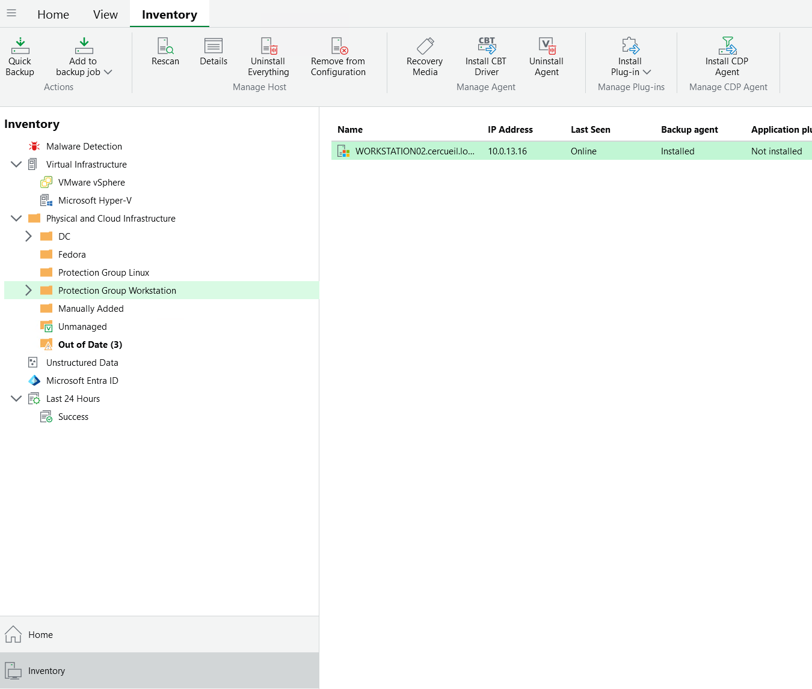
*Inventaire Veeam : groupes de protection (DC, Fedora, Linux, postes de travail) et poste WORKSTATION02 enrole.*

## Integration Active Directory et postes clients

Le serveur VEEAM est membre du domaine CERCUEIL. Un compte de service dedie `svc_veeam_auth` sert au deploiement et a la gestion des agents sur les postes. La GPO `SVC_VEEAM_USER` restreint ce compte : interdiction d'ouverture de session locale et de session Terminal Server, et ajout controle au groupe Administrateurs local des postes via les groupes restreints.

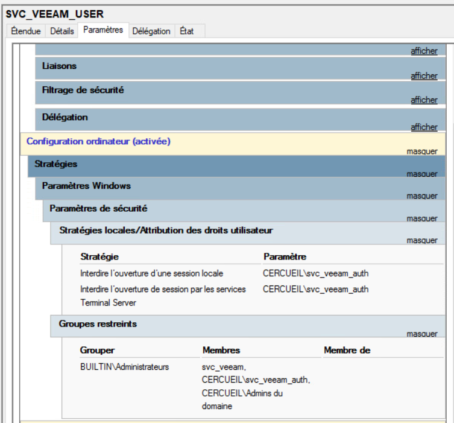
*GPO SVC_VEEAM_USER : le compte de service est admin local des postes mais ne peut pas ouvrir de session interactive.*

Une seconde GPO configure le pare-feu Windows des postes clients : les regles entrantes necessaires a Veeam (WMI/DCOM, WinRM, partage SMB, echo ICMP) ne sont autorisees que depuis l'adresse du serveur de sauvegarde, 10.0.40.10.

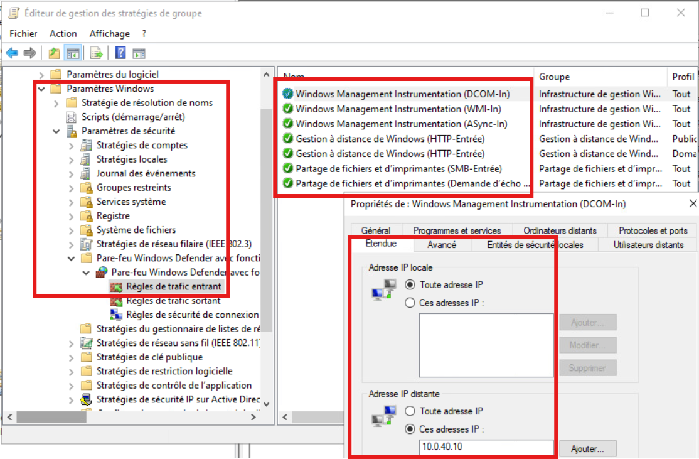
*GPO pare-feu des postes : flux entrants WMI, WinRM et SMB limites a l'adresse distante 10.0.40.10.*

## Cas particulier des machines Fedora

Veeam cible les distributions d'entreprise (type RHEL) et ne prend pas en charge le noyau recent de Fedora : l'enrolement des agents depuis le serveur Veeam echoue. L'agent est donc installe directement sur la machine, en variante no-snap (sans module noyau), a partir du depot el9 de Veeam. C'est notamment le cas du serveur de messagerie (mailbox). Cette variante ne permet que la sauvegarde de fichiers, pas d'image complete de la machine. Un mode de secours documente consiste a installer manuellement les paquets `veeam-libs`, `veeam` et `fuse-libs` avec `rpm --nodeps` si l'installation standard echoue.

```bash
# Depot Veeam el9 puis agent no-snap, seule variante
# compatible avec le noyau Fedora (sauvegarde de fichiers uniquement)
rpm -ivh https://repository.veeam.com/backup/linux/agent/rpm/el/9/x86_64/veeam-release-el9-1.0.11-1.noarch.rpm
dnf install veeam-nosnap
```

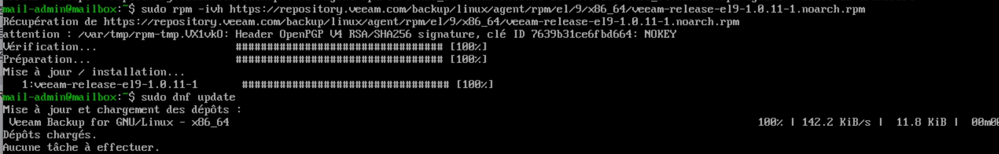
*Ajout du depot Veeam el9 sur la machine Fedora mailbox.*

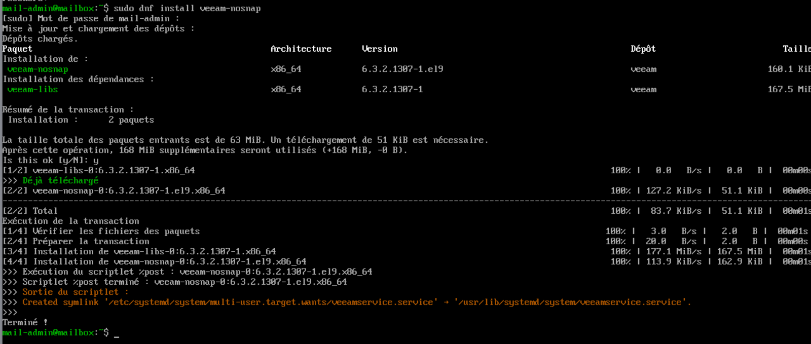
*Installation des paquets veeam-nosnap et veeam-libs 6.3.2 et activation du service veeamservice.*

## Restauration

La restauration de fichiers se pilote depuis la console Veeam. Pour la restauration complete d'un poste, un media de restauration (image ISO propre a la machine, par exemple `VeeamRecoveryMedia_WORKSTATION02_cercueil_local.iso`) est genere depuis la console puis presente a la machine comme media de demarrage (CD dans notre maquette). Apres verification des parametres reseau dans l'environnement de restauration, la fonction Bare Metal Recovery restaure le systeme depuis le depot.

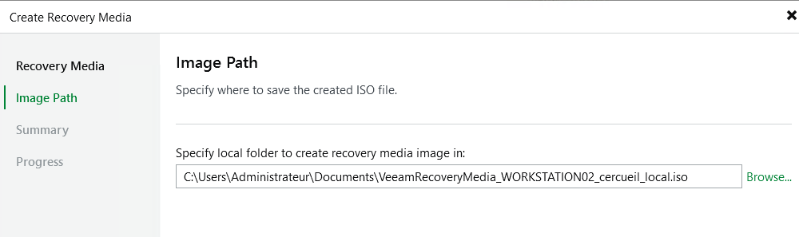
*Generation de l'ISO de restauration d'un poste depuis la console Veeam.*

## Interactions avec les autres briques

- Pare-feu et segmentation : les deux machines resident dans le VLAN 40 dedie a la sauvegarde ; les flux Veeam vers les postes clients (WMI, WinRM, SMB) sont limites cote poste a la source 10.0.40.10, et le trafic vers le depot (SSH, Data Mover 6162) reste interne au VLAN 40.
- Active Directory : serveur membre du domaine CERCUEIL, compte de service dedie a droits restreints, configuration des postes diffusee par GPO depuis les controleurs de domaine, qui font eux-memes partie du perimetre sauvegarde.
- DNS : les machines protegees sont jointes par leur nom du domaine cercueil.local.
- Messagerie : le serveur de mail Fedora (mailbox) est couvert par l'agent no-snap en sauvegarde de fichiers.

## Etat et limites

- Le service est fonctionnel : depot durci operationnel, immutabilite de 7 jours verifiee a la creation du depot, agents deployes sur les postes Windows et sur la messagerie.
- L'edition Community limite le nombre de charges protegees et impose la gestion par la console locale du serveur Windows.
- Les services Veeam sont longs a demarrer apres un redemarrage du serveur.
- Les machines Fedora ne beneficient que d'une sauvegarde au niveau fichiers, sans possibilite de restauration bare metal.
- Le depot est unique et heberge sur la meme infrastructure de virtualisation que le reste du SI ; il n'existe pas de copie secondaire hors site.
