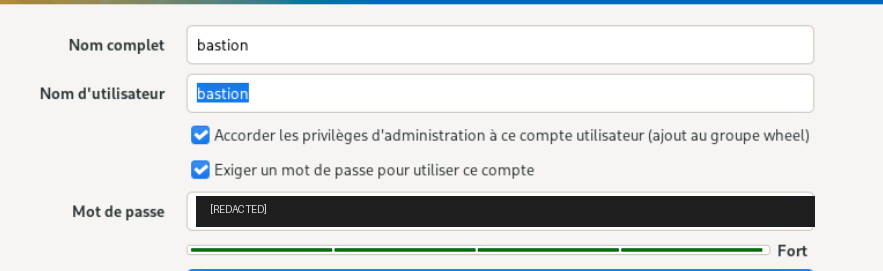
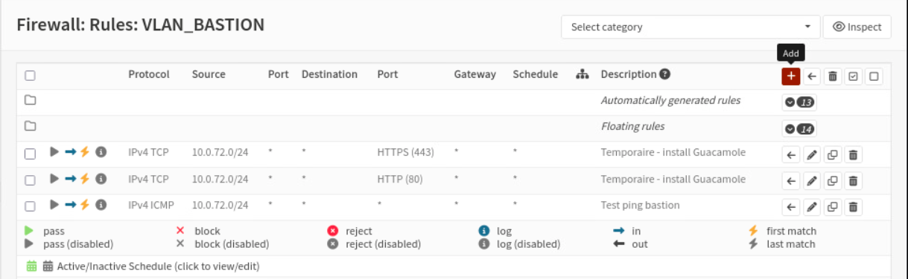

# Bastion d'administration

## Role dans l'infrastructure

Le bastion est le point de passage unique pour l'administration des serveurs du SI cercueil.fun.
Au lieu d'ouvrir des flux SSH ou RDP depuis les postes d'administration vers chaque VLAN, les
administrateurs se connectent en HTTP a une interface web Apache Guacamole hebergee sur le bastion,
qui relaie ensuite les sessions vers les machines cibles. Cette centralisation reduit les ouvertures
de flux d'administration au pare-feu a un couple source-destination connu et permet de tracer les
connexions dans un point unique.

Referents de la brique : Maxime et Tiphaine.

## Identite reseau

| VM | Systeme | IP | VLAN | Passerelle | DNS |
|----|---------|----|------|------------|-----|
| Bastion | Fedora 44 | 10.0.72.2/24 | 72 (VLAN_BASTION) | 10.0.72.1 (OPNsense) | 10.0.60.2 (resolveur LAN) |

## Architecture et fonctionnement

La pile logicielle repose sur Apache Guacamole 1.5.5 :

- **guacd**, le demon de proxy protocolaire, service systemd qui etablit les sessions RDP, SSH ou VNC
  vers les machines administrees ;
- **l'application web Guacamole** (fichier WAR) deployee dans un Tomcat 9.0.98 installe manuellement
  sous `/opt/tomcat9`, la version packagee n'existant pas dans les depots Fedora 44 ;
- **Java 21 (OpenJDK)**, retenu pour la compatibilite entre Fedora 44, guacd et Tomcat 9 ;
- **MariaDB** en local, qui porte la base applicative de Guacamole (connexions, permissions).

Une session d'administration suit donc le chemin : navigateur du poste d'administration, HTTP vers
Tomcat sur le bastion, application Guacamole, guacd, puis protocole natif (SSH/RDP/VNC) vers la cible.
Seul le premier segment traverse le pare-feu inter-VLAN ; les protocoles d'administration restent
confines derriere le bastion.

La VM dispose d'un compte local unique `bastion`, membre du groupe wheel, cree a l'installation du
systeme.



*Compte local d'administration `bastion` (groupe wheel) cree a l'installation de Fedora. Mot de passe masque.*



*Regles du pare-feu OPNsense sur l'interface VLAN_BASTION : ouvertures HTTP/HTTPS temporaires depuis
10.0.72.0/24 pour le telechargement des paquets lors du deploiement (le proxy n'etait pas encore en
service), et regle ICMP de test.*

## Configuration notable

Adressage statique de l'interface LAN, sans DHCP :

```bash
# Interface ens34 : IP fixe dans le VLAN 72, passerelle OPNsense
nmcli con mod "ens34" ipv4.method manual
nmcli con mod "ens34" ipv4.addresses 10.0.72.2/24
nmcli con mod "ens34" ipv4.gateway 10.0.72.1
nmcli con mod "ens34" ipv4.dns 10.0.60.2      # resolveur DNS du LAN
nmcli con mod "ens34" ipv4.ignore-auto-dns yes
```

La resolution DNS est verrouillee sur le resolveur interne : systemd-resolved est desactive et
`/etc/resolv.conf` est rendu immuable pour eviter toute reecriture :

```bash
# /etc/resolv.conf fige sur le resolveur LAN
echo "nameserver 10.0.60.2" > /etc/resolv.conf
chattr +i /etc/resolv.conf
```

MariaDB a ete durcie via `mysql_secure_installation` : mot de passe root defini, comptes anonymes
supprimes, connexion root distante interdite, base de test supprimee. La base applicative et son
compte a privileges reduits sont decrits dans [`config/guacamole-db.sql`](config/guacamole-db.sql).

L'authentification a l'interface Guacamole s'appuie sur le fichier plat
[`config/user-mapping.xml`](config/user-mapping.xml) (compte `guacadmin`), version epuree du fichier
`/etc/guacamole/user-mapping.xml` de la VM.

## Interactions avec les autres briques

- **Pare-feu OPNsense** : passerelle du VLAN 72 (10.0.72.1). Les seuls flux permanents concernent
  l'echange HTTP entre la machine d'administration et le bastion ; les regles HTTP/HTTPS sortantes
  visibles dans la capture etaient temporaires, limitees a la phase d'installation des paquets.
- **DNS** : le bastion resout exclusivement via le resolveur interne du LAN (10.0.60.2), ce qui le
  place dans le plan de nommage des zones cercueil.fun et mii8.fr.
- **Proxy** : le proxy sortant n'etait pas encore deploye au moment de l'installation, d'ou les
  ouvertures directes temporaires ; en cible, les acces sortants du bastion passent par lui.
- **Active Directory** : l'integration de l'authentification Guacamole a l'AD via LDAP a ete
  identifiee et documentee comme piste (sources it-connect referencees dans la documentation
  interne), sans deploiement atteste.

## Etat et limites

- La documentation interne note explicitement que les flux HTTP entre la machine d'administration
  et le bastion doivent etre restreints plus finement (le sens ou la portee d'une des deux regles
  est trop large).
- L'authentification repose sur un compte local en fichier plat ; le raccordement a l'annuaire
  AD/LDAP reste a realiser.
- L'acces a l'interface web se fait en HTTP ; aucune terminaison TLS n'est documentee sur Tomcat.
- Les sections "Recap service" et "Utilisation du service" de la documentation source sont restees
  vides ; le detail des connexions declarees dans Guacamole (machines cibles, protocoles) n'est pas
  documente.
