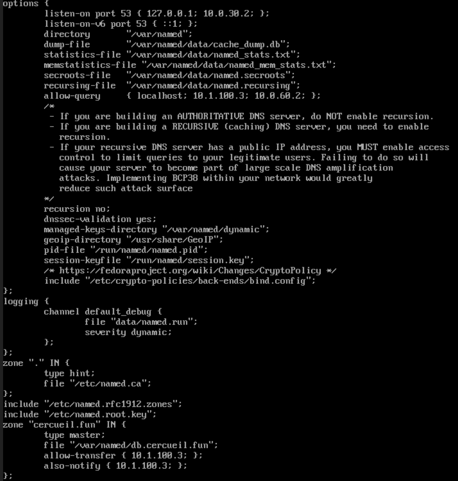
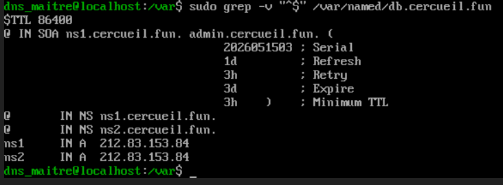
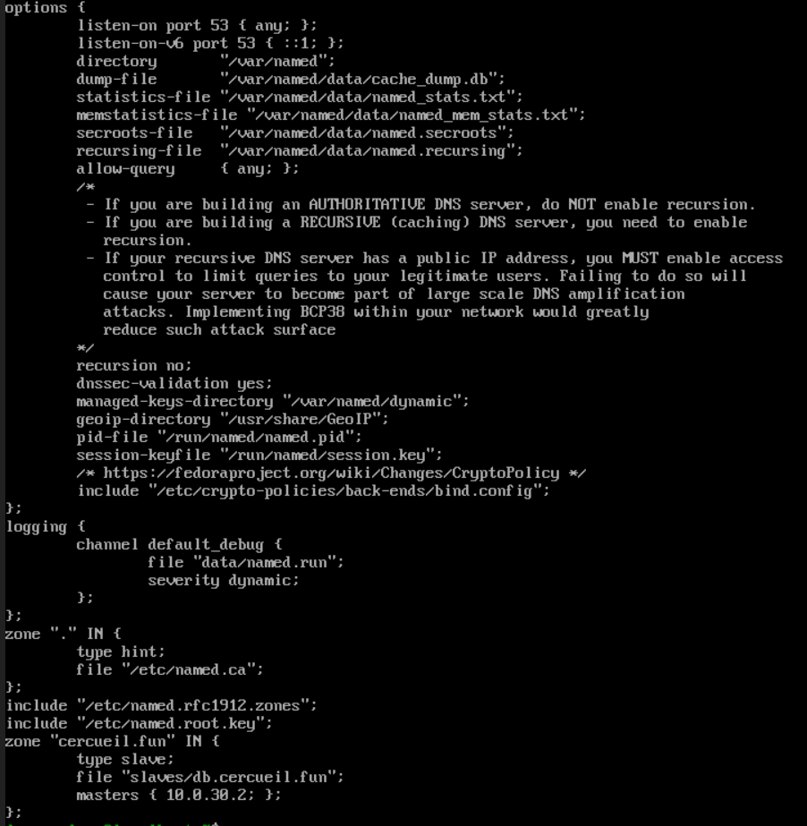
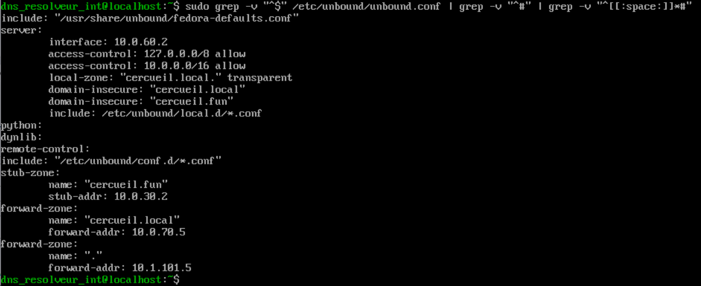
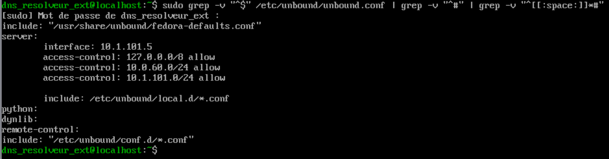
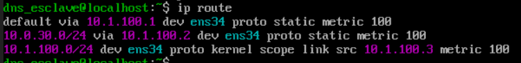
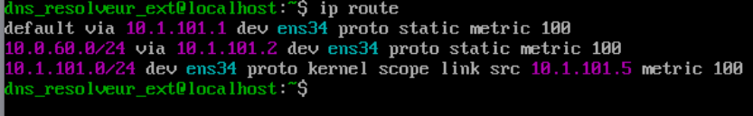

# DNS : autorite publique et resolution interne

## Role du service

Le plan DNS de l'infrastructure cercueil.fun repose sur quatre serveurs Fedora repartis en deux paires aux fonctions disjointes :

- une paire **autoritaire** sous Bind9 (named), composee d'un maitre et d'un esclave, qui fait autorite sur la zone publique `cercueil.fun` pour les requetes venant d'Internet comme du reseau interne ;
- une paire de **resolveurs** sous Unbound, un resolveur interne pour le LAN et un resolveur externe en DMZ, qui assure la resolution recursive pour les machines du site.

Un cinquieme serveur DNS existe dans l'infrastructure : le controleur de domaine Active Directory, autoritaire sur la zone privee `cercueil.local`. Sa configuration releve de la brique AD et n'est pas traitee ici.

## Machines

| VM | IP | VLAN | Logiciel | Fonction |
|---|---|---|---|---|
| DNS maitre | 10.0.30.2/24 | 30 (Services Core) | Bind9 | Autoritaire, detenteur de la zone cercueil.fun |
| DNS esclave | 10.1.100.3/24 | 100 (DMZ inbound) | Bind9 | Autoritaire, miroir expose a Internet |
| Resolveur interne | 10.0.60.2/24 | 60 (DNS) | Unbound | Resolution pour le LAN, aiguillage des zones internes |
| Resolveur externe | 10.1.101.5/24 | 101 (DMZ outbound) | Unbound | Recursion complete vers Internet |

## Architecture et fonctionnement

### Paire autoritaire maitre/esclave

Le maitre detient l'unique version modifiable de la zone `cercueil.fun` (`/var/named/db.cercueil.fun`). Il n'est pas expose : `allow-query` le restreint a l'esclave et au resolveur interne, et `recursion no` le cantonne au role autoritaire. Le transfert de zone (AXFR) est reserve a l'esclave via `allow-transfer`, et `also-notify` previent ce dernier a chaque modification. L'esclave ne retelecharge la zone que si le numero de Serial du SOA augmente ; un `rndc retransfer cercueil.fun` execute sur l'esclave force la resynchronisation si besoin.

*Configuration Bind9 du maitre : ecoute restreinte a 10.0.30.2, allow-query limite a l'esclave et au resolveur interne, zone cercueil.fun en type master avec allow-transfer et also-notify vers 10.1.100.3.*

*Zone publique cercueil.fun sur le maitre : SOA (Serial 2026051503, Refresh 1d, Retry 3h, Expire 3d, TTL negatif 3h), enregistrements NS ns1/ns2 et A vers l'IP publique 212.83.153.84.*

L'esclave, place en DMZ inbound, est le serveur reellement interroge depuis Internet : il ecoute sur toutes ses interfaces et accepte les requetes de tous (`allow-query { any; }`). Il ne conserve qu'une copie en lecture seule de la zone, telechargee depuis le maitre dans un format brut non editable.

*Configuration Bind9 de l'esclave : allow-query ouvert, zone cercueil.fun en type slave pointant sur le maitre 10.0.30.2.*

### Paire de resolveurs interne/externe

Le resolveur interne (Unbound) est le point d'entree DNS des machines du LAN (`access-control` limite a 10.0.0.0/16). Il n'effectue aucune recursion lui-meme mais aiguille les requetes selon la zone demandee :

- `cercueil.local` est transmis au controleur de domaine AD (10.0.70.5) via une `forward-zone`, apres desactivation du filtrage natif des TLD non routables (`local-zone: "cercueil.local." transparent`) ;
- `cercueil.fun` est resolu directement aupres du DNS maitre via une `stub-zone`, dont la reponse est mise en cache pour eviter de solliciter le maitre a chaque requete ;
- tout le reste est transfere au resolveur externe (10.1.101.5).

*Configuration Unbound du resolveur interne : ecoute sur 10.0.60.2, stub-zone vers le maitre, forward-zone cercueil.local vers l'AD et forward par defaut vers le resolveur externe.*

Le resolveur externe, en DMZ outbound, effectue la recursion complete sur Internet. Ses clients autorises sont le VLAN du resolveur interne et le VLAN du proxy.

*Configuration Unbound du resolveur externe : ecoute sur 10.1.101.5, access-control limite aux reseaux 10.0.60.0/24 et 10.1.101.0/24, aucune forward-zone donc recursion directe.*

### Routage lie au double pare-feu

Les machines en DMZ (esclave et resolveur externe) n'ont pour passerelle par defaut que pfSense (10.1.100.1 et 10.1.101.1). Pour joindre leurs homologues du LAN, une route statique les dirige vers la patte OPNsense de leur DMZ : sur l'esclave, 10.0.30.0/24 via 10.1.100.2 ; sur le resolveur externe, 10.0.60.0/24 via 10.1.101.2.

*Route statique de l'esclave : le reseau du maitre (10.0.30.0/24) est joint via la patte OPNsense 10.1.100.2 de la DMZ inbound.*

*Route statique du resolveur externe : le reseau du resolveur interne (10.0.60.0/24) est joint via la patte OPNsense 10.1.101.2 de la DMZ outbound.*

### DNSSEC

La zone `cercueil.fun` est signee selon la methode KASP : `dnssec-policy default` confie a Bind9 la creation, la signature et le renouvellement cyclique des cles sans script externe, et `inline-signing` maintient en arriere-plan un miroir signe (`db.cercueil.fun.signed` avec RRSIG et NSEC3) pendant que l'administrateur continue de modifier le fichier de zone en clair. Les cles (publique, privee et fichier d'etat) sont generees dans `/var/named`. La chaine de confiance est etablie aupres du registre `.fun` par la declaration d'un enregistrement DS dans l'interface OVH : key tag 63250, flag 257 (cle CSK), algorithme 13 (ECDSAP256SHA256), plus la cle publique en base64 extraite du fichier `.key` du maitre.

## Configuration

Les extraits transcrits depuis les captures de la documentation sont disponibles dans [`config/`](config/) :

- [`named.conf.maitre`](config/named.conf.maitre) et [`named.conf.esclave`](config/named.conf.esclave) : declaration de la zone autoritaire cote maitre et cote esclave ;
- [`db.cercueil.fun`](config/db.cercueil.fun) : contenu de la zone publique ;
- [`unbound.conf.resolveur-interne`](config/unbound.conf.resolveur-interne) et [`unbound.conf.resolveur-externe`](config/unbound.conf.resolveur-externe) : configuration des deux resolveurs.

## Interactions avec les autres briques

- **Pare-feux pfSense / OPNsense** : le service DNS est ouvert dans firewalld sur les quatre machines. OPNsense autorise le flux esclave vers maitre sur le port 53 pour le transfert de zone (TCP et UDP, le TCP etant requis notamment pour DNSSEC). Cote resolution, les regles autorisent le LAN vers le resolveur interne, le resolveur externe vers Internet, et le resolveur interne vers le maitre (10.0.30.2) et l'AD (10.0.70.5).
- **Active Directory** : le DC est autoritaire sur `cercueil.local` ; le resolveur interne lui delegue cette zone par forward.
- **Proxy** : le VLAN du proxy (10.1.101.0/24) est client autorise du resolveur externe.
- **OVH (registrar)** : deux serveurs de noms sont declares, `ns1.cercueil.fun` et `ns2.cercueil.fun`, qui partagent la meme adresse publique 212.83.153.84 faute de seconde IP publique, l'option d'utiliser nos propres serveurs DNS etant activee. L'enregistrement DS de la cle DNSSEC y est egalement publie.

## Etat et limites

- Le resolveur interne declare `domain-insecure` pour `cercueil.local` et `cercueil.fun`, ce qui desactive la validation DNSSEC sur ces zones ; la documentation prevoit de revoir ce point pour `cercueil.fun` maintenant que la zone est signee.
- La redondance des NS publics est nominale : ns1 et ns2 pointent vers la meme IP publique.
- Les procedures de sauvegarde et de restauration figurent en sections vides dans la documentation et n'ont pas ete formalisees.
