# Durcissement des systemes (GRUB, USB, Linux, Windows)

## Role dans l'infrastructure

Cette brique regroupe les mesures de durcissement appliquees a l'ensemble du parc du SI cercueil.fun. Elle ne correspond pas a une VM dediee : elle s'applique transversalement aux machines Linux (Fedora et Debian) via une boucle audit OpenSCAP / remediation Ansible et des mesures locales (mot de passe GRUB, blocage du stockage USB), et aux machines Windows du domaine cercueil.local via des GPO alignees sur les benchmarks CIS.

## Perimetre

| Perimetre | Systemes | Reperes |
|---|---|---|
| Parc Linux | Fedora, Debian | Inventaire Ansible : machine d'administration 10.0.30.19 (seule workstation), serveurs critiques (DNS maitre 10.0.30.2, CA intermediaire 10.0.70.4, bastion 10.0.72.2), serveurs importants (proxys 10.1.101.6 et 10.1.100.4, DNS 10.0.60.2 / 10.1.100.3 / 10.1.101.5, mails 10.1.102.3 et 10.0.32.3), autres (miroir 10.0.30.5, web 10.0.32.4) |
| Parc Windows | Controleurs de domaine et postes clients | Domaine cercueil.local, GPO liees au domaine, aux Domain Controllers et aux OU du modele en tiers (TieredAdministration/T0/T1/T2) |

## Durcissement Linux

### Boucle audit OpenSCAP / remediation Ansible

Le durcissement Fedora et Debian repose sur OpenSCAP (paquets openscap-scanner et scap-security-guide, contenu ssg-fedora-ds.xml). Chaque machine est auditee contre un profil CIS Benchmark de niveau 1, decline en deux variantes selon l'usage : server pour les machines de service, workstation pour la machine d'administration. Les configurations d'installation etant identiques entre serveurs, un seul audit par variante suffit a produire une remediation valable pour tout le groupe.

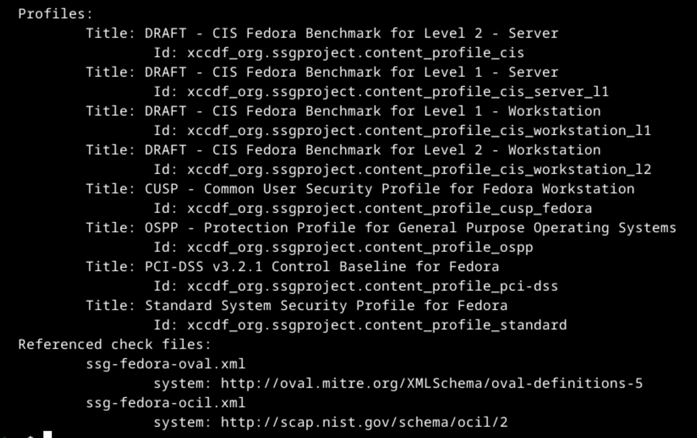
*Sortie oscap info sur ssg-fedora-ds.xml : quatre profils CIS (server/workstation, niveaux 1 et 2) servent de reference.*

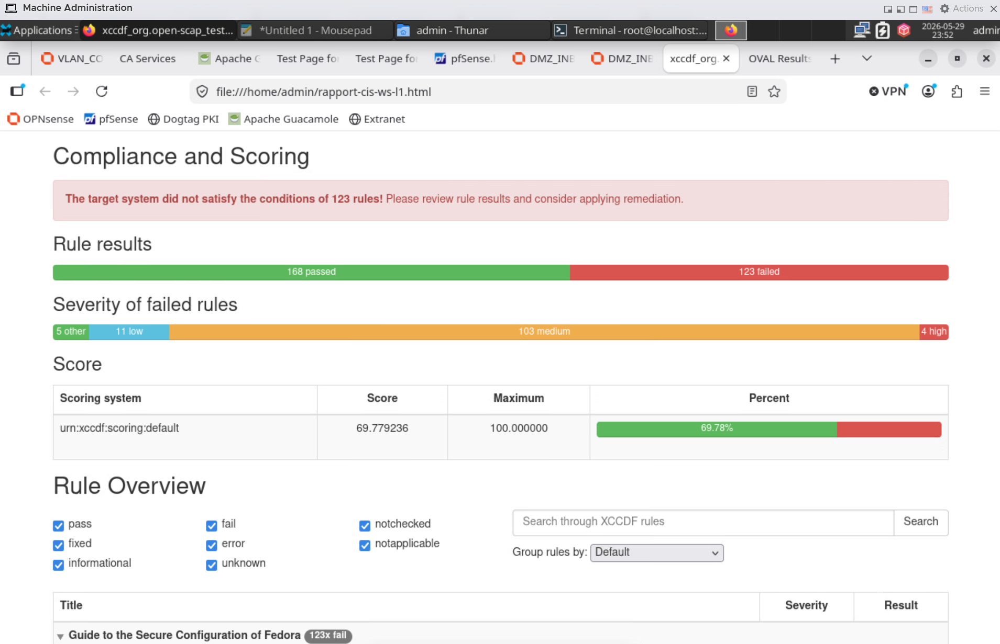
*Audit initial CIS workstation L1 sur la machine d'administration : 168 regles conformes, 123 en echec, score 69,78 %.*

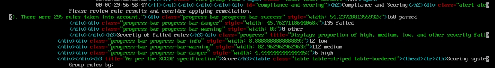
*Rapport de la variante server L1 consulte en console : 160 regles conformes sur 295 evaluees, 135 en echec (6 high, 112 medium, 12 low).*

A partir du fichier de resultats XML, oscap genere un playbook Ansible de remediation limite aux regles en echec, plutot que le playbook CIS complet qui reappliquerait des parametres deja conformes et pourrait desactiver des fonctions necessaires. Le playbook est ensuite execute par le serveur Ansible sur les groupes vises.

```yaml
# Generation du playbook de remediation a partir des resultats d'audit
# oscap xccdf generate fix --fix-type ansible --result-id "" \
#   --output remediation-cis-fedora-server-l1.yml resultats_cis_serveur_l1.xml
# En-tete du playbook : ignore_errors evite l'arret complet sur une regle en echec
- hosts: all
  become: true
  ignore_errors: true
```

L'inventaire (/ansible/inventory/hosts.yml) classe les machines par OS, par type (server / workstation) puis par criticite (critique, important, autres) et par service, ce qui permet de limiter chaque execution a un groupe coherent (option --limit, modes --check et --diff pour la previsualisation).


*Inventaire Ansible : hierarchie workstation / server, criticite et services, avec les IP du parc Fedora.*


*Fin de l'inventaire : groupe autres, avec le miroir (10.0.30.5) et le serveur web (10.0.32.4).*


*En-tete d'un playbook de remediation : cible, elevation de privileges et ignore_errors.*

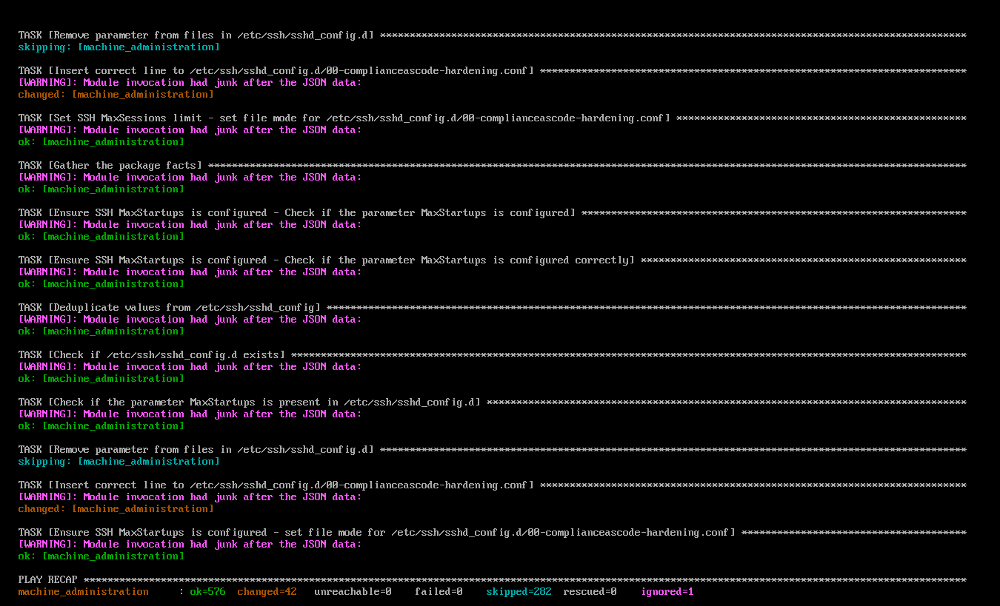
*Execution du playbook workstation L1 sur la machine d'administration : 576 taches ok, 42 changements, 0 echec.*

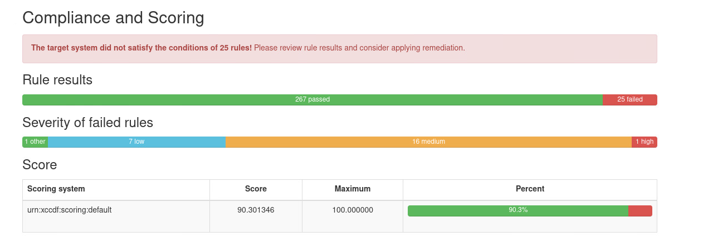
*Nouvel audit apres remediation : 267 regles conformes, 25 en echec, score 90,3 %.*

### Protection du chargeur GRUB

Le menu GRUB de chaque machine est protege par mot de passe afin d'empecher la modification des parametres de boot (mode single user, init=/bin/bash). Sur Fedora, la protection s'appuie sur l'outil integre grub2-setpassword. Sur Debian, un hash PBKDF2 genere par grub-mkpasswd-pbkdf2 est declare dans /etc/grub.d/40_custom (voir [config/40_custom](config/40_custom)) puis pris en compte par update-grub.

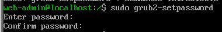
*Fedora : definition du mot de passe GRUB via grub2-setpassword.*

### Blocage du stockage USB

Le module noyau usb-storage est neutralise sur tout le parc Linux par un fichier modprobe.d qui substitue /bin/true a son chargement ([config/disable-usb-storage.conf](config/disable-usb-storage.conf)). Sur Debian, l'initramfs est regeneree pour que le module ne soit pas charge avant la lecture de cette configuration au demarrage.

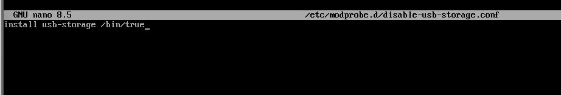
*Fichier /etc/modprobe.d/disable-usb-storage.conf : le stockage amovible est inutilisable sur les machines Linux.*

## Durcissement Windows

Le parc Windows est durci par GPO, organisees en baselines par niveau : Security Baseline Domain (politiques de comptes, Kerberos, exigences applicables a tout le domaine), Security Baseline Computers (postes, serveurs membres, DC), Security Baseline Servers et Security Baseline Domain Controllers (LSASS, LDAP, NTLM, audit propre aux DC). Les reglages suivent la numerotation du benchmark CIS Windows Server 2022.

### Politiques de comptes

La politique de mot de passe du domaine (GPO Security Baseline Domain) impose 12 caracteres minimum, complexite activee, historique de 24 mots de passe, duree de vie maximale de 90 jours et chiffrement reversible desactive. Des FGPP (Password Settings Container) renforcent ces exigences pour les comptes d'administration des tiers T0/T1/T2, conformement au modele defini (16 caracteres et verrouillage a 5 tentatives pour T1, 20 et plus pour T0, 30 et plus pour les comptes de service).


*GPO Security Baseline Domain sur DC01 : longueur 12, complexite, historique 24, duree maximale 90 jours.*


*FGPP appliquee aux comptes d'administration T1 via le Password Settings Container.*

### Chiffrement et protections systeme

BitLocker est impose sur les lecteurs systeme avec authentification supplementaire au demarrage (TPM, PIN ou cle de demarrage) et sauvegarde automatique des cles de recuperation dans Active Directory. Device Guard active la securite basee sur la virtualisation (VBS) avec verrouillage UEFI, l'integrite du code protegee par hyperviseur et Credential Guard. Le spouleur d'impression est desactive sur les DC (CVE PrintNightmare) et refuse les connexions clientes entrantes ailleurs.

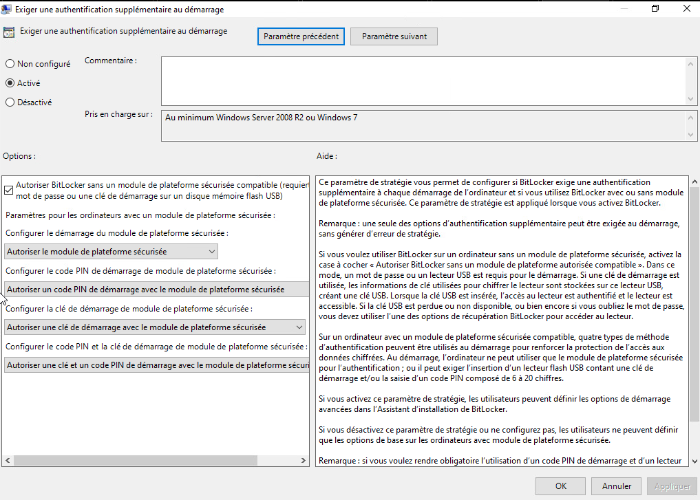
*BitLocker : authentification supplementaire exigee au demarrage des lecteurs systeme.*


*BitLocker : les cles de recuperation sont sauvegardees automatiquement dans l'annuaire.*

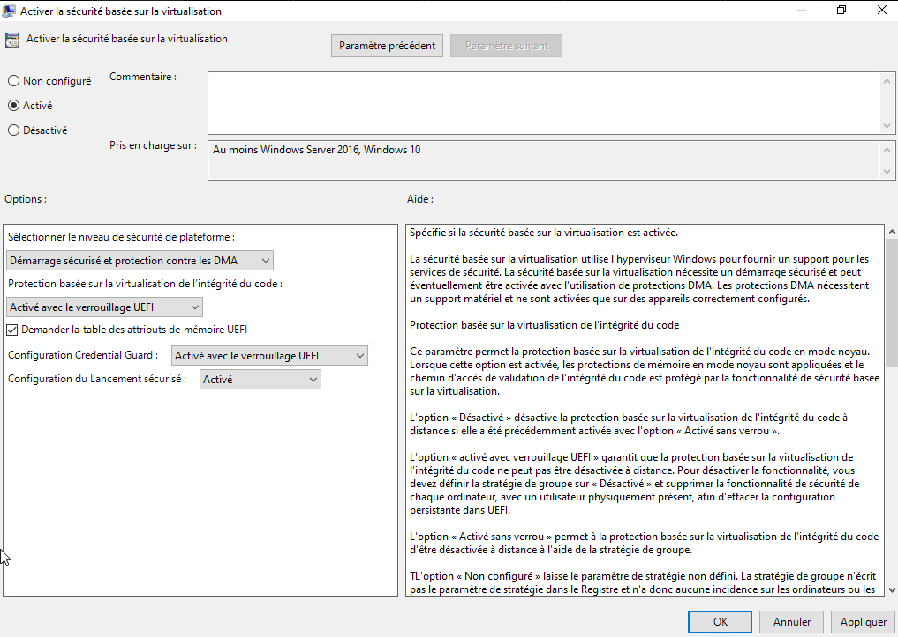
*Device Guard : VBS avec demarrage securise et protection DMA, integrite du code et Credential Guard verrouilles par UEFI.*

### Protocoles reseau

Les GPO imposent la signature SMB cote client et serveur, interdisent l'envoi de mots de passe non chiffres, restreignent l'enumeration anonyme (SID, comptes SAM, partages, canaux nommes), limitent Kerberos aux chiffrements AES128/AES256, refusent LM et NTLM (NTLMv2 uniquement), imposent SMB 3.1.1 minimum et durcissent les chemins UNC des partages NETLOGON et SYSVOL. L'option RequirePrivacy (chiffrement SMB v3) suppose des clients Windows 8 / Server 2012 minimum, contrainte compatible avec le parc.


*Chemins UNC renforces : authentification mutuelle Kerberos, integrite et chiffrement exiges sur SYSVOL et NETLOGON.*

### Durcissement de l'annuaire et des peripheriques

L'attribut ms-DS-MachineAccountQuota est ramene a 0 pour interdire aux utilisateurs standards de joindre des machines au domaine, le groupe Schema Admins est vide hors operation de schema, le compte Administrateur est marque sensible et non delegable, et la corbeille AD est activee. Windows LAPS gere la rotation des mots de passe administrateurs locaux, stockes chiffres dans l'annuaire. Le stockage amovible est refuse par GPO (Removable Storage Access), en coherence avec le blocage usb-storage cote Linux.

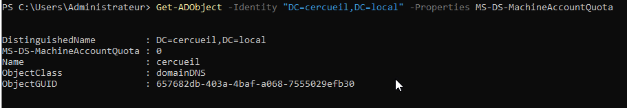
*Verification PowerShell de ms-DS-MachineAccountQuota apres passage a 0.*


*Compte Administrateur marque sensible et non delegable.*

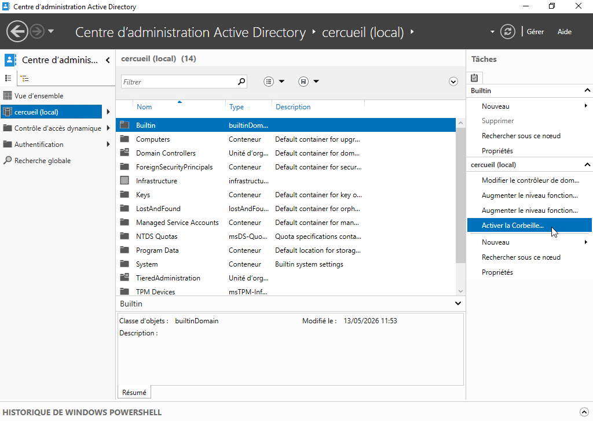
*Activation de la corbeille Active Directory sur le domaine cercueil.local.*


*GPO Removable Storage Access : tous les acces au stockage amovible sont refuses.*

Les configurations Windows sont auditees avec HardeningKitty (listes CIS et baselines Microsoft pour Server 2022) : sauvegarde des parametres machine et utilisateur en CSV avant application, audit avec rapport, puis mode HailMary pour appliquer la liste de durcissement retenue.

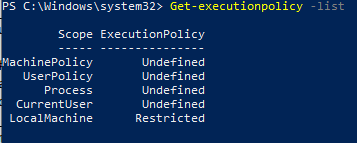
*Get-ExecutionPolicy -list avant la mise en place de HardeningKitty : LocalMachine en Restricted, les autres portees non definies.*

## Interactions avec les autres briques

- Ansible : le serveur Ansible (VLAN 30) execute les playbooks de remediation generes par OpenSCAP sur les groupes de l'inventaire.
- Pare-feux (OPNsense) : les flux vers les depots doivent etre ouverts pendant les remediations, certaines regles CIS installant des paquets ; le miroir Fedora local (10.0.30.5) limite cette dependance a Internet.
- PKI : une GPO ajoute les CA internes au magasin de confiance des machines Windows de l'OU T2/Computers.
- Supervision : une GPO d'audit sur les Domain Controllers journalise les evenements de la baseline Microsoft et augmente la taille des journaux, exploites par la brique de supervision.
- Active Directory : les baselines et FGPP s'appuient sur le modele d'administration en tiers (T0/T1/T2) porte par la brique AD.


*GPO Audit Policy Domain Controllers liee a cercueil.local/Domain Controllers.*


*GPO Ajout des CA dans le Trust Store, liee a l'OU TieredAdministration/T2/Computers.*

## Etat et limites

Le cycle complet audit / remediation / re-audit est demontre sur le parc Fedora, avec un score CIS passant de 69,78 % a 90,3 % sur la machine d'administration ; 25 regles restent en echec apres remediation et demandent un traitement manuel. Les playbooks s'executent avec ignore_errors, ce qui evite les interruptions mais impose de relire le recapitulatif pour reperer les taches en echec ou ignorees. Le durcissement Debian etait encore en cours a la fin du projet. Cote Windows, la politique de mot de passe du domaine etant unique par construction, les renforcements par population reposent entierement sur les FGPP.
