# Messagerie : passerelle SMTP, serveur de boites et SSO Kerberos

Cette brique fournit la messagerie interne et externe du SI cercueil.fun. Elle repose sur deux serveurs Fedora Linux : une passerelle SMTP exposee en DMZ qui route et filtre les mails, et un serveur de boites interne qui stocke les messages et les sert aux clients en IMAPS. L'authentification des utilisateurs est centralisee sur l'Active Directory, avec une ouverture de session unique (SSO) Kerberos depuis les postes du domaine.

| VM | FQDN | IP | VLAN | Roles |
|---|---|---|---|---|
| Mail gateway | mail.cercueil.fun | 10.1.102.3 | 102 (DMZ mail) | Postfix (relais SMTP), Amavis, ClamAV, SpamAssassin, OpenDKIM, Fail2ban |
| Mailbox server | mailbox.cercueil.local | 10.0.32.3 | 32 (services internes) | Postfix (remise locale), Dovecot (IMAPS, LMTP), Fail2ban |

## Architecture et flux

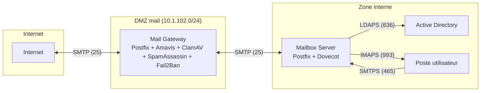

La passerelle est le seul point de contact SMTP avec Internet : elle ne stocke aucun mail et ne porte aucune authentification utilisateur. Le serveur de boites n'est joignable en SMTP que depuis la DMZ, a travers le pare-feu interne ; les utilisateurs le contactent uniquement en SMTPS (465) pour l'envoi et en IMAPS (993) pour la consultation. En local sur la mailbox, Postfix remet les messages a Dovecot via LMTP (127.0.0.1:24). Le pare-feu interne constitue le vrai perimetre de securite : seuls les flux strictement necessaires sont ouverts.

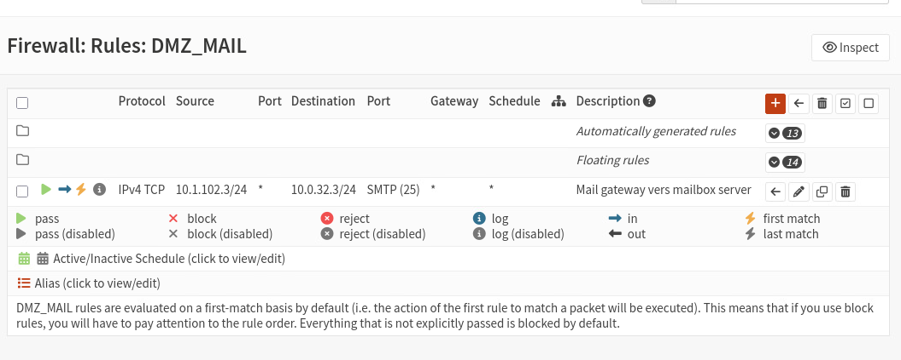
*Regle OPNsense (FW_2) sur la patte DMZ_MAIL : seul le flux SMTP 10.1.102.3 vers 10.0.32.3 est autorise vers la zone interne.*

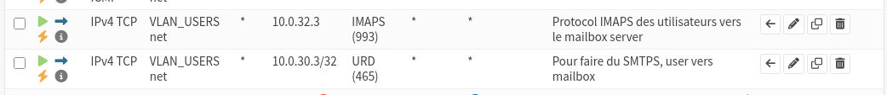
*Regles OPNsense cote VLAN utilisateurs : IMAPS 993 et soumission 465 autorises uniquement vers le serveur de boites.*

## Passerelle (mail.cercueil.fun)

Postfix y est configure en pur relais : `relay_domains = cercueil.fun` declare la passerelle comme responsable du domaine public sans en etre la destination finale, et la table `transport` aiguille tout mail `@cercueil.fun` vers la mailbox interne. L'option `relayhost` a ete retiree au profit de cette table : un mail vers un domaine absent de la table (gmail.com par exemple) est rejete immediatement, ce qui ferme la voie au relais ouvert. Les restrictions `smtpd_relay_restrictions` et `smtpd_recipient_restrictions` (permit_mynetworks, reject_unauth_destination) completent cette protection, la commande VRFY est desactivee contre l'enumeration de comptes et la taille des messages est plafonnee a 5 Mo. Extraits complets : [postfix-gateway-main.cf](config/postfix-gateway-main.cf) et [postfix-gateway-transport](config/postfix-gateway-transport).

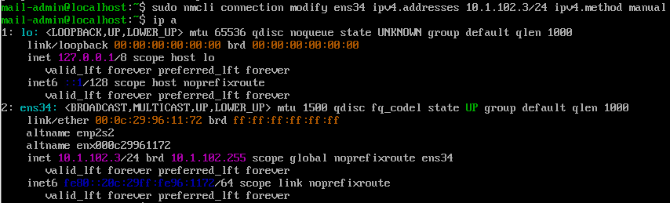
*Interface unique de la passerelle, configuree en statique via nmcli : 10.1.102.3/24 dans la DMZ mail.*

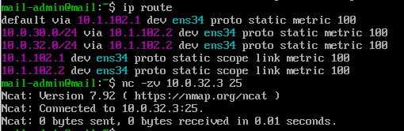
*Routes statiques de la passerelle via le pare-feu 10.1.102.2 et connexion verifiee au port 25 de 10.0.32.3.*

Le flux SMTP public est chiffre avec un certificat Let's Encrypt obtenu via Certbot, la PKI interne etant reservee aux echanges internes (sa racine n'est pas reconnue par les serveurs de messagerie externes). Le TLS est opportuniste (`may`) dans les deux sens : l'imposer romprait la compatibilite avec les serveurs distants sans TLS, en violation de la RFC 2487.

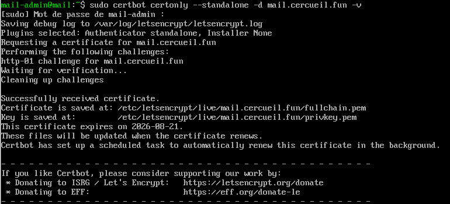
*Emission du certificat public via Certbot en mode standalone, apres ouverture temporaire du port 80 sur les pare-feux.*

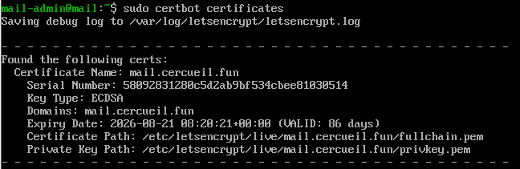
*Controle du certificat obtenu : cle ECDSA pour mail.cercueil.fun, validite et chemins des fichiers suivis par certbot certificates.*

## Serveur de boites (mailbox.cercueil.local)

Dovecot 2.4 sert les boites en IMAPS et recoit les messages du Postfix local en LMTP. Les mails sont stockes au format sdbox sous `/srv/mail/<adresse>`, propriete exclusive du compte systeme `vmail` (UID 5000) : aucun compte Linux n'est cree pour les utilisateurs. SELinux a ete instruit que ce chemin non standard contient des boites mail. Les comptes sont resolus dans l'Active Directory en LDAPS via le compte de service `svc_dovecot_ldap`, avec un filtre acceptant l'adresse mail ou l'UPN. Un destinataire absent de l'annuaire est rejete avec le code 550. Configuration complete commentee : [dovecot.conf](config/dovecot.conf) et [postfix-mailbox-main.cf](config/postfix-mailbox-main.cf).

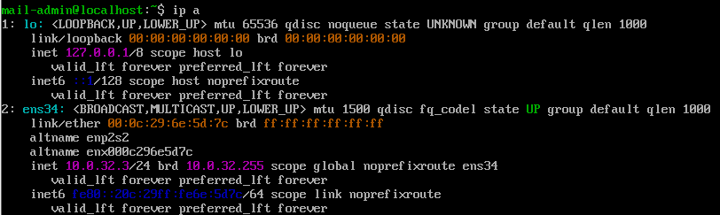
*Interface du serveur de boites en 10.0.32.3/24, dans le VLAN des services internes.*

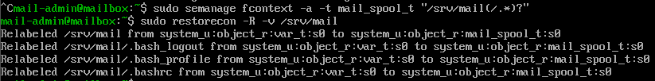
*Contexte mail_spool_t declare sur /srv/mail via semanage, puis applique par restorecon.*

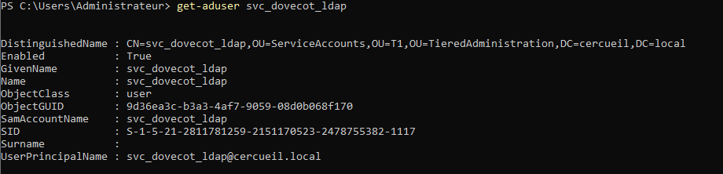
*Le compte de service de liaison LDAP, place dans l'OU ServiceAccounts du tiering T1 de l'AD.*

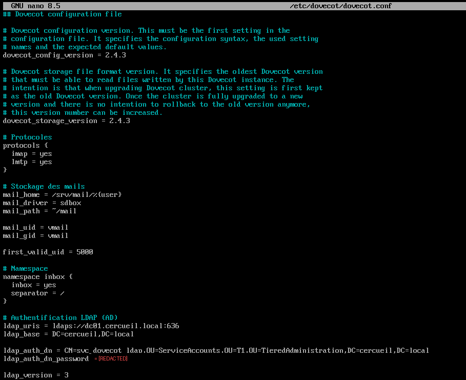
*Partie haute du dovecot.conf : versions 2.4.3, stockage sdbox sous /srv/mail et liaison LDAPS vers dc01.cercueil.local.*

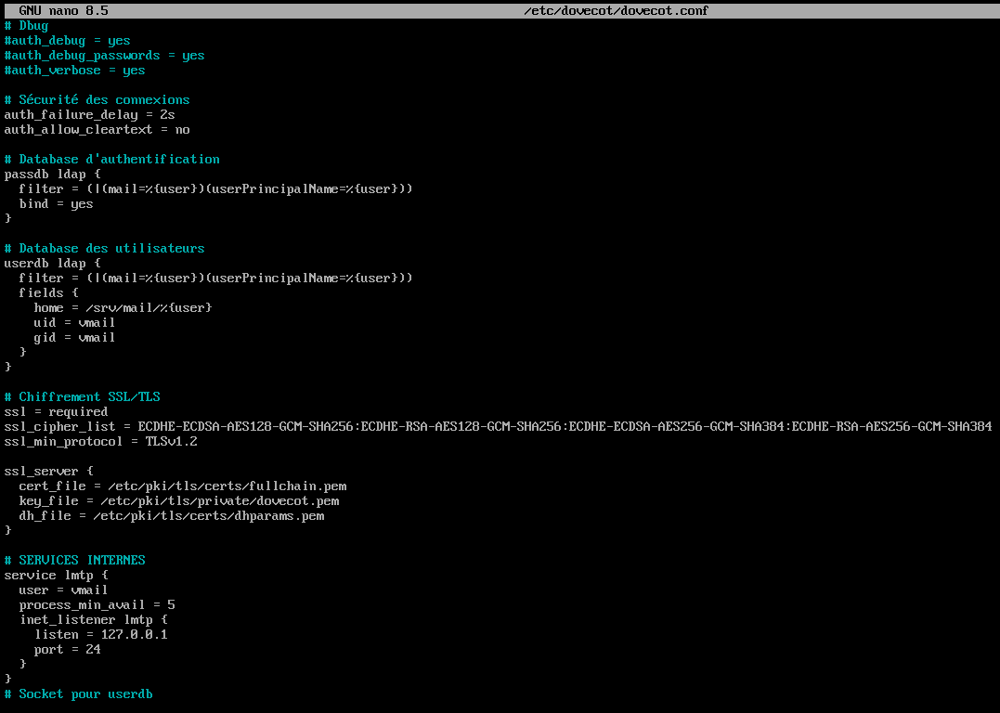
*Suite du dovecot.conf : filtres passdb et userdb sur l'AD, TLS 1.2 minimum avec suites ECDHE, ecoute LMTP sur 127.0.0.1:24.*

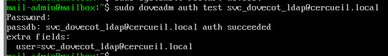
*Validation de la chaine Dovecot vers AD : `doveadm auth test` renvoie "auth succeeded" pour le compte de service.*

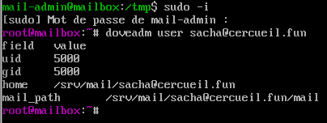
*`doveadm user` resout sacha@cercueil.fun dans l'annuaire : boite rattachee au compte vmail (UID 5000) sous /srv/mail.*

Le chiffrement s'appuie sur un certificat delivre par la PKI interne du projet, complete d'une cle Diffie-Hellman exigee par Dovecot. La cle privee `dovecot.pem` est isolee dans `/etc/pki/tls/private` et rendue lisible par Postfix et Dovecot via des ACL POSIX. Ce meme certificat est reutilise par le Postfix de la mailbox, dont le client SMTP est force en `encrypt` : aucun mail interne ne peut repartir vers la DMZ en clair, la connexion est coupee en cas d'interception.

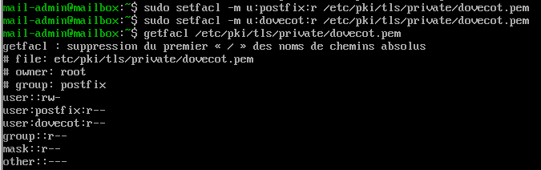
*Lecture seule accordee aux comptes postfix et dovecot sur la cle privee, sans ouvrir les droits au reste du systeme.*

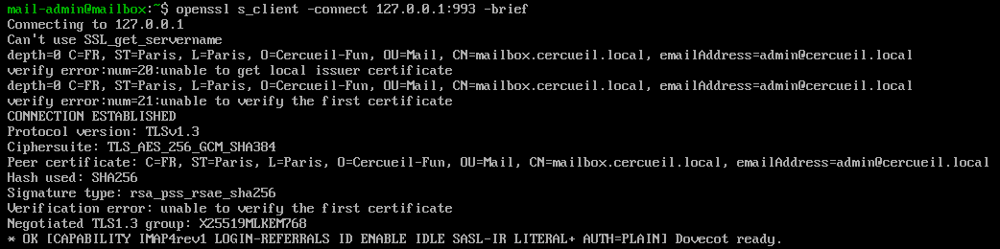
*Connexion `openssl s_client` sur le port 993 : session TLSv1.3 etablie, banniere "Dovecot ready".*

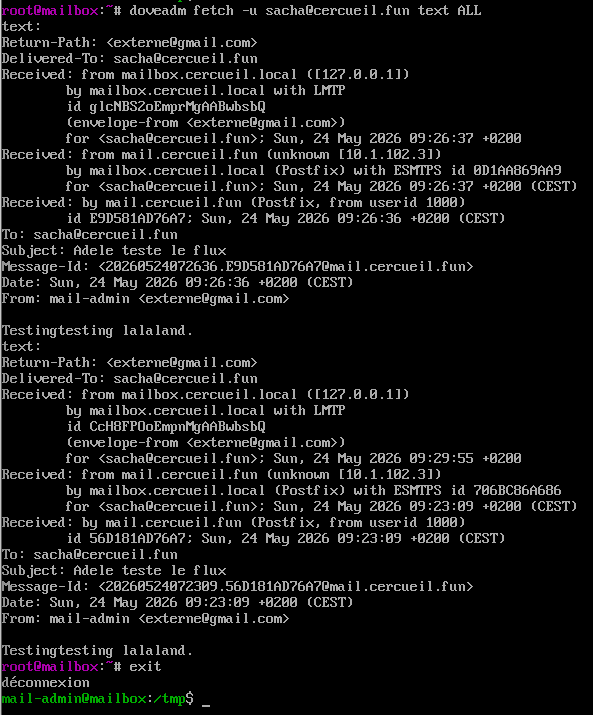
*Messages remis dans la boite de sacha@cercueil.fun : l'en-tete Received retrace le chemin passerelle puis LMTP local.*

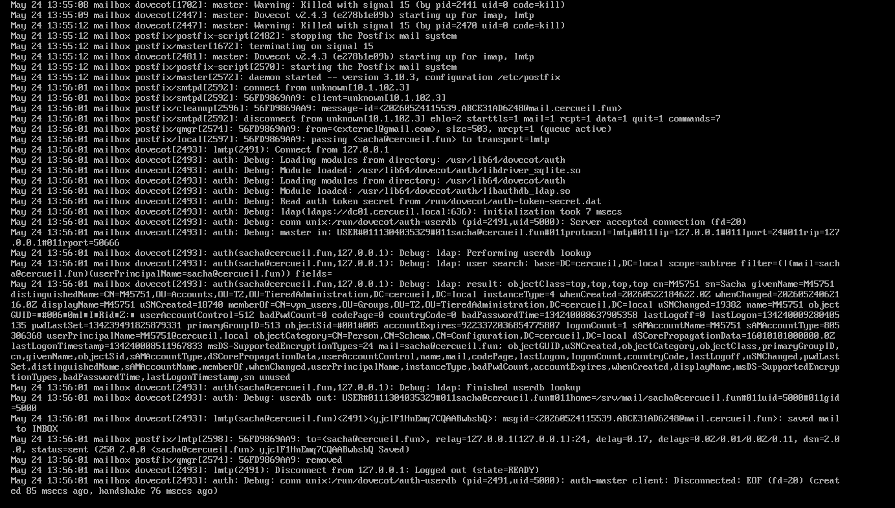
*Trace complete d'une remise : reception depuis la passerelle, recherche LDAP du destinataire sur dc01, puis remise LMTP en boite ("saved mail to INBOX").*

## SSO Kerberos (GSSAPI)

Pour eviter la saisie du mot de passe dans le client mail, Dovecot accepte les tickets Kerberos du domaine. Cote AD, deux SPN sont declares (`imap/mailbox.cercueil.fun` et `smtp/mailbox.cercueil.fun`) sur les comptes de service `svc_dovecot_ldap` et `svc_postfix`, et les keytabs correspondants sont generes avec `ktpass` en AES256. Sur la mailbox, les deux keytabs sont fusionnes avec `ktutil` dans `/etc/dovecot/dovecot.keytab` (droits 400, contexte SELinux restaure). Le socket d'authentification partage avec Postfix passe en mode 0660 pour que la soumission SMTPS beneficie aussi du SSO. Dans Thunderbird, la methode d'authentification est basculee sur Kerberos/GSSAPI pour les serveurs entrant et sortant.

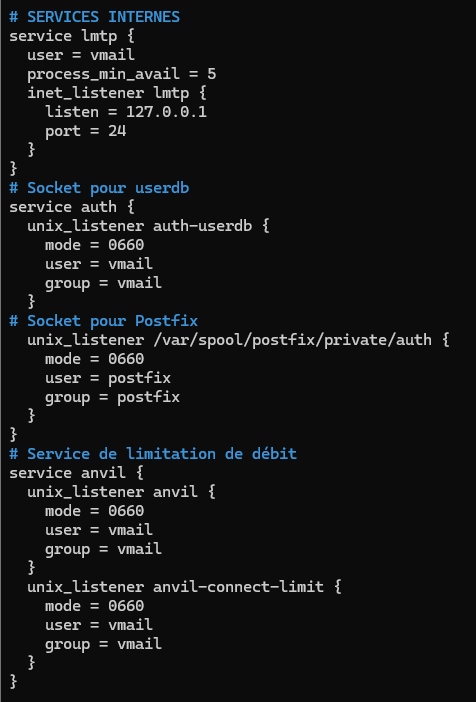
*Extrait du dovecot.conf apres mise en place du SSO : socket Postfix en 0660 et services auth/anvil dedies.*

## Filtrage : antivirus, antispam, anti brute force

Sur la passerelle, tout le trafic est detourne vers Amavis (`content_filter`, port 10024) qui orchestre ClamAV pour l'antivirus et SpamAssassin pour le scoring antispam, puis reinjecte les messages propres dans Postfix sur le port 10025. Les seuils SpamAssassin sont configures dans `amavisd.conf` : marquage des en-tetes a 2.0, tag "SPAM" dans le sujet a 6.2, blocage definitif a 6.9. La signature DKIM est centralisee dans Amavis afin d'etre apposee apres nettoyage du contenu. Fail2ban complete le dispositif sur les deux machines avec les prisons `postfix`, `dovecot` et `postfix-sasl` ([fail2ban-jail.local](config/fail2ban-jail.local)), les IP du service et des correcteurs etant en liste blanche.

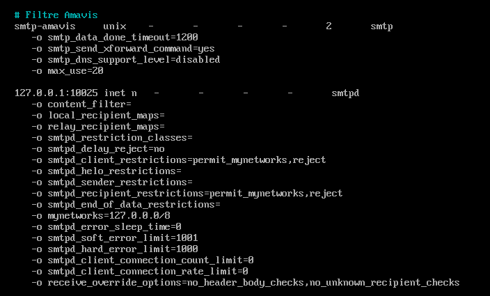
*Circuit du filtrage dans le master.cf : envoi vers Amavis par le service smtp-amavis, reinjection des messages propres sur 127.0.0.1:10025.*

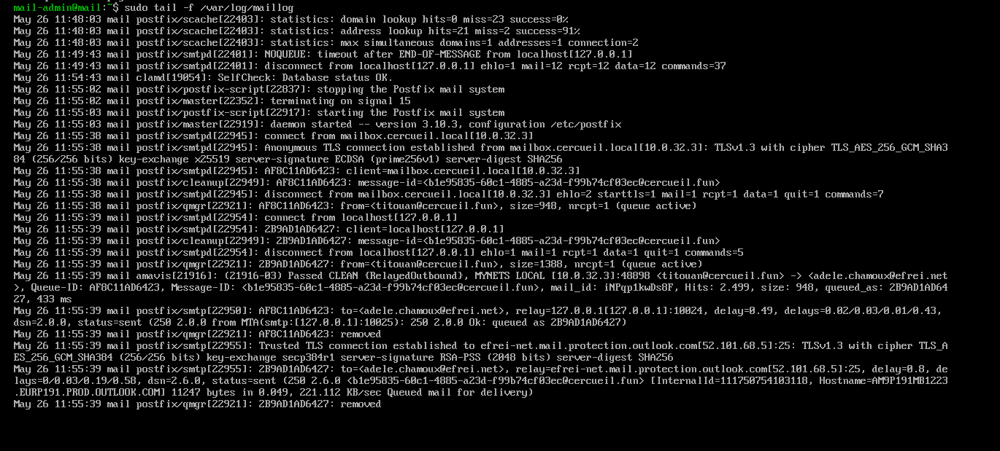
*Cycle complet dans /var/log/maillog : reception depuis la mailbox, verdict "Passed CLEAN" d'Amavis, reinjection locale puis remise a outlook.com en TLSv1.3.*

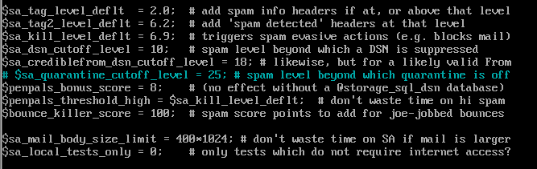
*Niveaux SpamAssassin : tag a 2.0, marquage "SPAM" a 6.2, suppression au-dela de 6.9.*

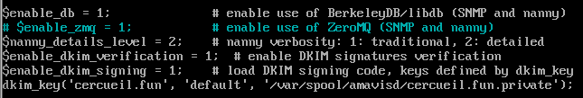
*Activation de la signature et de la verification DKIM dans Amavis, avec la cle privee du selecteur default de cercueil.fun.*

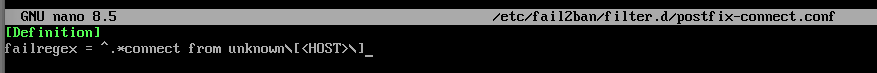
*Filtre additionnel postfix-connect : detection des connexions SMTP de clients sans nom DNS ("connect from unknown").*

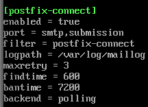
*Prison associee au filtre : trois occurrences en dix minutes entrainent un bannissement de deux heures.*

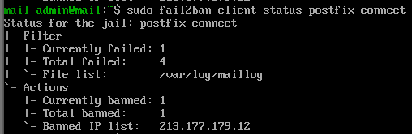
*Prison active sur la passerelle : une IP externe bannie apres des connexions repetees sans reverse DNS.*

## Protection DNS du domaine

La zone publique cercueil.fun porte les enregistrements de lutte contre l'usurpation : SPF n'autorise que l'IP publique 212.83.153.84 (politique `-all`), la cle publique DKIM generee par OpenDKIM est publiee dans `default._domainkey`, et DMARC impose le rejet (`p=reject`) en cas d'echec SPF ou DKIM avec envoi des rapports a un administrateur. Un reverse DNS associe l'IP publique au FQDN de la passerelle.

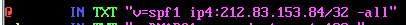
*SPF : seule 212.83.153.84 peut emettre pour le domaine, tout autre emetteur est rejete (-all).*

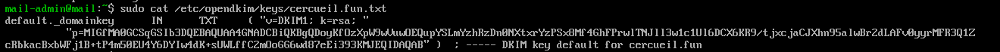
*Enregistrement TXT default._domainkey contenant la cle publique RSA servant a verifier les signatures DKIM.*

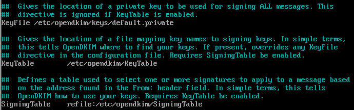
*opendkim.conf sur la passerelle : cles referencees par KeyTable, choix des signatures par SigningTable.*

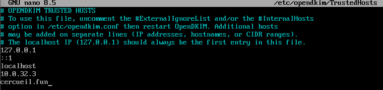
*TrustedHosts limite la signature aux emetteurs legitimes : boucle locale, mailbox 10.0.32.3 et domaine cercueil.fun.*

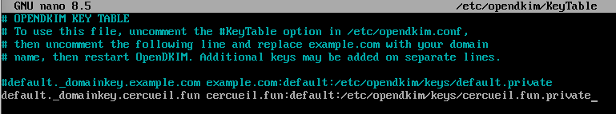
*KeyTable associe le selecteur default du domaine a la cle privee stockee sous /etc/opendkim/keys.*

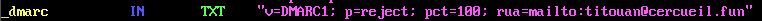
*DMARC en politique reject a 100 %, avec rapports agreges envoyes a un compte du domaine.*

## Acces client

Les postes utilisent Thunderbird, configure sur `mailbox.cercueil.fun` en IMAPS 993 (reception) et SMTPS 465 (envoi), le nom d'utilisateur devant correspondre au champ `mail` de l'AD. Le certificat de la PKI interne est accepte sur le poste. Le service de soumission 465 est declare dans le `master.cf` de la mailbox avec authentification SASL obligatoire (deleguee a Dovecot, donc a l'AD).

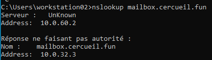
*nslookup depuis workstation02 : mailbox.cercueil.fun resolu en 10.0.32.3 par le DNS interne 10.0.60.2.*

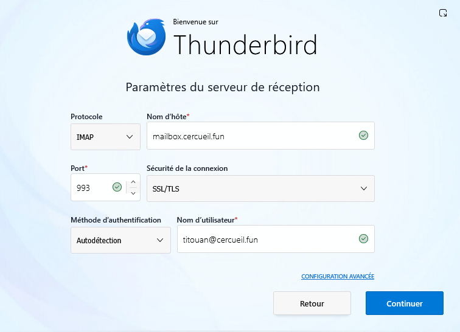
*Serveur entrant : IMAP sur mailbox.cercueil.fun, port 993 en SSL/TLS, identifiant sous forme d'adresse mail.*

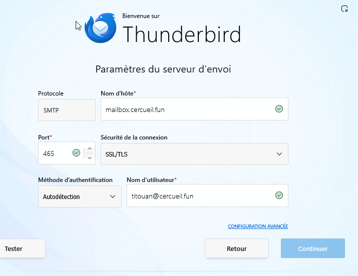
*Serveur sortant : SMTP sur mailbox.cercueil.fun, port 465 en SSL/TLS.*

*La racine de la PKI interne n'etant pas connue de Thunderbird, une exception permanente est enregistree pour mailbox.cercueil.fun:993.*

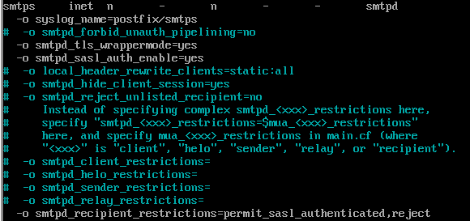
*Declaration du service smtps (465) : TLS en mode wrapper et authentification SASL exigee avant tout envoi.*

*Compte titouan@cercueil.fun operationnel : reception de mails internes et externes dans Thunderbird.*

## Interactions avec les autres briques

- Pare-feux : ouvertures limitees au SMTP 25 (Internet vers passerelle, passerelle vers mailbox), au 465/993 (LAN utilisateurs vers mailbox) et au LDAPS 636 (mailbox vers AD) ; ouverture ponctuelle du port 80 pour l'emission et le renouvellement Certbot.
- DNS : enregistrements MX, SPF, DKIM, DMARC et reverse sur la zone publique ; le routage passerelle vers mailbox utilise l'IP directe suite a un probleme de resolution interne.
- PKI : certificat interne pour Dovecot et le Postfix de la mailbox ; Let's Encrypt uniquement pour la face publique de la passerelle.
- Active Directory : annuaire d'authentification (LDAPS), comptes de service, SPN et keytabs du SSO Kerberos.

## Etat et limites

La chaine complete est fonctionnelle : envoi et reception internes, echanges avec des messageries externes (Gmail, Outlook) valides par les journaux, filtrage antivirus et antispam actifs, SSO Kerberos operationnel depuis les postes du domaine. Limites assumees et documentees : TLS opportuniste sur la passerelle publique (imposer `encrypt` violerait la RFC 2487), routage vers la mailbox par IP en dur en contournement du DNS interne, mot de passe du compte de service LDAP stocke en clair dans `dovecot.conf`, et renouvellement Certbot dependant d'une reouverture manuelle du port 80. La syntaxe de configuration Dovecot 2.4, recente et mal couverte par les documentations en ligne, a ete une source d'erreurs notable pendant le deploiement.
