# Miroir de dépôts Fedora (mises à jour du parc Linux)

Cette brique couvre la gestion des paquets et des mises à jour de l'ensemble du parc Fedora du SI cercueil.fun. Elle a connu deux états successifs, tous deux documentés ici :

1. un miroir local des dépôts Fedora (`updates` et `fedora`), monté sur une VM dédiée, synchronisé chaque nuit et servi en HTTP au parc, avec mise à jour automatique quotidienne des clients par timers systemd déployés via Ansible ;
2. après abandon du miroir (problème de flux retour vers les DMZ jamais résolu, remarque de soutenance imposant la migration des DNS sous Debian, alternative plus simple disponible), un accès direct aux dépôts officiels à travers le proxy Squid en liste blanche, avec dépôts épinglés sur un miroir maître unique et mises à jour quotidiennes conservées.

Le miroir a été entièrement fonctionnel pour les VLAN internes avant son retrait. Ce document présente ce qui a été construit, ce qui a fonctionné, ce qui a échoué et pourquoi, puis l'état final du service de mise à jour.

## Rôle dans l'infrastructure

Un miroir local est une copie, hébergée dans le LAN, des dépôts officiels Fedora. Les machines du parc, en particulier celles qui ne doivent pas avoir d'accès Internet, installent paquets et mises à jour depuis ce serveur interne en HTTP. Seule la machine miroir sort vers les dépôts officiels. Les objectifs poursuivis :

- **Bande passante** : un seul téléchargement WAN par paquet quelle que soit la taille du parc, puis distribution en LAN, le parc étant amené à s'étendre selon le sujet.
- **Disponibilité hors Internet** : les installations et mises à jour restent possibles si le lien WAN tombe.
- **Surface d'attaque réduite** : une seule règle de pare-feu (VLAN internes vers 10.0.30.5:80) au lieu de multiples autorisations sortantes.
- **Décharge du proxy** : des mises à jour planifiées simultanément sur tout le parc menaçaient de saturer le proxy Squid.

Le coût connu dès le départ : une empreinte disque importante (environ 164 Go mesurés pour une seule release Fedora) et une complexité de mise en place supérieure à la solution proxy seule.

## Machines concernées

| Machine | IP | VLAN / zone | Rôle |
|---|---|---|---|
| miroir (miroir.cercueil.fun) | 10.0.30.5 | VLAN 30 (zone serveurs interne) | Héberge les dépôts `updates` et `fedora`, servis en HTTP par Apache |
| ansible | 10.0.70.6 | VLAN 70 (administration) | Pilote les playbooks : déploiement du miroir et des clients, bascule des dépôts, rollback |
| proxy | 10.1.101.6 | DMZ (entre RTR_BORDER et FW_2) | Client de test représentatif des DMZ ; porte ensuite l'accès en liste blanche aux dépôts officiels |

Clients du miroir : le groupe d'inventaire Ansible `VMs_fedora` hors miroir, soit ansible, bastion, ca_int, dns_maitre, dns_interne, dns_externe, dns_esclave, machine_administration, serveur_web, webis, reverse_proxy, proxy, mail_gateway et mail_server.

Dimensionnement de la VM miroir : 2 vCPU, 2 Go de RAM, disque de 250 Go.

## Architecture et fonctionnement

### Structure des dépôts Fedora

Côté client, `dnf` s'appuie sur les fichiers `.repo` de `/etc/yum.repos.d/`. Un dépôt est une arborescence servie en HTTP composée de fichiers `.rpm` (les paquets) et de métadonnées XML regroupées dans un dossier `repodata/` à sa racine. Deux dépôts sont exploités :

- **`fedora`** : instantané de tout l'écosystème Fedora au moment de la release. Il sert à l'installation de nouveaux paquets.
- **`updates`** : uniquement les paquets ayant reçu une mise à jour depuis la release. C'est le canal de correctifs quotidien du parc.


*Fichiers de configuration `.repo` surveillés par dnf dans `/etc/yum.repos.d/` sur la machine miroir.*

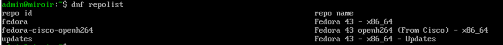

*Dépôts actifs retournés par `dnf repolist` : `fedora`, `fedora-cisco-openh264` et `updates`.*

Dans un `.repo` d'origine, l'URL des dépôts n'est pas fixe : la variable `metalink` pointe vers un fichier XML listant des miroirs géographiquement répartis, parmi lesquels dnf choisit. La variable `baseurl` (URL directe d'un dépôt unique) est commentée par défaut. La clé `gpgkey` référence la clé publique Fedora utilisée pour vérifier la signature des paquets.

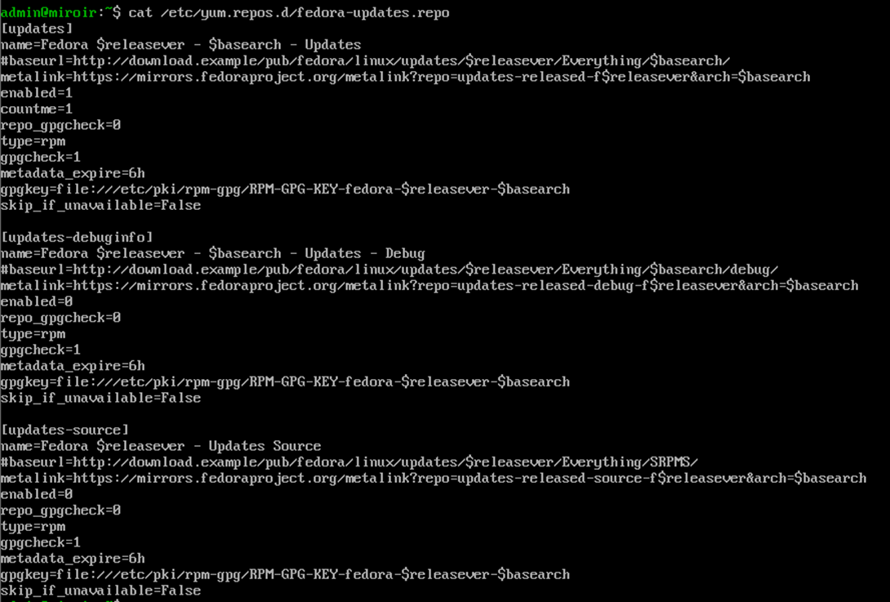

*Contenu du fichier `fedora-updates.repo` : ID `[updates]`, `baseurl` commenté, `metalink` actif et `gpgkey`.*

### Côté miroir : synchronisation et publication

La chaîne repose sur trois composants, déployés par le playbook [`config/playbook_miroir.yml`](config/playbook_miroir.yml) :

- **`reposync`** (plugin dnf) télécharge les `.rpm` du dépôt distant, en se limitant aux paquets absents localement ;
- **`createrepo_c`** régénère le dossier `repodata/` pour que l'arborescence locale soit un dépôt lisible par dnf ;
- **Apache (`httpd`)** expose `/var/www/html/mirror/` en HTTP sur le port 80, ouvert dans firewalld.

La synchronisation est portée par une unité systemd `mirror-sync.service` déclenchée chaque nuit à 00:00 par `mirror-sync.timer` (`OnCalendar=daily`, `Persistent=true`) :

```ini
[Service]
Type=oneshot
# Copie locale des .rpm du depot updates (derniere version de chaque paquet,
# architectures x86_64 et noarch, suppression des anciennes versions,
# rejet des paquets a signature GPG invalide)
ExecStart=/usr/bin/dnf reposync --repoid=updates --download-path=/var/www/html/mirror --newest-only --delete --gpgcheck --arch=x86_64 --arch=noarch
# Regeneration des metadonnees repodata/ du depot updates
ExecStart=/usr/bin/createrepo_c --update /var/www/html/mirror/updates
# Idem pour le depot fedora (base)
ExecStart=/usr/bin/dnf reposync --repoid=fedora --download-path=/var/www/html/mirror --newest-only --delete --gpgcheck --arch=x86_64 --arch=noarch
ExecStart=/usr/bin/createrepo_c --update /var/www/html/mirror/fedora
# Retablissement des contextes SELinux sous le DocumentRoot Apache
ExecStart=/usr/sbin/restorecon -R /var/www/html/mirror
```

Choix des options `reposync` :

- `--newest-only` et `--delete` bornent l'empreinte disque : seule la dernière version de chaque paquet est conservée, les versions obsolètes sont purgées après téléchargement ;
- `--arch=x86_64 --arch=noarch` correspond à l'architecture des VM, plus les paquets noarch nécessaires notamment à `dkms` utilisé pour le SIEM ;
- `--gpgcheck` supprime après téléchargement tout paquet dont la signature GPG est invalide. Les RPM signés étant copiés tels quels, les clients conservent `gpgcheck=1` avec la clé Fedora officielle.

Les dépôts sont servis aux URLs `http://10.0.30.5/mirror/updates/` et `http://10.0.30.5/mirror/fedora/`.

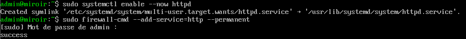

*Activation persistante d'Apache et ouverture du service HTTP dans firewalld sur le miroir.*

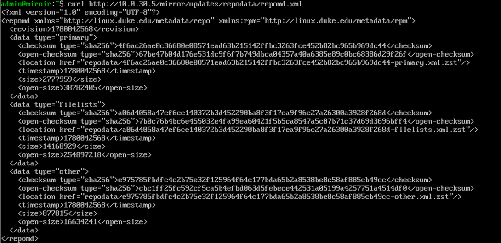

*Vérification de la publication : récupération du `repomd.xml` du dépôt via HTTP.*

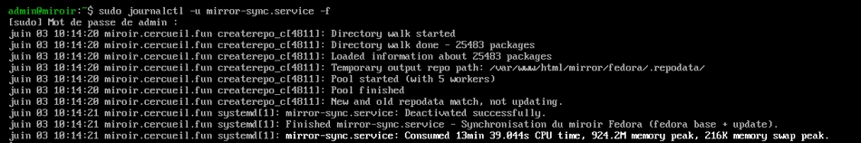

*Fin d'une synchronisation `mirror-sync.service` suivie dans journald : 25 483 paquets indexés par createrepo_c, environ 13 min de CPU.*

Volumétrie mesurée sur le miroir (x86_64 + noarch) : dépôt `fedora` 110 Go, dépôt `updates` 54 Go, soit environ 164 Go au total. Première synchronisation complète : environ 2 h 30.

### Côté clients : dépôts locaux et mise à jour quotidienne

Le playbook [`config/playbook_clients_miroir.yml`](config/playbook_clients_miroir.yml) configure chaque client (jamais le miroir lui-même, sous peine de casser `reposync`) :

```ini
# /etc/yum.repos.d/local-updates.repo deploye sur chaque client
[local-updates]
name=Fedora Updates - Miroir Local
baseurl=http://10.0.30.5/mirror/updates/
enabled=1
gpgcheck=1
gpgkey=file:///etc/pki/rpm-gpg/RPM-GPG-KEY-fedora-$releasever-$basearch
proxy=_none_
```

Un second `.repo` identique (`local-fedora`) pointe vers `/mirror/fedora/`. La directive `proxy=_none_` garantit que ces flux internes ne tentent pas de passer par le proxy Squid. Les dépôts publics `fedora` et `updates` sont désactivés par un override DNF5 (`/etc/dnf/repos.override.d/99-mirror-local.repo` avec `enabled=0`), afin qu'aucun client n'essaie de sortir vers Internet.

La mise à jour des clients est elle aussi un couple service/timer systemd : `client-update.service` exécute `dnf upgrade -y` chaque jour à 04:00, soit quatre heures après la synchronisation du miroir, laissant le temps à celle-ci de se terminer.

Points d'attention relevés pendant la mise au point :

- Fedora 43 utilise DNF5 : le module Ansible `ansible.builtin.dnf5` est obligatoire, l'ancien module `dnf` reposant sur python3-dnf incompatible avec les bindings DNF5 ;
- lors d'une montée de version de Fedora, le dépôt `fedora` de la nouvelle release devrait être resynchronisé intégralement, opération non réalisée sur la maquette par contrainte d'espace disque ESXi.

Le miroir alimente aussi l'outillage des autres briques : le playbook client installe depuis le miroir les paquets de base de l'infrastructure (tar, zip, perl, dkms, kernel-devel, rsyslog), prérequis notamment de l'agent de sauvegarde Veeam et de la collecte SIEM ([`config/prerequis_paquets_veeam.yml`](config/prerequis_paquets_veeam.yml)).

## Interactions avec les autres briques

- **Pare-feux (RTR_BORDER et FW_2)** : le modèle de flux visé se réduit à une règle TCP/80 des VLAN internes vers 10.0.30.5, plus la sortie HTTPS du miroir vers les dépôts officiels. C'est la traversée des pare-feux par les machines de DMZ qui a causé l'abandon (section suivante).
- **Proxy (Squid, 10.1.101.6)** : d'abord simple client de test du miroir, il devient après l'abandon le point de passage unique des mises à jour, avec une politique tout bloqué par défaut et les URLs des dépôts officiels en liste blanche (`dl.fedoraproject.org` en splice/nobump).
- **Ansible (10.0.70.6, VLAN 70)** : toute la brique est pilotée par playbooks : déploiement du miroir et des clients, bascule des dépôts, rollback, mises à jour quotidiennes. Les timers systemd ont été préférés à cron car systemd est toujours présent (aucune dépendance à un dépôt fonctionnel pour s'installer) et journald trace chaque exécution (`journalctl -u maj-auto.service`), exportable vers le SIEM.
- **DNS** : la remarque de soutenance du 3 juin imposant Debian ou FreeBSD pour les serveurs DNS aurait obligé à ajouter les dépôts Debian au miroir, doublant un stockage déjà conséquent. C'est l'une des trois raisons de l'abandon.
- **Sauvegarde et SIEM** : les paquets dkms, kernel-devel et rsyslog servis par le canal de mise à jour sont des prérequis de l'agent Veeam (VEEAM01.cercueil.local, 10.0.40.10) et de la remontée de journaux.
- **PKI** : pas de dépendance à la PKI interne ; l'intégrité des paquets repose sur la signature GPG Fedora, vérifiée au téléchargement sur le miroir puis à l'installation sur les clients.

## Le problème bloquant : perte du flux retour vers les DMZ

Le déploiement des clients a été validé sur l'ensemble des machines des VLAN internes (installation des six paquets de base depuis le miroir), mais échouait systématiquement sur les machines situées en DMZ entre RTR_BORDER et FW_2.

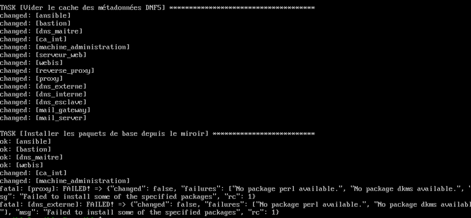

*Déploiement clients : tâches OK sur les VLAN internes, échec `No package ... available` sur les machines de DMZ (proxy, dns_externe), incapables de joindre le miroir.*

### Symptômes observés

Toutes les machines de DMZ échouaient à joindre le miroir en HTTP : les `curl -I http://10.0.30.5/mirror/fedora/repodata/repomd.xml` se terminaient en `curl: (28) Failed to connect to 10.0.30.5 port 80`.

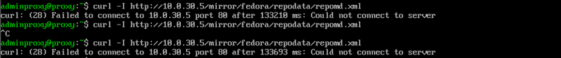

*Depuis le proxy (10.1.101.6, DMZ) : timeout de connexion vers 10.0.30.5:80.*

Les captures réseau ont localisé la perte du paquet :

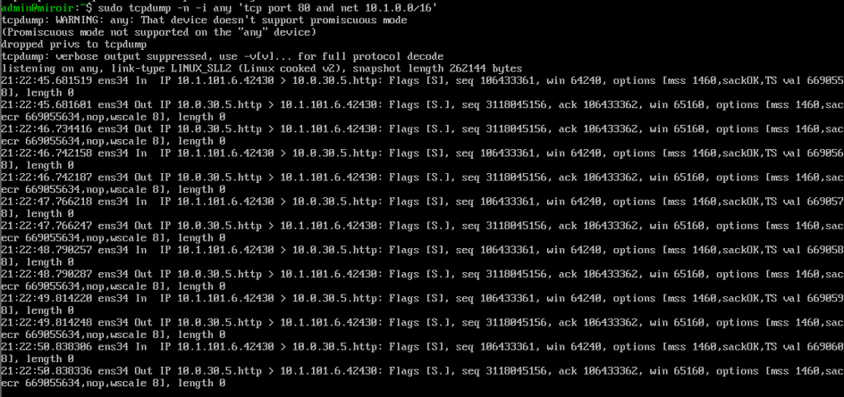

*Sur le miroir : le SYN du client DMZ arrive, le miroir répond SYN-ACK, puis le client retransmet indéfiniment son SYN.*

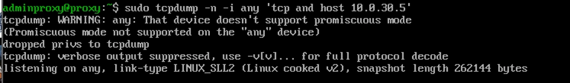

*Sur le proxy : aucun SYN-ACK reçu. Le paquet se perd entre la sortie du miroir et le client, à la seconde traversée de FW_2.*

Les journaux Live View d'OPNsense montraient des blocages `Default deny / state violation rule` (notamment de 10.0.32.4 vers 10.0.30.5:80) alors qu'aucune règle block n'était configurée au-dessus des règles pass.

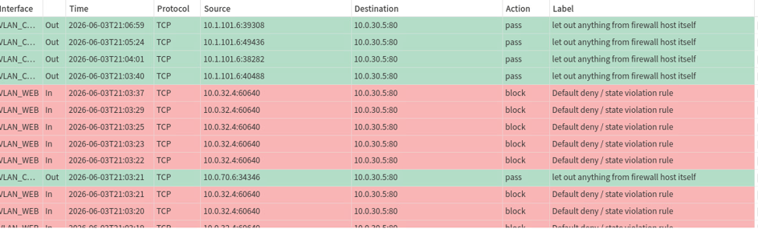

*Live View : le trafic émis par le pare-feu lui-même passe, les paquets du client sont rejetés par `Default deny / state violation rule`.*

### Pistes de diagnostic explorées

- Règles pass aller et retour entre le miroir 10.0.30.5:80 et le proxy 10.1.101.6, appliquées après chaque modification ; vérification qu'aucune règle block ne les précédait.
- Purge de la table d'états pf (Firewall > Diagnostics > States) pour forcer la réévaluation des règles.

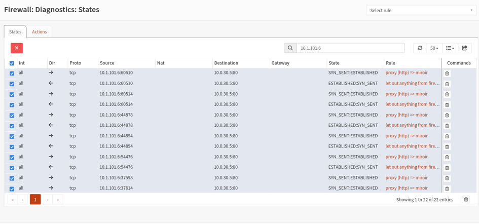

*Table d'états filtrée sur 10.1.101.6 : les connexions restent en `SYN_SENT:ESTABLISHED`, la poignée de main TCP ne se termine jamais.*

- Analyse du NAT sortant : en mode Automatic, OPNsense NATait tout le trafic sortant de l'interface DMZ, y compris le trafic inter-VLAN. Passage en mode Hybrid avec une règle manuelle No NAT (source 10.0.0.0/8, destination 10.0.0.0/8) placée avant les règles automatiques.

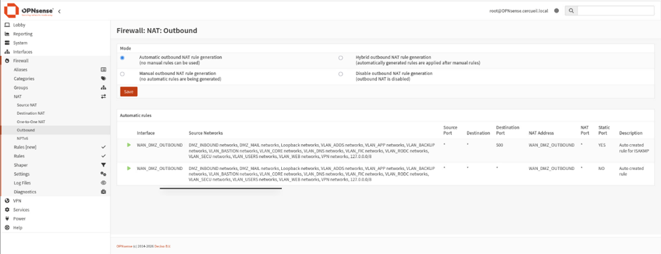

*Configuration initiale : génération automatique des règles de NAT sortant, appliquée aussi au trafic interne.*

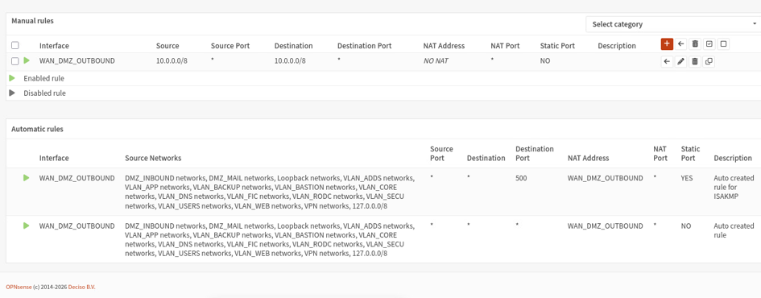

*Mode Hybrid : règle manuelle No NAT (source 10.0.0.0/8, destination 10.0.0.0/8) désactivant la translation pour le trafic inter-VLAN.*

- Captures de paquets sur OPNsense lui-même (Interfaces > Diagnostics > Packet Capture) pour suivre le SYN-ACK à l'intérieur du pare-feu, analyse des journaux filtrés par IP, vérification du routage des hôtes des deux côtés (`ip r`) et de l'étiquetage VLAN des port groups côté ESXi.

### Contournement fonctionnel mais inapplicable en production

Une seule configuration a rétabli le flux : une règle pass en ALL (tous protocoles, ports, sources et destinations) combinée à la règle No NAT. Le `curl` renvoyait alors `HTTP/1.1 200 OK`. Chaque tentative de durcissement de cette règle (restriction au protocole TCP, au port 80, aux interfaces réelles, à des sources et destinations précises), testée pourtant paramètre par paramètre, recassait immédiatement le flux.


*Exemple de règle durcie (TCP, source 10.1.101.6, destination port http) : dès que la règle n'est plus en ALL, le flux retombe en échec.*

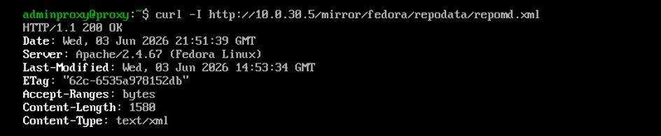

*Avec la règle ALL et le No NAT actifs : le proxy récupère le `repomd.xml` du miroir en HTTP 200.*

Une règle ALL n'étant pas conservable en production, le problème est resté non résolu.

## Décision d'abandon

Trois raisons cumulées :

1. le flux retour vers les DMZ est resté non résolu et la seule configuration fonctionnelle (règle ALL) était inacceptable en production ;
2. la contrainte de soutenance imposant Debian ou FreeBSD pour les serveurs DNS aurait exigé d'ajouter les dépôts Debian au miroir, soit environ un doublement d'un stockage déjà conséquent (164 Go) ;
3. une alternative plus simple couvrait le besoin : faire passer les machines sans accès Internet par le proxy Squid, tout bloqué par défaut sauf les URLs des dépôts officiels en liste blanche, en conservant l'automatisation quotidienne par playbook. Moins extensible à un agrandissement du parc, mais suffisante et plus économe en stockage.

Les timers `mirror-sync.timer` (miroir) et `client-update.timer` (clients) ont été arrêtés et désactivés via Ansible, puis le playbook de rollback [`config/annulation_miroir.yml`](config/annulation_miroir.yml) a ramené tout le parc à l'état antérieur : suppression des unités systemd et des `.repo` locaux, suppression de l'override désactivant les dépôts publics, purge du cache DNF5. La vérification post-rollback portait sur `dnf repolist` (retour des dépôts `fedora` et `updates` publics), le contenu de `/etc/yum.repos.d/` et l'état inactif du timer.

## État final : mises à jour via le proxy en liste blanche

Deux playbooks portent la solution retenue :

- [`config/bascule_depots_fedora.yml`](config/bascule_depots_fedora.yml) : sur toutes les VM Fedora, commente le `metalink` des dépôts actifs `[fedora]` et `[updates]` et active un `baseurl` épinglé sur le miroir maître `https://dl.fedoraproject.org/pub/fedora/linux`. Sous liste blanche, le metalink est inutilisable puisqu'il renvoie une liste dynamique de miroirs tiers aux domaines imprévisibles ; épingler un miroir unique réduit l'autorisation Squid à un seul domaine. Le playbook est idempotent (les regex ne matchent plus après bascule), sauvegarde chaque fichier avant modification, désactive le dépôt `fedora-cisco-openh264` (codec inutile sur serveur, qui ferait échouer dnf sous liste blanche) et termine par un `dnf makecache` non bloquant remontant un statut par hôte.

```yaml
# Extrait : epinglage du baseurl du depot [updates]
- name: "fedora-updates.repo | activer le baseurl du depot [updates]"
  ansible.builtin.replace:
    path: /etc/yum.repos.d/fedora-updates.repo
    regexp: '^#\s*baseurl=https?://download\.example/pub/fedora/linux/updates/\$releasever/Everything/\$basearch/$'
    replace: 'baseurl={{ fedora_mirror_base }}/updates/$releasever/Everything/$basearch/'
    backup: true
```

- [`config/maj_auto_quotidienne.yml`](config/maj_auto_quotidienne.yml) : redéploie la mise à jour quotidienne à 00:00 par timer systemd, désormais pour les deux OS du parc : `dnf -y upgrade --refresh` sur le groupe `VMs_fedora`, `apt-get update` puis `apt-get -y upgrade` (options `--force-confdef/--force-confold` pour ne jamais bloquer sur un prompt) sur le groupe `VMs_debian`. `Persistent=true` rattrape les mises à jour manquées si la VM était éteinte à minuit. Le `dnf upgrade` reste dans la release courante (baseurl épinglé sur /43/), une montée de version restant une opération explicite (`dnf system-upgrade`).

Les hôtes qui ne sortent pas en direct nécessitent en complément `proxy=http://10.1.101.6:3128` dans `/etc/dnf/dnf.conf` (ou `/etc/apt/apt.conf.d/00proxy` côté Debian) ; tant que ce n'est pas en place, l'échec de mise à jour est tracé dans le journal, comportement attendu.

## Limites

- Le problème de flux retour DMZ à travers FW_2 n'a jamais été élucidé (comportement pf/OPNsense non compris malgré les captures : la règle fonctionnait uniquement en ALL). Il est documenté comme point ouvert.
- La solution proxy en liste blanche fait dépendre toutes les mises à jour d'un miroir maître unique et du proxy : elle passe moins bien à l'échelle qu'un miroir local en cas d'agrandissement du parc.
- Le dépôt `fedora` complet d'une nouvelle release n'a jamais été synchronisé sur le miroir (contrainte d'espace ESXi) : une montée de version de Fedora n'était pas couverte du temps du miroir.

## Contenu du dossier

| Fichier | Description |
|---|---|
| `config/playbook_miroir.yml` | Configuration du serveur miroir : paquets, DocumentRoot, unité et timer `mirror-sync`, firewalld |
| `config/playbook_clients_miroir.yml` | Configuration des clients : `.repo` locaux, override DNF5, unité et timer `client-update` |
| `config/annulation_miroir.yml` | Rollback complet des clients vers les dépôts publics |
| `config/bascule_depots_fedora.yml` | Bascule metalink vers baseurl épinglé, compatible liste blanche proxy (état final) |
| `config/maj_auto_quotidienne.yml` | Mise à jour quotidienne Fedora (dnf) et Debian (apt) par timers systemd (état final) |
| `config/prerequis_paquets_veeam.yml` | Installation des paquets prérequis de l'agent Veeam sur les VM Fedora |
| `assets/` | Captures d'écran de la mise en place, des tests et du diagnostic réseau |
