# Pare-feux : RTR_BORDER (pfSense) et FW_2 (OPNsense)

## Role dans l'infrastructure

Le SI de cercueil.fun repose sur une architecture a double pare-feu. RTR_BORDER, sous pfSense, est le pare-feu perimetrique : il porte l'adresse publique de la maquette, expose les services publies et encadre les quatre DMZ. FW_2, sous OPNsense, est le pare-feu interne : il raccorde en etoile l'ensemble des VLAN du LAN (utilisateurs, serveurs, AD, PKI, securite) et les separe des DMZ. Tout flux entre Internet et le LAN traverse donc deux equipements de filtrage d'editeurs differents, et les quatre DMZ (INBOUND, OUTBOUND, MAIL, VPN) sont placees entre les deux.

## VM, adressage et VLAN

| VM | Systeme | Adresses IP principales | VLAN raccordes |
|---|---|---|---|
| RTR_BORDER | pfSense 2.8.1 | WAN publique 212.83.153.84/32 ; 10.1.100.1, 10.1.101.1, 10.1.102.1, 10.1.103.1 ; LAN d'administration 192.168.1.1/24 | 100, 101, 102, 103 (+ WAN et LAN profs) |
| FW_2 | OPNsense 26.1.6 | 10.1.100.2, 10.1.101.2 (WAN, passerelle amont 10.1.101.1), 10.1.102.2, 10.1.103.2 ; passerelles des VLAN internes, dont 10.0.30.1 (VLAN 30 Services Core) | 100, 101, 102, 103 et trunk 4095 vers les VLAN internes |

| VLAN | Zone | Sous-reseau |
|---|---|---|
| 100 | DMZ INBOUND (reverse proxy et WAF, DNS esclave) | 10.1.100.0/24 |
| 101 | DMZ OUTBOUND (DNS resolveur externe 10.1.101.5, proxy 10.1.101.6) | 10.1.101.0/24 |
| 102 | DMZ MAIL (MTA Postfix) | 10.1.102.0/24 |
| 103 | DMZ VPN (passerelle OpenVPN) | 10.1.103.0/24 |
| 10 a 72 | VLAN internes derriere FW_2 (LAN, fichiers, core, applicatif, backup, securite, DNS, ADDS, RODC, bastion, PKI) | 10.0.X.0/24 |

## Architecture et fonctionnement

### Support de virtualisation

Les deux pare-feux sont des VM ESXi. Un vSwitch dedie (vSwitch1) porte les port groups des quatre DMZ, auxquels RTR_BORDER est raccorde ; un second vSwitch porte les VLAN internes remis a FW_2 par un port group en trunk (PG_LAN_Trunk, VLAN 4095).

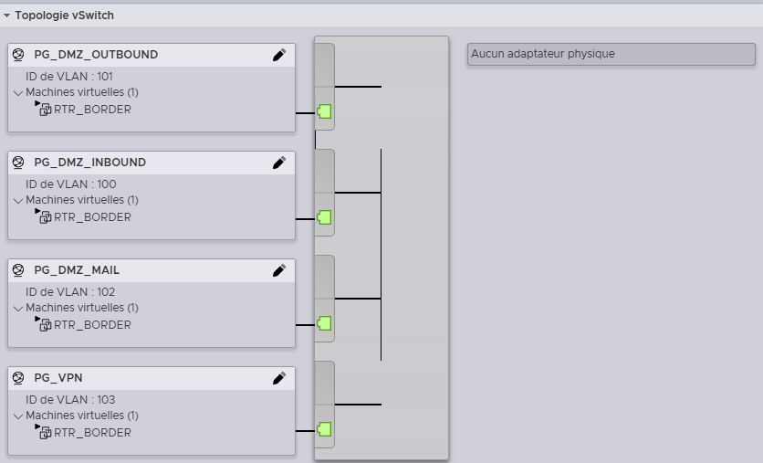

*Port groups PG_DMZ_OUTBOUND (101), PG_DMZ_INBOUND (100), PG_DMZ_MAIL (102) et PG_VPN (103) sur vSwitch1.*

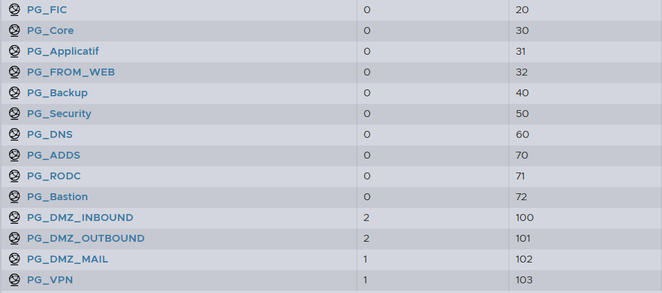

*Les VLAN internes (20 a 72) et les DMZ (100 a 103) declares sur l'hyperviseur.*

### RTR_BORDER (pfSense)

Le pare-feu de bordure comporte six interfaces : WAN (vSwitch0, acces Internet), LAN (vSwitch_Profs, acces d'administration des encadrants), puis OPT1 a OPT4 pour les DMZ.

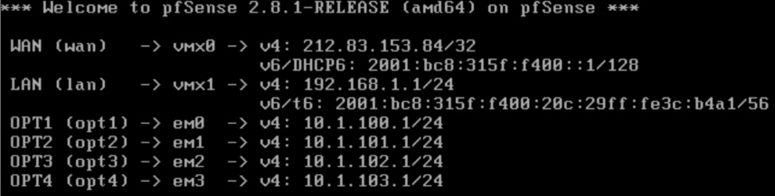

*Console de RTR_BORDER : WAN publique, LAN 192.168.1.1 et les quatre interfaces OPT en 10.1.10X.1/24.*

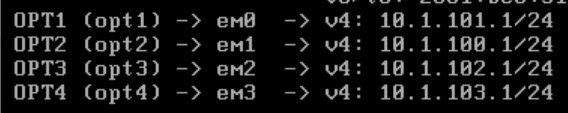

*Affectation finale apres correction : em0 porte la DMZ OUTBOUND (10.1.101.1), conformement aux port groups ESXi.*

pfSense bloque par defaut tout flux entrant sur les interfaces OPT. La politique de sortie repose sur un alias regroupant les reseaux prives RFC 1918 : une regle autorise les flux des DMZ vers toute destination qui n'est pas privee, ce qui revient a autoriser Internet tout en interdisant les rebonds entre zones internes.

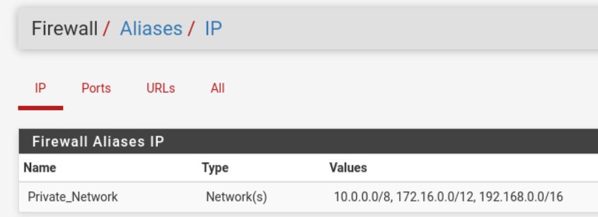

*Alias regroupant 10.0.0.0/8, 172.16.0.0/12 et 192.168.0.0/16.*

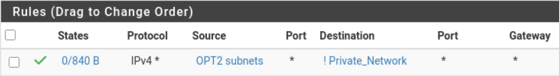

*Regle pass IPv4 depuis les sous-reseaux OPT2 vers !Private_Network : seul Internet est joignable.*

Deux regles complementaires ouvrent les services du pare-feu lui-meme : la resolution DNS (le resolveur Unbound de pfSense servait de DNS avant le deploiement de la brique DNS) et l'acces a l'interface web depuis les zones autorisees.

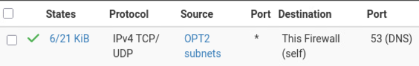

*Autorisation TCP/UDP 53 vers This Firewall, necessaire car la regle de sortie interdit les destinations privees.*

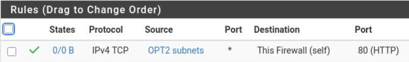

*Ouverture du webConfigurator depuis les sous-reseaux OPT ; cette regle a ete posee sur OPT1 et OPT2.*

Un serveur DHCP avait ete active sur la DMZ OUTBOUND pour les tests initiaux (plage 10.1.101.10 a 10.1.101.50), puis desactive une fois l'adressage statique en place.

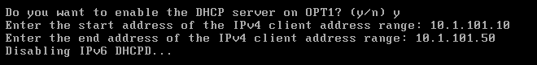

*Plage DHCP temporaire de la DMZ OUTBOUND, desactivee par la suite.*

### FW_2 (OPNsense)

FW_2 dispose de cinq cartes reseau : une par DMZ et une sur le trunk des VLAN internes. Son interface WAN est volontairement placee sur la DMZ OUTBOUND, avec RTR_BORDER (10.1.101.1) comme passerelle amont : tout trafic a destination inconnue remonte vers le pare-feu de bordure.

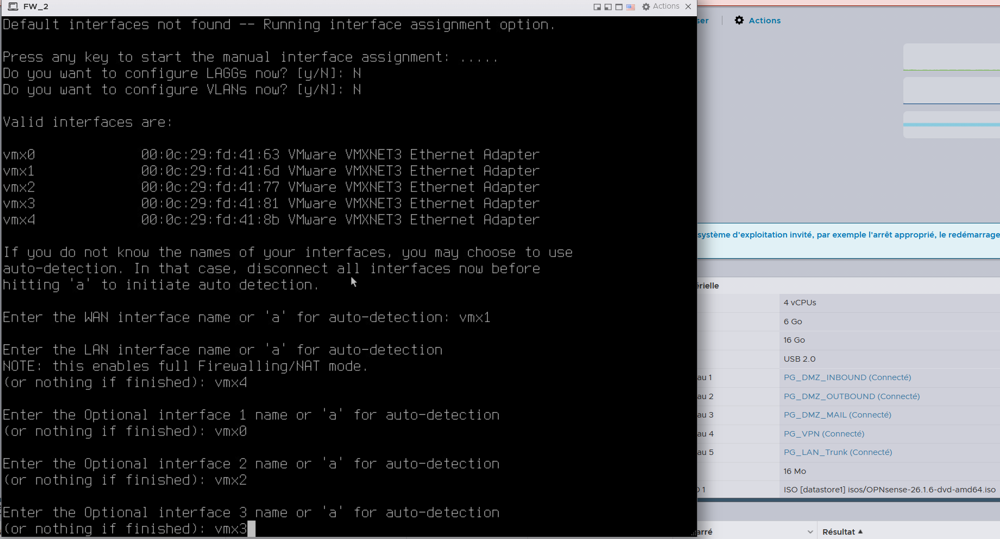

*Assignation console sur OPNsense 26.1.6 : vmx1 en WAN (DMZ OUTBOUND), vmx4 en LAN (trunk), vmx0/vmx2/vmx3 pour les autres DMZ. A droite, les cinq port groups de la VM.*

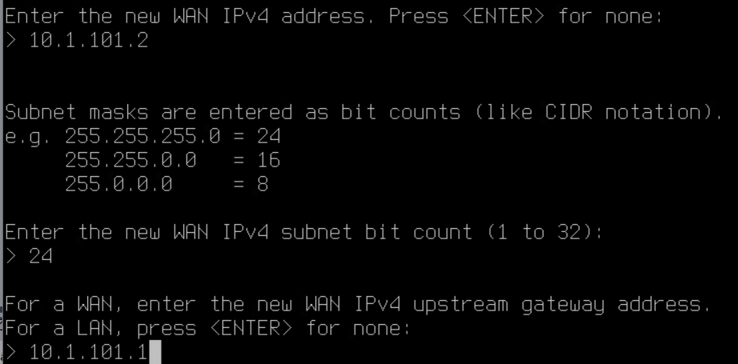

*WAN en 10.1.101.2/24 avec passerelle amont 10.1.101.1 (RTR_BORDER).*

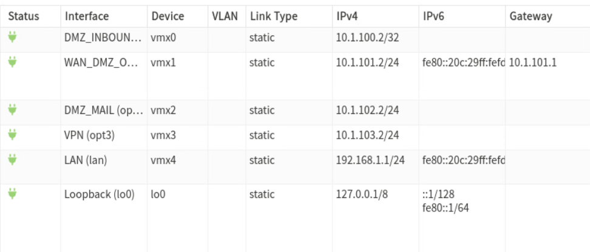

*Les interfaces DMZ_INBOUND, WAN_DMZ_OUTBOUND, DMZ_MAIL et VPN en 10.1.10X.2.*

Les VLAN internes sont declares sur l'interface trunk et la politique par defaut d'OPNsense (tout bloquer) est conservee. Les regles de base autorisent le HTTPS vers le pare-feu pour son administration, le DNS vers le pare-feu pour la resolution, et les flux vers les adresses non privees pour le VLAN 30 uniquement, ce qui interdit toute communication directe entre VLAN.

### Sortie web par le proxy

Une fois le proxy Squid deploye (10.1.101.6, DMZ OUTBOUND), les regles de sortie directe ont ete retirees de FW_2 : les VLAN en proxy explicite ne peuvent joindre que 10.1.101.6:3128, et les VLAN en mode transparent voient leurs flux 80/443 routes vers la passerelle proxy par policy-based routing. Le detail des regles est conserve dans [config/opnsense-regles-proxy.txt](config/opnsense-regles-proxy.txt).

## Durcissement de RTR_BORDER

Le durcissement suit le benchmark CIS pfSense. Points appliques :

- interface d'administration en HTTPS uniquement, timeout de session de 10 minutes, menu console protege par mot de passe ;
- banniere legale SSH signalant que l'acces est reserve aux administrateurs et journalise (`/etc/issue.net` reference par `Banner` dans `sshd_config`) ;
- protection anti bruteforce de l'interface de connexion (seuil 20, blocage 300 s) ;
- sauvegarde automatique chiffree de la configuration vers les serveurs Netgate (Auto Config Backup) a chaque modification ;
- DNSSEC active sur le resolveur Unbound ; fuseau horaire configure.

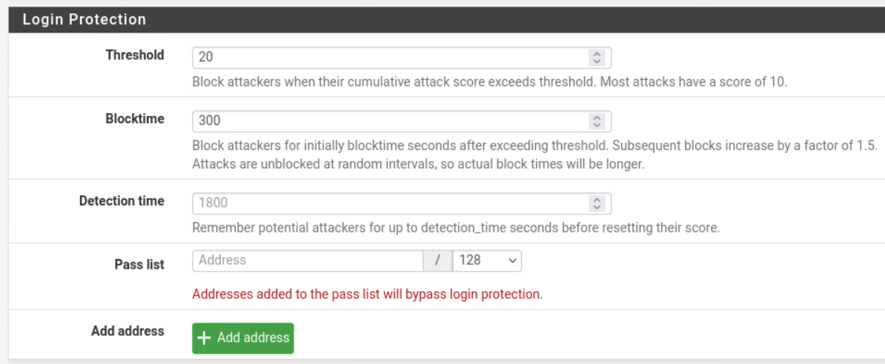

*Parametres de blocage des tentatives de connexion sur le webConfigurator.*

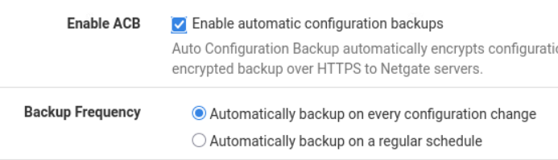

*Sauvegarde chiffree de la configuration a chaque changement.*

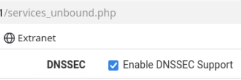

*Activation de DNSSEC sur le service DNS du pare-feu.*

## Interactions avec les autres briques

- **Proxy** : seul point de sortie web du LAN ; FW_2 force les flux 80/443 vers 10.1.101.6 (explicite ou transparent).
- **DNS** : le resolveur externe (10.1.101.5) et le DNS esclave (DMZ INBOUND) dependent des ouvertures 53 sur les deux pare-feux ; avant leur mise en service, Unbound sur pfSense assurait la resolution.
- **Messagerie** : le MTA Postfix (DMZ MAIL, VLAN 102) est encadre par les deux pare-feux pour les flux SMTP entrants et sortants.
- **VPN** : la passerelle OpenVPN (DMZ VPN, VLAN 103) est publiee au travers de RTR_BORDER.
- **Reverse proxy / WAF** : expose en DMZ INBOUND derriere RTR_BORDER, il relaie vers le VLAN 32 au travers de FW_2.
- **PKI** : le certificat du webConfigurator doit etre emis par la CA interne (point identifie, non realise).
- **AD** : l'administration des pare-feux par comptes LDAP/RADIUS adosses a l'AD a ete etudiee sans etre tranchee.
- **SIEM** : l'export syslog vers Graylog (VLAN 50) est identifie comme prerequis du durcissement, non raccorde.

## Etat et limites

- Pas de haute disponibilite : un seul equipement par niveau, la recommandation CIS sur le peer HA est sans objet dans la maquette.
- Journalisation des regles de filtrage non generalisee et export syslog vers le SIEM non mis en place.
- Certificat PKI non installe sur l'interface d'administration ; comptes par defaut a remplacer par des mots de passe forts (action relevee comme prioritaire).
- Politique ICMP non formalisee (aucun echo autorise au moment de la redaction).
- Certaines regles conservent un port destination generique et devaient etre resserrees (revue CIS 4.1.3).
- La documentation de FW_2 est moins detaillee que celle de RTR_BORDER ; le detail des regles par VLAN n'a pas ete consigne.
