# PKI : autorite de certification interne (Cercueil-Fun)

## Role du service

La PKI fournit la chaine de confiance interne du SI Cercueil-Fun. Elle emet et gere les certificats X.509 utilises par les autres briques : LDAPS sur les controleurs de domaine Active Directory, certificats serveurs (VPN, mail, web interne), certificats clients pour l'authentification des utilisateurs au VPN, et publication des listes de revocation (CRL).

L'architecture retenue est une hierarchie a deux niveaux :

- une autorite racine (Root CA) geree manuellement avec OpenSSL, maintenue hors ligne ;
- une autorite intermediaire (Intermediate CA) sous Dogtag Certificate System, seule autorite en ligne, qui assure l'emission courante, la validation des demandes, les revocations et la publication des CRL. Dogtag embarque egalement un sous-systeme de signature OCSP (cle dediee generee a l'installation).

Ce decoupage limite l'exposition de la cle racine : si l'intermediaire est compromise, elle peut etre revoquee et re-emise par la racine sans invalider l'ancre de confiance deployee sur l'ensemble du parc.

## VM, IP et VLAN

| VM | Role | OS | IP | VLAN |
|---|---|---|---|---|
| CA Root | Autorite racine hors ligne (OpenSSL) | Fedora Linux | 10.0.70.3 | 70 (serveurs de confiance) |
| ica01.cercueil.local | Autorite intermediaire (Dogtag + 389 DS local) | Fedora Linux | 10.0.70.4 | 70 (serveurs de confiance) |

Machines en interaction directe : dc01.cercueil.local (AD/KDC, 10.0.70.5), le resolveur DNS interne (10.0.60.2, VLAN 60) et la machine d'administration (10.0.30.19) qui detient la chaine de certificats publics dans `~/Chain` et sert de point de passage pour les demandes.

La VM racine est eteinte la majorite du temps. Elle n'est demarree que pour signer ou renouveler le certificat de l'intermediaire et quelques certificats particuliers (LDAPS des DC). Aucun flux entrant n'est necessaire vers elle ; son interface reseau n'a ete configuree que pour les transferts SCP vers ica01 lors de la mise en place.

## Autorite racine (10.0.70.3)

La racine est une CA OpenSSL classique : arborescence `/root/ca` (certs, newcerts, crl, private, index.txt, serial) en mode 700, cle privee RSA 4096 chiffree AES-256, certificat autosigne SHA-256 d'une duree de 7300 jours (20 ans) au nom de l'organisation Cercueil-Fun. Le disque de la VM est chiffre (passphrase LUKS demandee au demarrage), ce qui protege la cle racine meme en cas de vol du fichier VMDK sur l'hyperviseur.

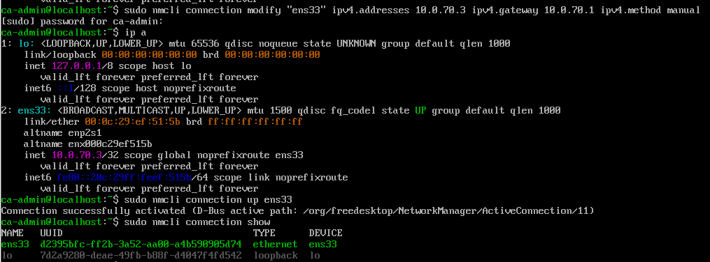

*Configuration reseau statique de la racine (nmcli, ens33, 10.0.70.3/32, passerelle 10.0.70.1).*

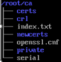

*Arborescence OpenSSL de la racine : certs, crl, newcerts, private, index.txt (registre des emissions) et serial.*

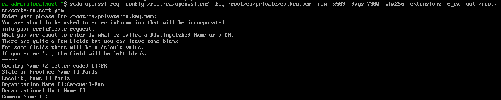

*Emission du certificat racine : SHA-256, 7300 jours, extensions v3_ca, DN C=FR, O=Cercueil-Fun.*

La configuration OpenSSL complete est dans [`config/openssl-root-ca.cnf`](config/openssl-root-ca.cnf). Deux points structurants :

```ini
[ policy_strict ]
countryName      = match     # la racine ne signe que pour FR / Cercueil
organizationName = match

[ v3_intermediate_ca ]
basicConstraints = critical, CA:true, pathlen:0   # pas de sous-CA sous l'intermediaire
keyUsage         = critical, digitalSignature, cRLSign, keyCertSign
```

### Certificats LDAPS des controleurs de domaine

Les certificats de dc01 et rodc01 sont signes directement par la racine (825 jours, `extendedKeyUsage = serverAuth`, SAN DNS) car ils ont ete necessaires avant que l'intermediaire ne soit operationnelle : Dogtag exige un annuaire, et l'AD exige LDAPS pour etre integre proprement. Le gabarit de requete est dans [`config/openssl-dc01.cnf`](config/openssl-dc01.cnf).

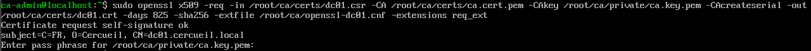

*Signature de la CSR de dc01 par la cle racine (subject C=FR, O=Cercueil, CN=dc01.cercueil.local).*

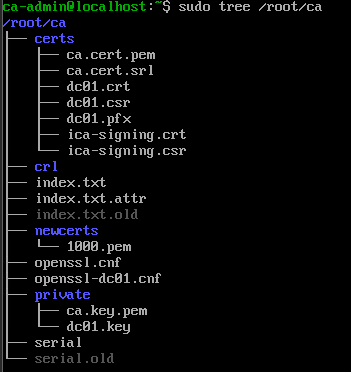

*Etat final de /root/ca : certificats dc01 (crt, csr, pfx), certificat et CSR de l'intermediaire (ica-signing), chaine et cles privees.*

Le certificat et sa cle sont convertis en PKCS#12 (`dc01.pfx`) pour Windows, transferes vers le DC via un partage SMB temporaire (`smbclient //dc01.cercueil.local/temp`), importes dans le magasin Personnel de l'ordinateur (`certlm.msc`), puis le fichier `.pfx` est detruit avec `shred -u` sur les machines de transit.

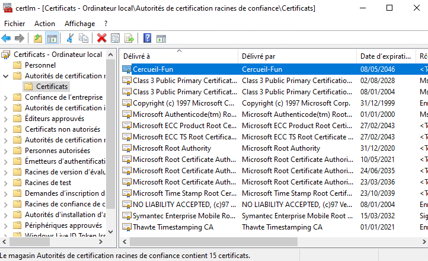

*Magasin "Autorites de certification racines de confiance" du DC : l'ancre Cercueil-Fun est presente (expiration 2046).*

## Autorite intermediaire ica01 (10.0.70.4)

### Prerequis reseau et integration au domaine

La VM est configuree en IP statique, avec le resolveur interne et une entree hosts vers le DC :

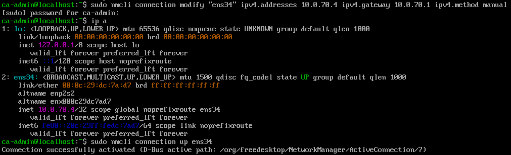

*Configuration de l'interface ens34 en 10.0.70.4/32, passerelle 10.0.70.1.*

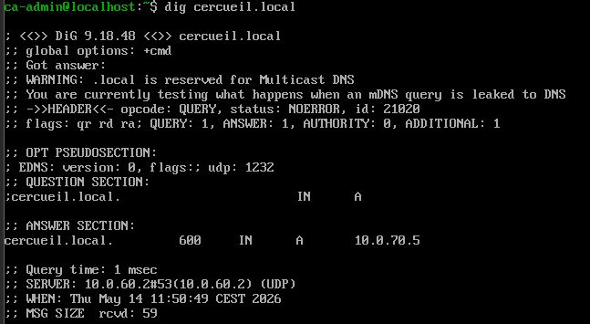

*Verification de la resolution : cercueil.local repond 10.0.70.5 (dc01) via le resolveur 10.0.60.2. L'avertissement dig rappelle que .local est reserve mDNS, limite assumee du plan de nommage du lab.*

`systemd-resolved` reecrivait `/etc/resolv.conf` a chaque demarrage ; le service a ete desactive et le fichier fige :

```bash
sudo systemctl disable systemd-resolved
echo "nameserver 10.0.60.2" | sudo tee /etc/resolv.conf
sudo chattr +i /etc/resolv.conf     # empeche toute reecriture
```

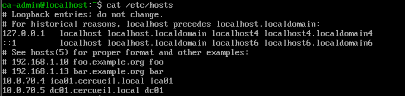

*Entrees statiques : ica01 (10.0.70.4) et dc01 (10.0.70.5), en secours de la resolution DNS.*

L'integration a Active Directory suit la chaine realmd / sssd / adcli. Kerberos etant sensible a la derive d'horloge, chrony est pointe sur le DC :

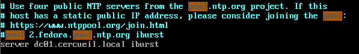

*chrony synchronise sur dc01.cercueil.local (iburst), les serveurs publics du pool Fedora sont commentes.*

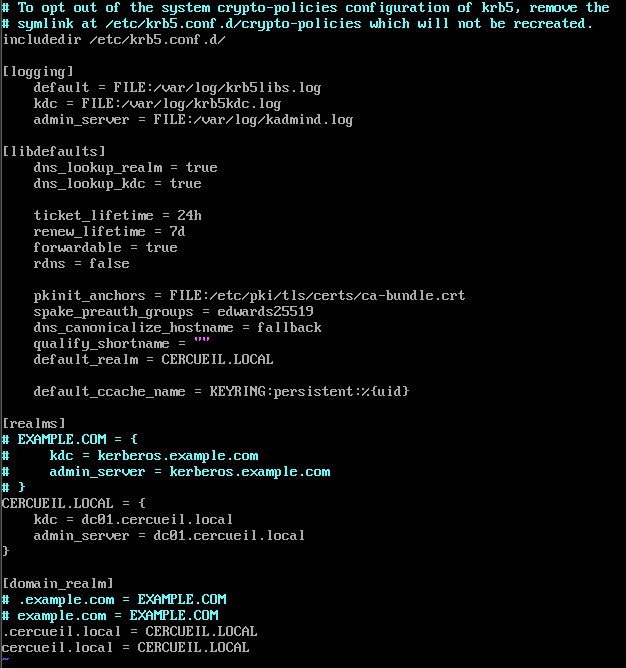

*krb5.conf : realm par defaut CERCUEIL.LOCAL, KDC et admin_server sur dc01, mapping domain_realm.*

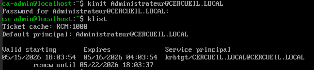

*Validation Kerberos avant la jonction : kinit Administrateur@CERCUEIL.LOCAL puis klist (TGT krbtgt obtenu). Regle adoptee pendant le deploiement : ne pas poursuivre tant que cette etape echoue.*

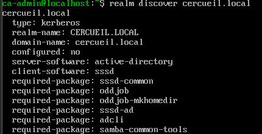

*realm discover cercueil.local : type kerberos, server-software active-directory, client sssd.*

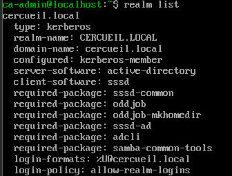

*Apres realm join : configured kerberos-member, login-format %U@cercueil.local.*

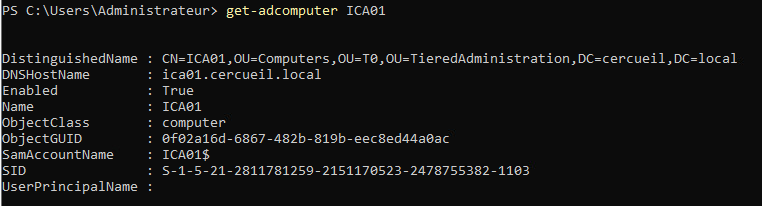

*Cote AD, le compte machine ICA01 est place dans l'OU T0 du modele d'administration en tiers (OU=T0,OU=TieredAdministration), coherent avec la criticite d'une CA.*

La creation automatique des homedirs pour les comptes AD est activee via `authselect select sssd with-mkhomedir` et le service oddjobd.

### Annuaire local 389 Directory Server

Dogtag stocke ses certificats, demandes et utilisateurs dans un annuaire LDAP. Une instance 389 DS dediee et locale (`pki-ldap`, suffixe `dc=pki,dc=cercueil,dc=local`, ecoute sur 127.0.0.1:389) a ete preferee a une dependance vers l'AD : la CA reste fonctionnelle meme si le domaine est indisponible, et aucune donnee de la PKI ne transite hors de la VM. Le fichier d'instance est dans [`config/ds.inf`](config/ds.inf).

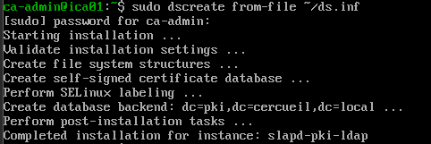

*dscreate from-file ~/ds.inf : creation de l'instance slapd-pki-ldap et du backend dc=pki,dc=cercueil,dc=local.*

### Installation Dogtag en mode CA externe (deux passes pkispawn)

Dogtag est deploye avec `pkispawn` en mode `pki_external=True`, ce qui permet de faire signer le certificat de la CA intermediaire par la racine hors ligne :

- la premiere passe ([`config/ca-external-step1.cfg`](config/ca-external-step1.cfg)) genere la cle de signature (RSA 4096, SHA256withRSA) et la CSR `ica-signing.csr`. Les numeros de serie aleatoires sont actives (`pki_enable_random_serial_numbers`, plage 1000000000 a 2000000000) pour eviter les numeros previsibles ;
- la CSR est ensuite transferee vers la racine (SCP vers 10.0.70.3), signee avec les extensions `v3_intermediate_ca` (CA:true, pathlen:0, cRLSign, keyCertSign, validite 3650 jours), puis le certificat et la chaine `ca-chain.crt` reviennent sur ica01 ;
- la seconde passe ([`config/ca-external-step2.cfg`](config/ca-external-step2.cfg)) importe le certificat signe et la chaine et finalise l'instance `pki-tomcat`.

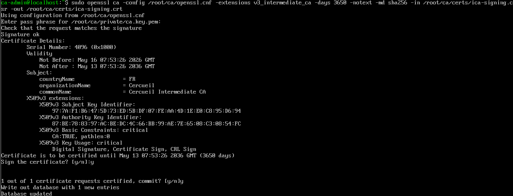

*Signature de la CSR de l'intermediaire par la racine : CN=Cercueil Intermediate CA, basicConstraints critical CA:true pathlen:0, keyUsage Digital Signature + Certificate Sign + CRL Sign, validite jusqu'en 2036.*

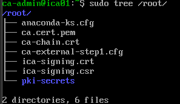

*Retour sur ica01 : ca.cert.pem (racine), ica-signing.crt (intermediaire signee) et ca-chain.crt prets pour la seconde passe de pkispawn.*

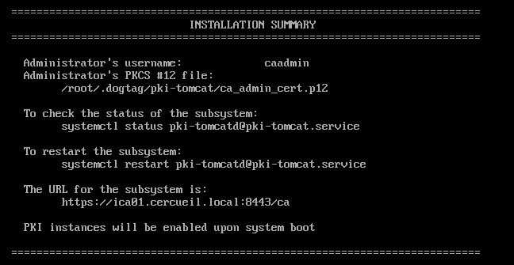

*Fin de la seconde passe : instance pki-tomcat installee, compte administrateur caadmin (PKCS#12 dans /root/.dogtag), interface sur https://ica01.cercueil.local:8443/ca.*

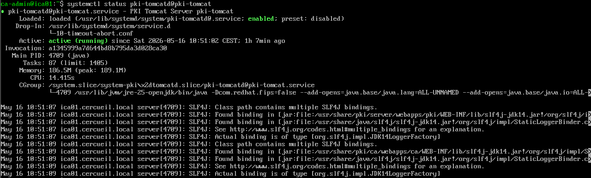

*Service pki-tomcatd@pki-tomcat actif (JVM Tomcat portant les webapps Dogtag).*

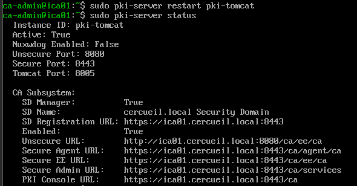

*pki-server status : security domain cercueil.local, URLs End Users (ca/ee), Agent (ca/agent) et Admin (ca/services) sur le port 8443.*

Le certificat racine est egalement installe dans le trust store systeme d'ica01 (`/etc/pki/ca-trust/source/anchors/` puis `update-ca-trust`), et le certificat administrateur est importe dans la base NSS locale pour piloter la CA en CLI (`pk12util -i ca_admin.cert -d ~/.dogtag/nssdb`).

Le pare-feu local n'expose que le necessaire :

```bash
firewall-cmd --permanent --add-service=https      # interface Dogtag
firewall-cmd --permanent --add-port=8443/tcp      # port applicatif Tomcat
firewall-cmd --permanent --add-service=kerberos   # integration AD
```

### Droits d'administration Dogtag

L'installation cree quatorze groupes internes (Certificate Manager Agents, Registration Manager Agents, Administrators, Auditors, Security Domain Administrators, etc.). Le compte `caadmin` a ete ajoute au groupe Registration Manager Agents pour pouvoir approuver les demandes d'enregistrement depuis l'interface Agent Services.

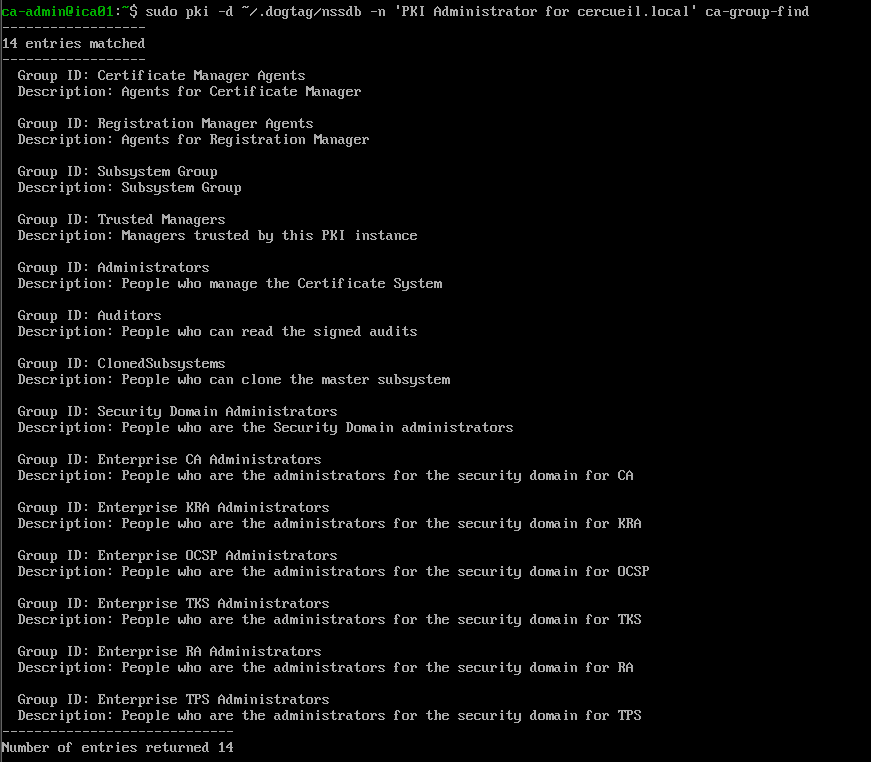

*Liste des groupes de l'instance CA (pki ca-group-find), dont les agents de validation et les administrateurs du security domain.*

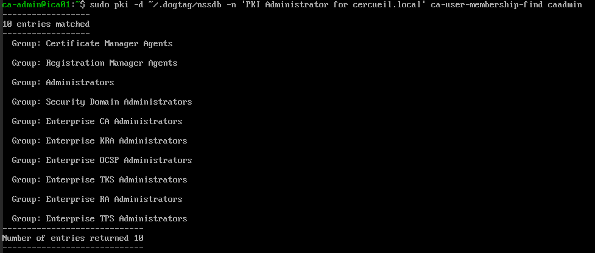

*Appartenances finales de caadmin : agents Certificate Manager et Registration Manager, administrateur du security domain et des sous-systemes.*

## Fonctionnement : emission, validation, revocation

L'interface web Dogtag (https://ica01.cercueil.local:8443/ca) expose deux portails distincts, ce qui materialise la separation demandeur / valideur :

- SSL End Users Services : depot des demandes (CSR) par les administrateurs des services ;
- Agent Services : validation, revocation et publication de CRL, reserve aux agents (authentification par certificat client, le certificat de la CA intermediaire devant etre importe dans le navigateur).

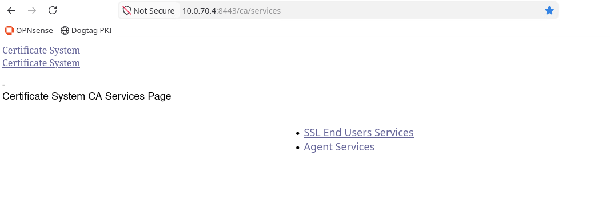

*Portail Certificate System sur ica01 : SSL End Users Services pour les demandes, Agent Services pour la validation.*

Le cycle d'un certificat serveur est le suivant : le service genere sa cle privee et sa CSR localement (la cle privee ne quitte jamais le serveur), la CSR est deposee dans End Users avec le profil adapte (Manual Server Certificate Enrollment pour les serveurs, profil User pour les certificats clients VPN dont le CN doit correspondre au CN du compte AD), puis un agent relit et approuve la demande dans Agent Services, et le certificat emis est recupere en Base64.

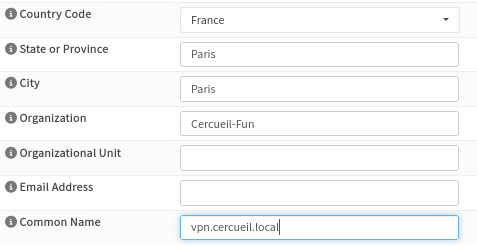

*Exemple de DN pour un certificat serveur : O=Cercueil-Fun, CN=vpn.cercueil.local.*

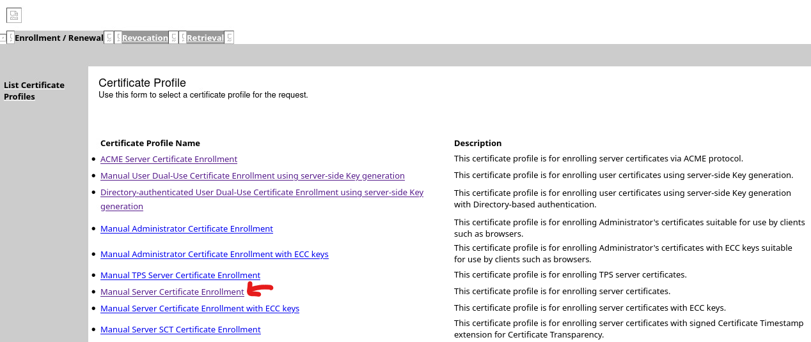

*Profils d'enrolement proposes par Dogtag ; les certificats serveurs utilisent Manual Server Certificate Enrollment.*

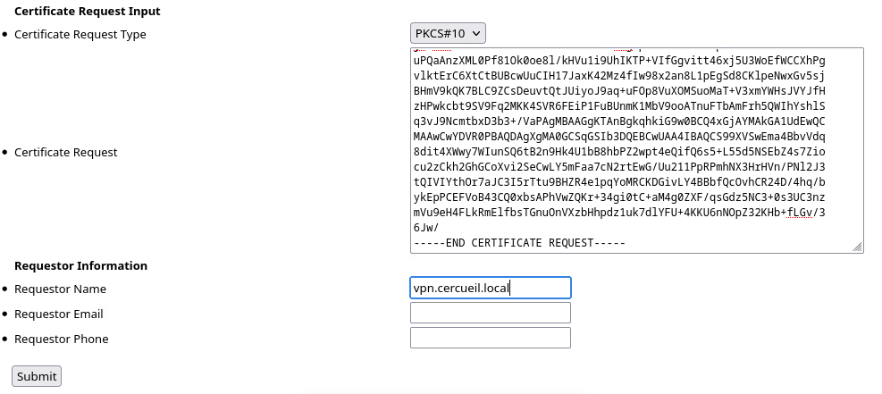

*Depot d'une CSR PKCS#10 (ici pour vpn.cercueil.local) dans le portail End Users.*

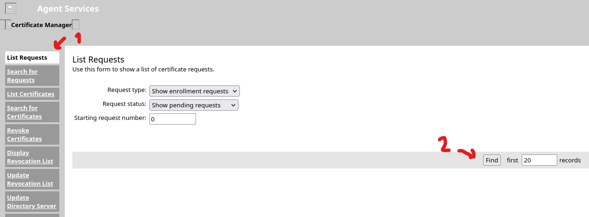

*Agent Services : listage des demandes en attente avant relecture et approbation. Le meme menu porte les fonctions Revoke Certificates, Display Revocation List et Update Revocation List (publication CRL).*

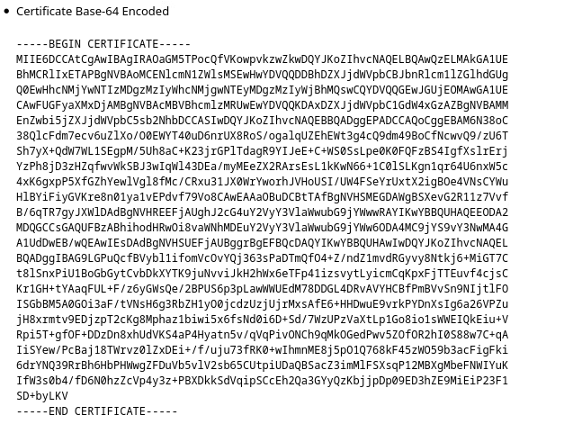

*Certificat signe restitue en Base64, pret a etre installe sur le service demandeur.*

La revocation suit le meme circuit dans Agent Services (Revoke Certificates), la CRL etant regeneree et publiee via Update Revocation List. La cle de signature OCSP est en place (generee a l'installation, SHA256withRSA), le repondeur n'a pas ete expose comme service autonome.

## Diffusion de la confiance sur le parc

Les certificats publics (racine `ca.cert.pem`, intermediaire `ica-signing.crt`, chaine `ca-chain.crt`) sont centralises dans `~/Chain` sur la machine d'administration, qui est aussi le noeud de controle Ansible.

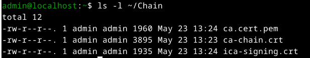

*Le dossier ~/Chain de la machine d'administration : les trois fichiers publics distribues au parc.*

Le deploiement du truststore est automatise par deux playbooks Ansible, un par famille d'OS car les mecanismes different :

- [`config/deploy_ca_truststore_fedora.yml`](config/deploy_ca_truststore_fedora.yml) : copie dans `/etc/pki/ca-trust/source/anchors/` puis `update-ca-trust extract`, verification par `trust list | grep cercueil` ;
- [`config/deploy_ca_truststore_debian.yml`](config/deploy_ca_truststore_debian.yml) : copie dans `/usr/local/share/ca-certificates/` puis `update-ca-certificates`, verification par `openssl verify` de l'intermediaire contre le magasin systeme.

Les deux playbooks verifient la presence des sources avant toute copie et ne declenchent la mise a jour du magasin que si un fichier a change (handler). Piege rencontre sur Debian, documente dans le playbook :

```yaml
#  - EXTENSION : le fichier DOIT se terminer par .crt ET etre en PEM,
#                sinon update-ca-certificates l'IGNORE silencieusement.
#                -> ca.cert.pem est donc renomme en .crt au moment de la copie.
ca_files:
  - src: ca.cert.pem
    dest: cercueil-root-ca.crt
  - src: ica-signing.crt
    dest: cercueil-intermediate-ca.crt
```

Sur les postes Windows, l'import se fait dans le magasin machine (`certlm.msc`, Autorites de certification racines de confiance), comme montre plus haut pour le DC.

## Interactions avec les autres briques

| Brique | Interaction |
|---|---|
| Active Directory (dc01, rodc01) | Certificats LDAPS signes par la racine ; ica01 est membre du domaine (realmd/sssd, compte machine en OU T0) ; Kerberos et NTP fournis par dc01 |
| DNS | Resolveur interne 10.0.60.2 ; resolution de cercueil.local et des enregistrements des CA |
| Pare-feux (OPNsense) | La CA int n'expose que 8443/tcp (et https) sur le VLAN 70 ; les transferts SCP et SMB de mise en place ont necessite des ouvertures temporaires ; la racine est hors ligne donc sans regle permanente |
| VPN | Certificats serveur (vpn.cercueil.local) et certificats clients utilisateurs emis par Dogtag ; le CN client doit correspondre au compte AD |
| Ansible | Distribution du truststore (racine + intermediaire) sur les groupes VMs_fedora et VMs_debian depuis la machine d'administration |
| Autres services (mail, web...) | Workflow CSR via End Users / Agent Services avec les profils serveur de Dogtag |

## Exploitation

L'ordre de demarrage sur ica01 importe : l'annuaire d'abord, Dogtag ensuite.

```bash
# annuaire local puis instance PKI
sudo systemctl start dirsrv@pki-ldap
sudo pki-server start pki-tomcat        # verification : pki-server status

# arret propre (sauvegardes)
sudo pki-server stop
sudo systemctl stop dirsrv@pki-ldap
```

La racine reste eteinte hors operations de signature. Les sauvegardes de l'intermediaire se font a froid apres arret des deux services.

## Problemes rencontres et solutions

- Depots inaccessibles depuis le VLAN 70 pendant l'installation : la VM a ete basculee temporairement sur le port group PG_CORE de l'ESXi (adresse en 10.0.30.x) le temps d'installer les paquets (sssd, adcli, samba-client...), puis remise dans le VLAN 70. Ce contournement date d'avant la mise en service du miroir de paquets interne.
- `/etc/resolv.conf` ecrase par systemd-resolved : service desactive et fichier rendu immuable (`chattr +i`).
- `update-ca-certificates` (Debian) ignore silencieusement les certificats sans extension `.crt` : renommage systematique a la copie dans les playbooks.
- Transferts initiaux : `PermitRootLogin` et `PasswordAuthentication` ont ete actives ponctuellement dans sshd pour les echanges de fichiers, puis retires immediatement ; les fichiers PKCS#12 contenant des cles privees ont ete effaces avec `shred -u` apres import.
- Derive d'horloge bloquant Kerberos : chrony pointe sur le DC ; la jonction au domaine n'a ete tentee qu'apres un `kinit` reussi.
- Acces Agent Services refuse par defaut : il exige une authentification par certificat, donc l'import prealable du certificat d'agent dans le navigateur, et l'ajout de `caadmin` au groupe Registration Manager Agents pour approuver les demandes d'enregistrement.

## Etat et limites

- La hierarchie deux niveaux est operationnelle : racine hors ligne (validite 20 ans), intermediaire Dogtag (validite 10 ans, pathlen 0), emission et revocation fonctionnelles via l'interface web.
- La CRL est generee et publiee par Dogtag (Update Revocation List) mais il n'y a pas de point de distribution HTTP dedie ni de repondeur OCSP expose ; les clients reposent sur le truststore deploye et sur la consultation manuelle de la CRL.
- Les certificats LDAPS des DC sont signes directement par la racine (contrainte de chronologie du deploiement) ; leur renouvellement (825 jours) imposera de redemarrer la racine, la cible naturelle etant une re-emission par l'intermediaire.
- Le suffixe `.local` du domaine entre en conflit avec mDNS (avertissement dig) ; contrainte heritee du plan de nommage AD du projet.
- L'interface Dogtag est parfois consultee par IP (https://10.0.70.4:8443), ce qui declenche un avertissement de certificat puisque le certificat serveur porte le nom ica01.cercueil.local.
