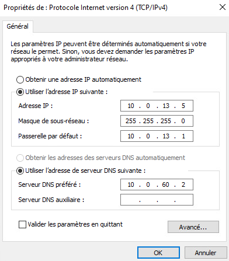
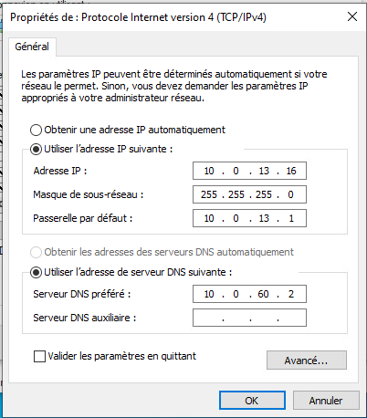
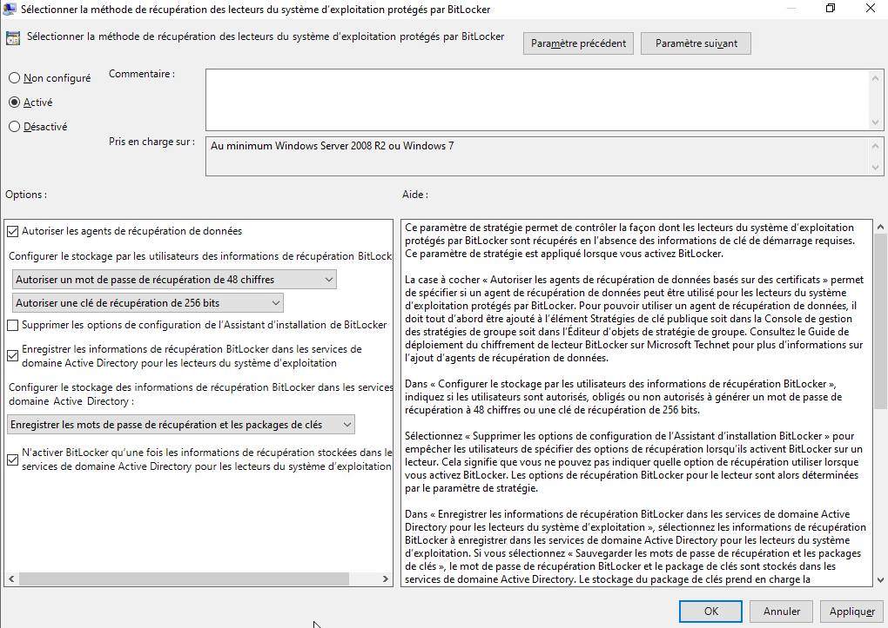
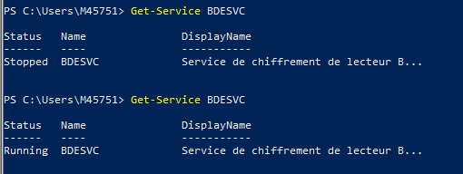
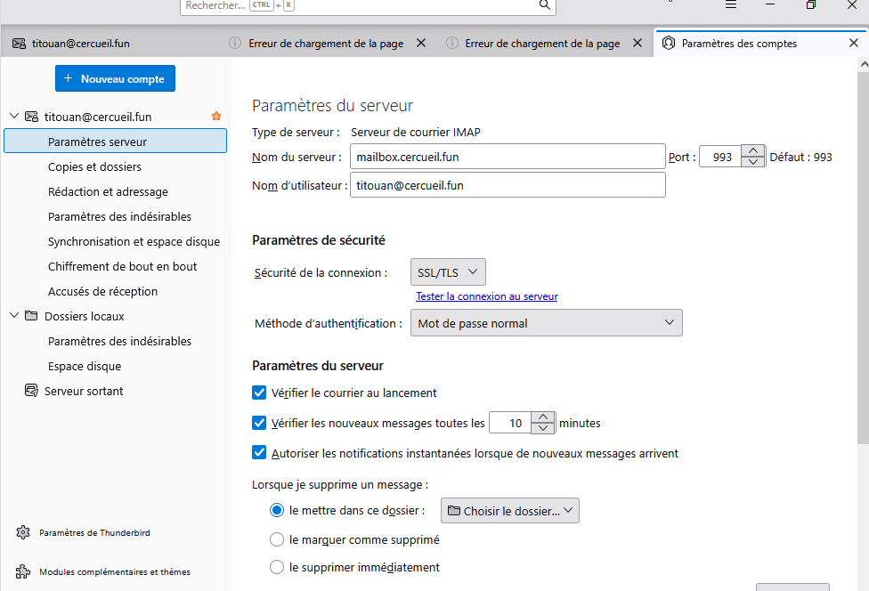
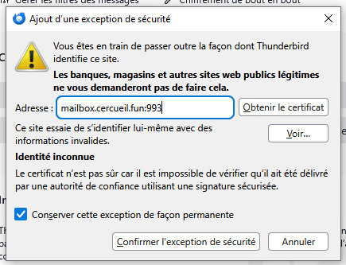
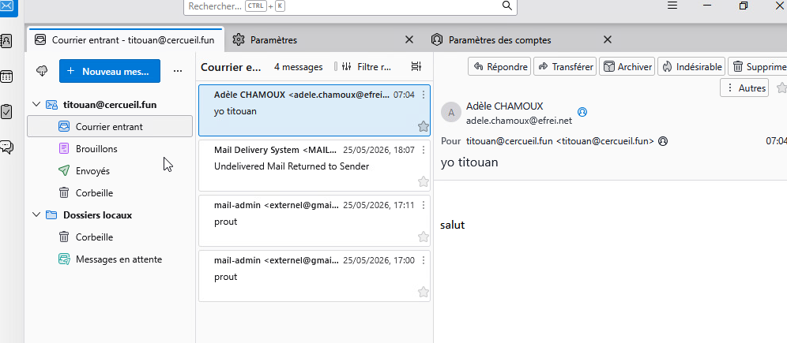

# Postes de travail Windows

## Role dans l'infrastructure

Le parc de postes de travail Windows represente les utilisateurs finaux du SI de cercueil.fun. Il sert a valider de bout en bout les services rendus par l'infrastructure : rattachement au domaine Active Directory, application des strategies de groupe (GPO), chiffrement des disques, resolution DNS interne et acces a la messagerie d'entreprise via un client lourd. Les postes sont isoles dans un VLAN utilisateurs dedie, dont les flux vers les zones serveurs sont filtres par les pare-feux.

## Machines et adressage

| VM | IP | VLAN | Role |
|---|---|---|---|
| Poste_Windows | 10.0.13.5 | 13 (parc utilisateurs) | Poste bureautique de reference, joint au domaine, chiffre par BitLocker |
| Poste utilisateur mails | 10.0.13.16 | 13 (parc utilisateurs) | Poste de test de la messagerie (client Thunderbird) |

Le reseau du parc est 10.0.13.0/24, passerelle 10.0.13.1 (interface du pare-feu interne). La resolution DNS est assuree par le resolveur interne 10.0.60.2, qui fait suivre les zones du domaine vers l'AD.

## Architecture et fonctionnement

### Configuration reseau

Les postes sont adresses statiquement dans le VLAN 13. Le seul serveur DNS declare est le resolveur interne, ce qui force toute resolution (domaine cercueil.fun compris) a passer par la chaine DNS de l'infrastructure.



*Parametres IPv4 du poste 10.0.13.5 : masque /24, passerelle 10.0.13.1, DNS 10.0.60.2.*



*Parametres IPv4 du poste de messagerie 10.0.13.16, identiques hormis l'adresse.*

### Integration au domaine Active Directory

Les postes sont joints au domaine cercueil.fun porte par le controleur de domaine (10.0.70.5). La jointure s'effectue par le renommage systeme classique de Windows avec un compte administrateur du domaine, puis redemarrage. Elle suppose que les regles de pare-feu entre le VLAN 13 et le VLAN du DC autorisent les flux AD (DNS, Kerberos, LDAP, SMB). Une fois le poste integre, les comptes du domaine ouvrent des sessions locales et les GPO du DC s'appliquent.

### Chiffrement de disque BitLocker

Le chiffrement des disques systeme est impose par GPO depuis le controleur de domaine, dans `Computer Configuration > Administrative Templates > Windows Components > BitLocker Drive Encryption > Operating System Drives`. Deux strategies sont activees.

La premiere autorise BitLocker sans module TPM compatible, avec mot de passe ou cle de demarrage USB. Ce choix est impose par le contexte de virtualisation : les VM du lab ne disposent pas de vTPM.


*GPO Exiger une authentification supplementaire au demarrage : activee, avec l'option Autoriser BitLocker sans un module de plateforme securisee compatible.*

La seconde definit la methode de recuperation : mot de passe de recuperation de 48 chiffres et cle de 256 bits autorises, sauvegarde obligatoire des informations de recuperation dans l'annuaire Active Directory (mots de passe et packages de cles), et interdiction d'activer BitLocker tant que ces informations ne sont pas stockees dans l'AD. Les cles de secours sont donc centralisees sur le DC et jamais uniquement locales.



*GPO Selectionner la methode de recuperation : sauvegarde des informations de recuperation dans les services de domaine Active Directory avant activation du chiffrement.*

Sur le poste, le service de chiffrement de lecteur BitLocker (BDESVC) est demarre pour appliquer la strategie :

```powershell
# Service BitLocker Drive Encryption, requis pour le chiffrement du volume systeme
Start-Service BDESVC
```



*Verification du service BDESVC en PowerShell : passage de Stopped a Running.*

### Poste de messagerie (Thunderbird)

Le poste 10.0.13.16 valide la chaine de messagerie du point de vue utilisateur avec Thunderbird. Le client interroge le serveur mailbox en IMAPS et remet les messages sortants en SMTPS (submission) :

- IMAPS, port 993/TCP vers `mailbox.cercueil.fun` (Dovecot) pour la consultation des boites ;
- SMTPS, port 465/TCP vers le service de submission de Postfix pour l'envoi.

L'identifiant du compte doit correspondre exactement a l'attribut `mail` de l'utilisateur dans l'AD (par exemple `titouan@cercueil.fun`), la chaine d'authentification de la messagerie s'appuyant sur l'annuaire.



*Compte titouan@cercueil.fun : serveur entrant IMAP mailbox.cercueil.fun, port 993, connexion SSL/TLS.*

Le certificat presente par le serveur est emis par la PKI interne du projet. L'autorite n'etant pas deployee dans le magasin de confiance de ce poste de test, une exception de securite permanente est enregistree dans Thunderbird.



*Acceptation du certificat de mailbox.cercueil.fun:993 emis par la PKI interne.*

Les flux correspondants sont explicitement ouverts sur le pare-feu entre le VLAN utilisateurs et les VLAN de messagerie :


*Regles OPNsense : VLAN_USERS vers 10.0.32.3 en IMAPS (993) et vers 10.0.30.3 en SMTPS (465).*

Le fonctionnement est verifie par l'echange de messages internes et externes depuis le client :



*Reception dans Thunderbird de messages internes et externes (Gmail, efrei.net) sur le compte titouan@cercueil.fun.*

## Interactions avec les autres briques

- **Active Directory (DC 10.0.70.5)** : jointure au domaine cercueil.fun, authentification des sessions, application des GPO BitLocker, sequestre des cles de recuperation.
- **DNS (10.0.60.2)** : resolveur unique declare sur les postes, point de passage oblige de toute resolution de noms.
- **Pare-feux (OPNsense)** : passerelle 10.0.13.1 du VLAN 13, filtrage des flux vers le DC et ouverture nominative des ports 993 et 465 vers la messagerie.
- **Messagerie (Postfix/Dovecot)** : consommee depuis Thunderbird en IMAPS et SMTPS, comptes adosses a l'attribut mail de l'AD.
- **PKI interne** : emet le certificat TLS presente par le serveur mailbox aux clients.
- **WSUS** : les mises a jour du parc sont distribuees par le serveur WSUS de l'infrastructure, conformement a l'architecture cible du projet.

## Etat et limites

Les deux postes sont operationnels : jointure AD effective, GPO BitLocker appliquees avec sequestre des cles dans l'annuaire, envoi et reception de mails valides. Deux limites sont identifiees dans la documentation : l'autorite de la PKI interne n'est pas poussee dans le magasin de confiance des postes, ce qui oblige a une exception de securite manuelle dans Thunderbird ; et l'absence de vTPM sur les VM impose un mode BitLocker degrade (authentification par mot de passe ou cle USB au lieu du TPM).
