# Proxy LAN (Squid)

Passerelle web unique du SI cercueil.fun. Toute sortie HTTP/HTTPS du réseau interne transite par un serveur Squid placé en DMZ sortante : le pare-feu interne (FW_2, OPNsense) ne laisse passer aucun flux web direct vers Internet, seul le proxy est autorisé à sortir. Le service assure le filtrage d'URL par liste noire, l'inspection TLS (SSL bumping) adossée à la PKI interne, l'authentification Kerberos SSO des utilisateurs du domaine et une journalisation nominative exploitable en investigation.

## Fiche d'identité

| Élément | Valeur |
|---|---|
| VM | proxy.cercueil.local (Fedora Server + Squid) |
| IP / VLAN | 10.1.101.6 / VLAN 101 (DMZ sortante) |
| Passerelle du VLAN 101 | RTR_BORDER (pfSense, 10.1.101.1) |
| Pare-feu amont (côté LAN) | FW_2 (OPNsense, 10.0.30.1) |
| Ports d'écoute Squid | 3128 (explicite), 3127 (HTTP intercepté), 3129 (HTTPS intercepté) |
| Résolveurs DNS utilisés | 10.1.101.5 (résolveur externe, VLAN 101) et 10.0.60.2 (résolveur LAN, VLAN 60) |
| Compte de service AD | svc_proxy_kerberos (OU TieredAdministration > T1 > ServiceAccounts) |
| SPN | HTTP/proxy.cercueil.local@CERCUEIL.LOCAL |
| Console d'administration | Cockpit, https://proxy.cercueil.local:9090 |

## Rôle dans l'infrastructure

Le proxy matérialise l'exigence "passerelle Internet sécurisée avec authentification Active Directory" du sujet. Ses fonctions :

- point de sortie web unique : les règles OPNsense ne laissent joindre Internet en 80/443 qu'au proxy, tout contournement est bloqué par défaut;
- filtrage de contenu : liste noire de 5 370 032 domaines (`/etc/squid/blocked_domains.txt`, environ 123 Mo), appliquée à la fois sur l'en-tête Host (HTTP) et sur le SNI (HTTPS);
- inspection TLS par SSL bumping, avec exceptions (banque, santé) et interruption pure des flux non autorisés;
- authentification Kerberos transparente (SSO) des postes utilisateurs, avec traçabilité par identité AD;
- politique différenciée par VLAN : utilisateurs authentifiés, machines avec Internet, machines limitées aux dépôts de mise à jour, machines sans aucune sortie.

## Modes de raccordement : explicite et transparent

Le SSL bumping décrit le traitement appliqué au trafic; le mode décrit la façon dont le trafic parvient au proxy.

| Critère | Mode explicite | Mode transparent |
|---|---|---|
| Principe | Le client est configuré pour envoyer son trafic au proxy | Le pare-feu détourne le trafic vers le proxy à l'insu du client |
| Machines concernées | Postes utilisateurs (VLAN USERS 10.0.13.0/24 et quarantaine 10.0.11.0/24) | Serveurs et invités (VLAN 12, 20, 30, 31, 32, 40, 50, 60, 70, 71, 72) |
| Configuration client | Obligatoire, poussée par GPO (proxy.cercueil.local:3128) | Aucune |
| Authentification | Kerberos via keytab, traçabilité par utilisateur et par IP | Aucune, traçabilité par IP uniquement |
| Ports Squid | 3128 seul (HTTP et HTTPS via CONNECT) | 3127 intercept (HTTP) et 3129 intercept (HTTPS) |

### Acheminement côté FW_2 (OPNsense)

Une passerelle "Proxy" pointant sur 10.1.101.6 est déclarée sur OPNsense, et deux alias regroupent les réseaux selon leur mode.

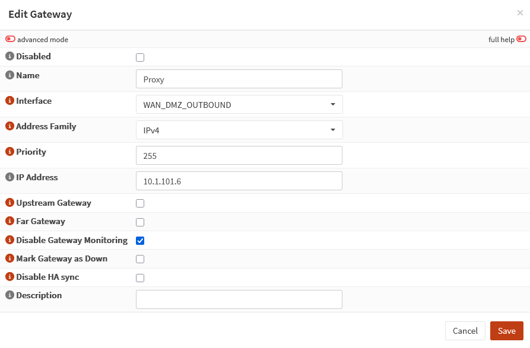

*Déclaration de la passerelle Proxy (10.1.101.6) sur l'interface WAN_DMZ_OUTBOUND d'OPNsense.*

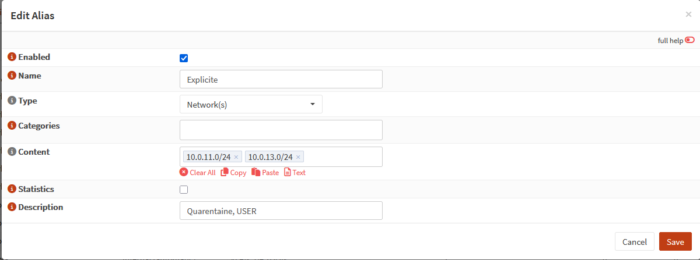

*Alias Explicite : VLAN quarantaine (10.0.11.0/24) et VLAN utilisateurs (10.0.13.0/24).*

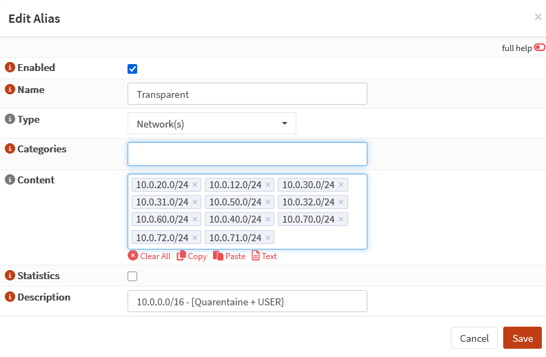

*Alias Transparent : l'ensemble des VLAN serveurs et invités raccordés en interception.*

Trois règles de filtrage assurent l'acheminement :

- explicite : pass TCP, source alias Explicite, destination 10.1.101.6 port 3128, passerelle par défaut;
- HTTP transparent : pass TCP, source alias Transparent, destination hors 10.0.0.0/8 (Internet) port 80, passerelle forcée Proxy;
- HTTPS transparent : identique sur le port 443.

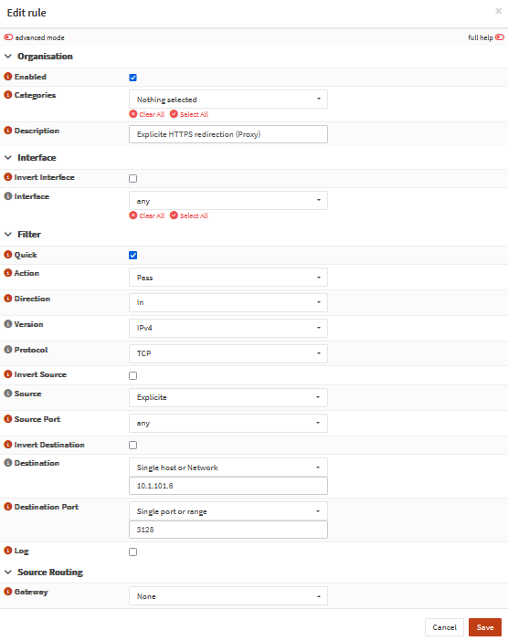

*Règle OPNsense du mode explicite : les postes joignent directement le proxy sur son port 3128.*

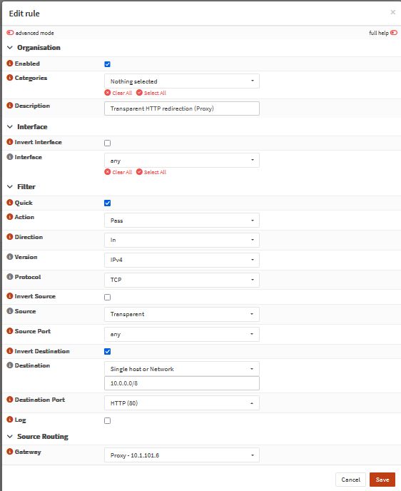

*Règle du HTTP transparent : le trafic port 80 à destination d'Internet est routé de force vers la passerelle Proxy.*

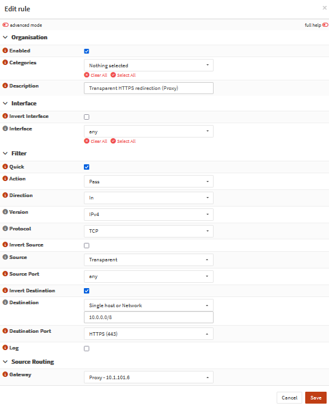

*Règle du HTTPS transparent, même mécanisme pour le port 443.*

Sur le proxy lui-même, firewalld redirige localement les paquets ainsi routés vers les ports d'interception de Squid : 80 vers 3127 et 443 vers 3129.

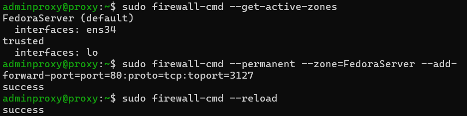

*Forward-port firewalld sur la zone FedoraServer : tout paquet TCP arrivant en port 80 est remis à Squid sur 3127.*

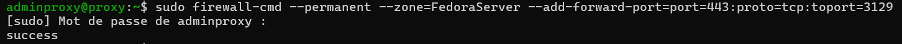

*Forward-port équivalent pour le HTTPS : 443 vers 3129.*

Enfin, le NAT sortant d'OPNsense est passé en mode hybride avec deux règles NO NAT (vers le proxy et vers Internet) : les adresses sources internes sont préservées jusqu'au proxy, condition de la traçabilité par IP, la translation vers l'extérieur restant à la charge de la bordure.

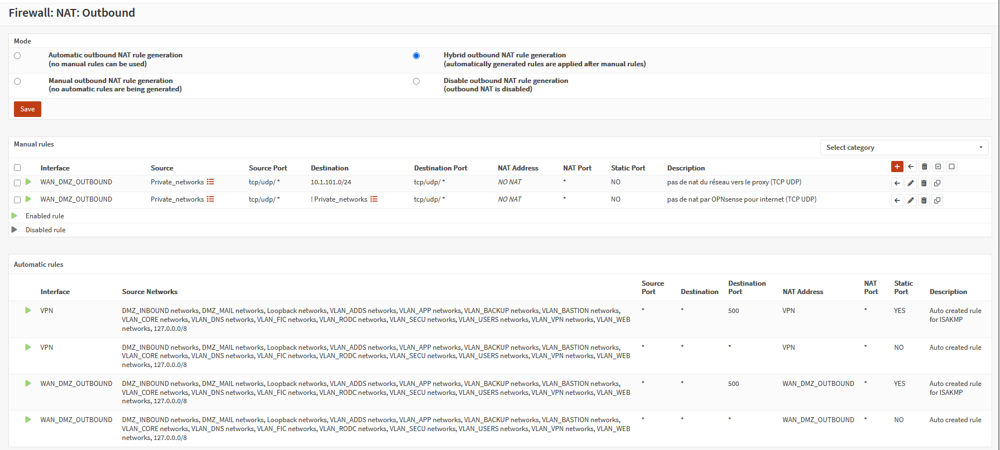

*NAT sortant hybride sur OPNsense : pas de translation vers le proxy ni vers Internet pour les réseaux privés.*

## SSL bumping

Le trafic HTTPS étant chiffré, un proxy classique ne voit que la destination via le SNI, jamais l'URL complète ni le contenu. Le SSL bumping place Squid en position d'homme du milieu contrôlé : pour chaque connexion, il génère à la volée un certificat dont le CN et les SAN reprennent ceux du site visité, signé par une autorité de la chaîne de confiance interne. Le poste client, qui possède les CA racine et intermédiaire dans son magasin de confiance (déployées par GPO), accepte la session sans avertissement.

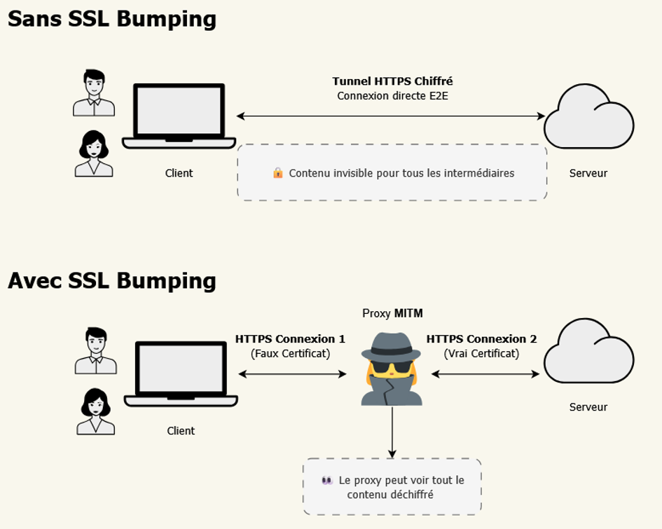

*Principe du SSL bumping : deux sessions TLS distinctes, client-proxy avec un certificat généré à la volée, proxy-serveur avec le vrai certificat du site.*

Éléments de mise en oeuvre :

- le certificat de bump du proxy est une sous-CA dédiée (CN "Cercueil Proxy SSL-Bump CA") signée par la CA interne, avec `CA:TRUE, pathlen:0` : le proxy peut signer des certificats de sites mais pas d'autres autorités;
- la clé privée RSA 4096 est volontairement non chiffrée (`-nodes`) : une passphrase couperait la sortie Internet de toute l'infrastructure à chaque redémarrage du service, notamment lors des mises à jour quotidiennes;
- les certificats générés sont mis en cache dans une base dédiée (`security_file_certgen`, `/var/spool/squid/ssl_db`, 4 Mo, purge automatique des plus anciens).

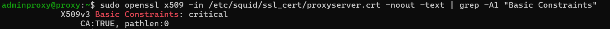

*Vérification du certificat installé : Basic Constraints critical, CA:TRUE, pathlen:0.*

La décision de bump est prise par étapes :

```
ssl_bump peek step1              # lecture du ClientHello, extraction du SNI
ssl_bump splice step2 nobump_domains   # domaines sensibles (banque, santé) : passage sans déchiffrement
ssl_bump splice step2 repos_tls        # dépôts de mise à jour : pas de déchiffrement
ssl_bump terminate step2 no_internet   # machines sans Internet : connexion tuée au stade du SNI
ssl_bump bump all                # tout le reste est déchiffré puis rechiffré
```

Le premier certificat émis pour le proxy était un certificat serveur classique, sans l'attribut CA : Squid ne pouvait pas signer les certificats générés. Le problème a été corrigé en régénérant une CSR de type sous-CA depuis la clé existante, signée avec le profil `basicConstraints = critical, CA:TRUE, pathlen:0`, puis en vidant la base ssl_db pour invalider les faux certificats déjà émis.

## Flux détaillés

### HTTP explicite (3128)

1. Le client envoie `GET http://domaine/ HTTP/1.1` (URL absolue) au proxy, sans en-tête `Proxy-Authorization`.
2. Le proxy répond `407 Proxy Authentication Required`.
3. Le client obtient auprès du KDC (RODC pour les postes) un ticket de service pour `HTTP/proxy.cercueil.local`, chiffré AES256 avec la clé dérivée du mot de passe du compte de service, et rejoue la requête avec `Proxy-Authorization: Negotiate <ticket>`.
4. Le proxy déchiffre et valide le ticket localement avec sa keytab (aucun aller-retour vers l'AD), lit l'identité, applique les ACL et transmet ou refuse (403).

### HTTPS explicite (3128)

Même séquence d'authentification sur la requête `CONNECT domaine:443`, en clair. Une fois le tunnel accordé (200 Connection Established), le proxy lit le SNI du ClientHello, vérifie la liste noire et les exceptions, ouvre sa propre session TLS vers le site réel, génère le certificat imité et termine le handshake avec le client. Les requêtes déchiffrées sont ensuite filtrées comme du HTTP ordinaire.

### HTTP transparent (3127)

Le client croit joindre directement le site (`GET / HTTP/1.1` + `Host:`). OPNsense route le paquet vers le proxy, firewalld le remet sur 3127, Squid reconstitue l'URL complète depuis l'en-tête Host, applique les ACL par IP source et transmet ou refuse.

### HTTPS transparent (3129)

Le ClientHello destiné au site est routé vers le proxy et remis sur 3129. Squid extrait le SNI, décide (splice, terminate ou bump), puis procède comme en explicite, sans authentification : la traçabilité repose sur l'IP source.

## Politique d'accès

La configuration est modulaire : `squid.conf` porte les ACL et les ports, les règles d'accès sont externalisées dans `/etc/squid/conf.d/` et incluses dans un ordre déterminant (les include sont évalués séquentiellement, premier match gagnant) :

```
include /etc/squid/conf.d/deny_generaux.conf    # refus globaux (ports exotiques, liste noire)
include /etc/squid/conf.d/no_connection.conf    # machines sans Internet, sauf dépôts de MAJ
include /etc/squid/conf.d/transparent.conf      # machines avec Internet, sans authentification
include /etc/squid/conf.d/explicite.conf        # postes utilisateurs, Kerberos obligatoire
```

Les populations sont définies par ACL source :

```
acl postes_utilisateurs src 10.0.13.0/24 10.0.11.0/24   # USERS + quarantaine
acl internet src 10.0.12.0/24 10.0.30.19 10.0.30.3 10.0.50.0/24   # invités, admin, WSUS, sécurité
acl no_internet src 10.0.20.0/24 10.0.31.0/24 10.0.32.0/24 ...    # fichiers, ERP, web, backup, DNS, AD...
acl from_transparent myportname transparent   # trafic reçu sur 3127/3129
acl from_explicit myportname explicit         # trafic reçu sur 3128
```

La directive `myportname` (les ports portent un `name=` dans leur déclaration) permet d'écrire des règles distinctes selon le port d'entrée sans dupliquer la configuration.

La liste noire est appliquée deux fois, car un même domaine peut se présenter sous deux formes :

```
acl blocked_http_domains dstdomain "/etc/squid/blocked_domains.txt"                        # en-tête Host (HTTP)
acl blocked_tls_domains ssl::server_name --client-requested "/etc/squid/blocked_domains.txt"  # SNI (HTTPS)
```

Le cas des machines sans Internet est traité dans `no_connection.conf` : elles ne peuvent joindre que les dépôts de mise à jour (Debian, Fedora, Veeam, ESET), tout le reste est refusé, et côté TLS la connexion est tuée au stade du SNI par `ssl_bump terminate` :

```
acl repos_http dstdomain .debian.org dl.fedoraproject.org repository.veeam.com .eset.com
acl repos_tls  ssl::server_name .debian.org dl.fedoraproject.org repository.veeam.com .eset.com

http_access allow from_transparent no_internet repos_http
http_access allow from_transparent no_internet step1 SSL_ports   # laisse le TLS atteindre l'étape SNI
http_access allow from_transparent no_internet repos_tls
http_access deny no_internet
```

Les fichiers complets, sans secret, sont dans [config/](config/) : [squid.conf](config/squid.conf), [deny_generaux.conf](config/deny_generaux.conf), [no_connection.conf](config/no_connection.conf), [transparent.conf](config/transparent.conf), [explicite.conf](config/explicite.conf). La liste noire n'est pas reproduite ici (123 Mo).

## Authentification Kerberos (SSO)

Trois objets liés portent le SSO : un compte de service AD (`svc_proxy_kerberos`, identité Kerberos du proxy, aucun privilège), le SPN `HTTP/proxy.cercueil.local` posé sur ce compte, et une keytab contenant la clé AES256 dérivée du mot de passe du compte, déposée sur le proxy (`/etc/squid/squid.keytab`, root:squid, 640, contexte SELinux réétiqueté). Aucun mot de passe ne circule et le proxy valide les tickets localement : le KDC n'est sollicité qu'à la génération de la keytab.

Le compte est durci selon le standard du projet : sensible et non délégable, AES 128/256 uniquement (RC4 et DES désactivés par GPO au niveau domaine), mot de passe sans expiration (la clé de la keytab en dérive), GPO de refus d'ouverture de session interactive sur l'OU ServiceAccounts. La keytab est générée par `ktpass` sur le DC avec `-crypto AES256-SHA1 -mapop set`, ce qui réinitialise le mot de passe du compte et réécrit son UPN : toute modification ultérieure du compte impose de régénérer la keytab (le salt AES dépend du principal).

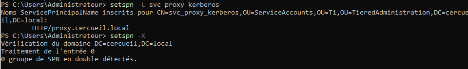

*Vérification sur le DC : le SPN HTTP/proxy.cercueil.local est mappé au compte svc_proxy_kerberos et setspn -X ne détecte aucun doublon.*

Côté proxy, la machine Fedora est jointe au domaine (OU T1 > Computers) pour que son FQDN soit résolvable par les clients, et `/etc/krb5.conf` pointe le realm CERCUEIL.LOCAL sur T0_DC01, avec `rdns = false` pour éviter les mismatch de principal liés au reverse DNS, classiques avec Squid.

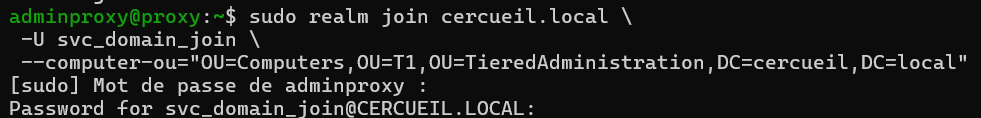

*Jonction de la machine proxy au domaine cercueil.local dans l'OU T1 dédiée.*

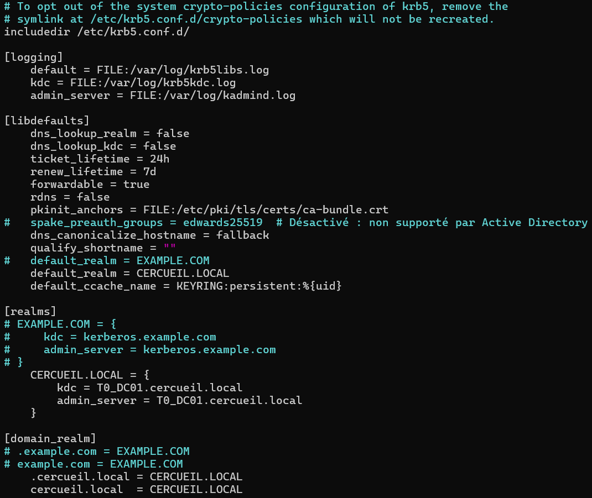

*Fichier /etc/krb5.conf : realm par défaut CERCUEIL.LOCAL, KDC T0_DC01, rdns désactivé.*

L'activation dans Squid tient en trois directives :

```
# Helper Negotiate : valide localement les tickets clients avec la keytab
auth_param negotiate program /usr/lib64/squid/negotiate_kerberos_auth \
    -k /etc/squid/squid.keytab -s HTTP/proxy.cercueil.local@CERCUEIL.LOCAL
auth_param negotiate children 20 startup=0 idle=1
acl authenticated_users proxy_auth REQUIRED
```

### Déploiement du SSO par GPO

Quatre GPO sur le tiers T2 rendent le SSO effectif sans action utilisateur :

1. proxy système WinINET défini sur `proxy.cercueil.local:3128` (jamais par IP : un poste configuré par IP demanderait un ticket `HTTP/10.1.101.6` inexistant, replierait sur NTLM, refusé au niveau domaine, et échouerait), avec exceptions `*.cercueil.local;10.*;127.0.0.1`;
2. ajout de `proxy.cercueil.local` et `*.cercueil.local` à la zone Intranet locale : c'est ce réglage qui autorise l'envoi automatique du ticket Kerberos sans fenêtre d'authentification;
3. verrouillage des paramètres proxy sur les postes (champs grisés);
4. import des certificats CA racine et intermédiaire dans le magasin de confiance des machines, prérequis du SSL bumping.

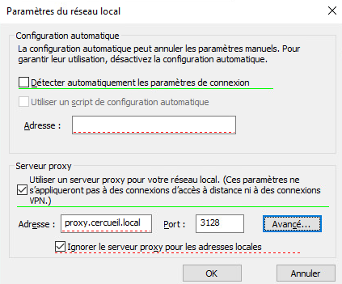

*GPO 1 : proxy système poussé sur les postes, adresse proxy.cercueil.local port 3128.*

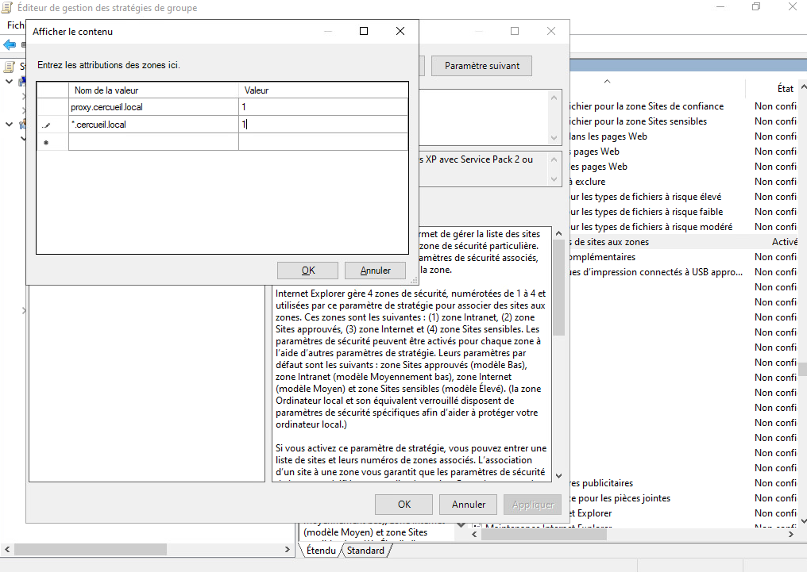

*GPO 2 : attribution de proxy.cercueil.local et *.cercueil.local à la zone Intranet (valeur 1) pour l'envoi silencieux du ticket.*

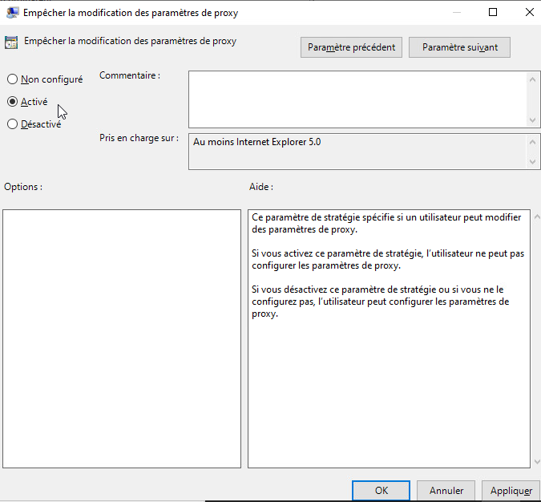

*GPO 3 : interdiction de modifier les paramètres de proxy sur les postes.*

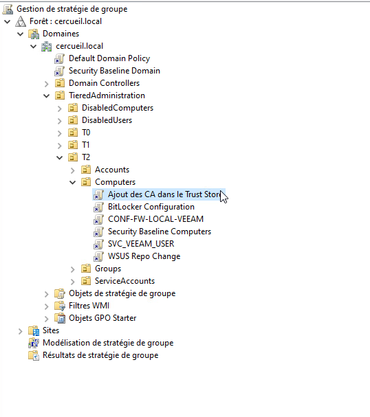

*GPO 4 : déploiement des CA internes dans le magasin de confiance, liée à l'OU des ordinateurs T2.*

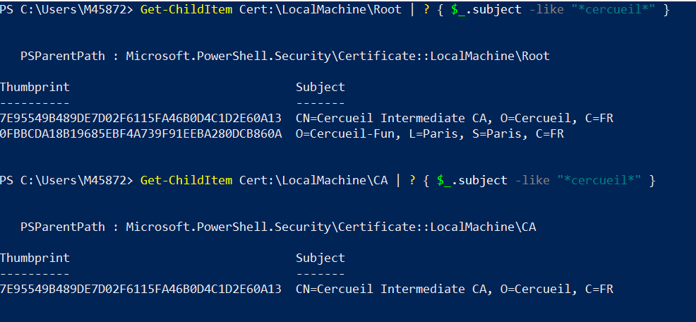

*Contrôle sur un poste : CA racine Cercueil-Fun et CA intermédiaire présentes dans les magasins Root et CA.*

## Journalisation et exploitation

Le format de log est personnalisé pour inclure l'identité Kerberos (`%[un`) à côté de l'IP source, ce qui donne une traçabilité nominative en mode explicite et par IP en mode transparent :

```
logformat mon_format %ts.%03tu %6tr %>a %Ss/%03>Hs %<st %rm %ru %[un %Sh/%<a %mt
access_log /var/log/squid/access.log mon_format
```

| Champ | Signification |
|---|---|
| %ts.%03tu | horodatage |
| %6tr | durée de la requête (ms) |
| %>a | IP source du client |
| %Ss/%03>Hs | statut Squid / code HTTP (ex. TCP_DENIED/403) |
| %<st | taille de la réponse (octets) |
| %rm | méthode |
| %ru | URL |
| %[un | utilisateur authentifié (ou -) |

Une base de requêtes d'exploitation est documentée dans le projet : navigation en direct par utilisateur ou par IP, top des utilisateurs actifs, recherche des refus (`TCP_DENIED`) groupés par compte ou par IP, détection des machines no_internet tentant de sortir (entrées `NONE_NONE` sur les CONNECT tués par le terminate), et filtrage temporel par jour ou par heure.

## Interactions avec les autres briques

- **FW_2 (OPNsense, 10.0.30.1)** : politique de sortie par défaut deny, alias Explicite/Transparent, règles d'acheminement vers le proxy, passerelle Proxy pour le routage forcé, NO NAT interne. Le proxy est le seul chemin web vers l'extérieur.
- **RTR_BORDER (pfSense, 10.1.101.1)** : passerelle par défaut du VLAN 101, porte la sortie effective vers Internet pour les flux émis par le proxy.
- **DNS** : Squid résout via 10.1.101.5 (résolveur externe en DMZ sortante) puis 10.0.60.2 (résolveur LAN); des règles ont été ajoutées sur le pare-feu du résolveur pour autoriser les requêtes 53 TCP/UDP du proxy. L'enregistrement A de `proxy.cercueil.local` vers 10.1.101.6 conditionne le SSO.
- **Active Directory** : realm CERCUEIL.LOCAL, KDC T0_DC01 (10.0.70.5), tickets des postes délivrés par le RODC; compte de service et GPO décrits ci-dessus.
- **PKI** : la CA intermédiaire signe le certificat sous-CA de bump; CA racine et intermédiaire sont poussées dans le trust store des postes par GPO.
- **Mises à jour (Ansible)** : les machines no_internet passent par le proxy pour leurs dépôts (`proxy=` dans dnf.conf, `00proxy` pour apt). Le metalink Fedora, qui renvoie des miroirs tiers imprévisibles, était incompatible avec la logique de whitelist : les dépôts ont été basculés sur un `baseurl` épinglé vers dl.fedoraproject.org, seul domaine à autoriser.

## Problèmes rencontrés et solutions

| Problème | Solution |
|---|---|
| Certificat de bump initial sans attribut CA, Squid incapable de signer les certificats générés | Régénération d'une CSR sous-CA depuis la clé existante, signature avec CA:TRUE pathlen:0, purge de ssl_db |
| Passphrase sur la clé privée : sortie Internet coupée à chaque redémarrage du service | Clé générée avec -nodes, protégée par permissions (600, squid:squid) |
| SSO en échec quand le proxy est référencé par IP (ticket HTTP/10.1.101.6 inexistant, repli NTLM refusé) | GPO imposant le FQDN et la zone Intranet |
| Mismatch de principal Kerberos lié au reverse DNS | rdns = false dans krb5.conf |
| Metalink Fedora incompatible avec le filtrage par liste | Épinglage baseurl sur dl.fedoraproject.org via playbook Ansible |
| Erreur "request buffer full" sur certaines requêtes | request_header_max_size porté à 64 KB |
| Helper Kerberos en échec malgré kinit -k fonctionnel | Contexte SELinux de la keytab réétiqueté (restorecon) |

## État et limites

Fonctionnel en fin de projet : modes explicite et transparent, SSL bumping avec exceptions, authentification Kerberos SSO poussée par GPO, filtrage par liste noire, restriction des machines serveurs aux dépôts de mise à jour, journalisation nominative.

Limites documentées :

- la liste noire est statique (5,4 millions de domaines), sans catégorisation dynamique ni mise à jour automatisée;
- le mode transparent ne trace que l'IP source, sans identité; c'est un choix assumé pour les serveurs et les invités, qui ne peuvent pas répondre au défi 407 d'un proxy;
- le VLAN sécurité (10.0.50.0/24) figure à la fois dans les ACL `internet` et `no_internet`; l'ordre des include fait prévaloir la restriction aux dépôts, l'incohérence restait à arbitrer;
- la keytab est le secret unique du SSO : sa compromission permettrait d'usurper le proxy, la rotation passe par une régénération ktpass;
- la liste des domaines exclus du bump (`nobump_domains`) est minimale et devrait être étendue en production.
