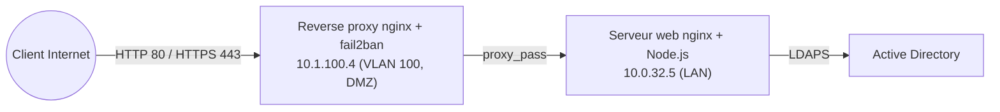
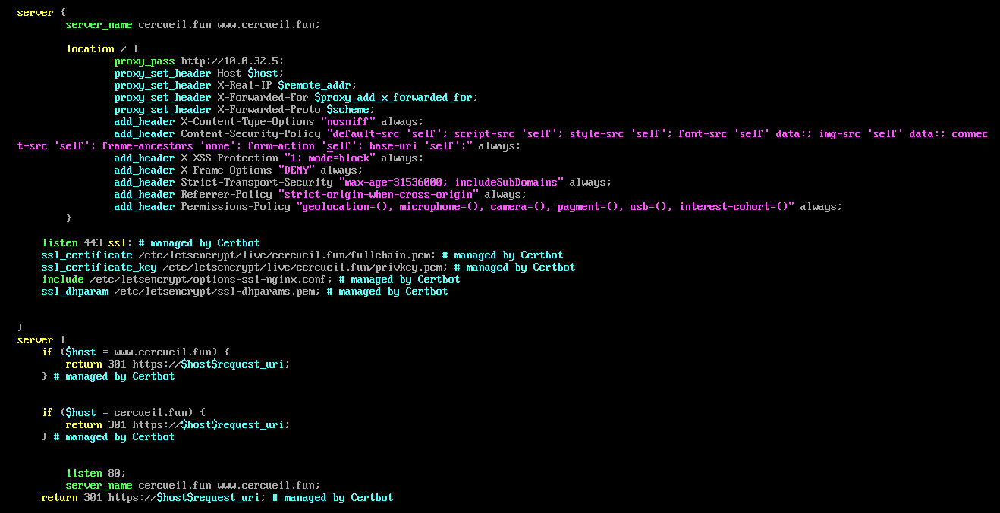

# Reverse proxy / WAF

Brique d'exposition web du SI cercueil.fun. Elle constitue l'unique point d'entree HTTP/HTTPS depuis Internet vers le site vitrine de l'entreprise. Referents de la brique : Nicolas et Adèle.

## Role dans l'infrastructure

Le reverse proxy est place en DMZ entrante et remplit trois fonctions :

- relayer les requetes des clients Internet vers le serveur web heberge dans le LAN, sans jamais exposer ce dernier directement ;
- terminer le TLS pour les domaines cercueil.fun et www.cercueil.fun (certificats Let's Encrypt) et forcer la redirection de tout le trafic HTTP vers HTTPS ;
- assurer une fonction de type WAF en injectant les en-tetes de securite HTTP (CSP, HSTS, anti-clickjacking) et en bannissant les IP malveillantes via fail2ban.

Technologies retenues : nginx pour le relais et les en-tetes, fail2ban pour le bannissement dynamique.

## VM, adressage et zone reseau

| Machine | IP | VLAN | Zone | Role |
|---|---|---|---|---|
| Reverse proxy | 10.1.100.4 | 100 | DMZ entrante | nginx + fail2ban, point d'entree public |
| Serveur web (backend) | 10.0.32.5 | LAN interne | Zone serveurs | nginx frontal + application Node.js / Vue.js |

## Architecture et fonctionnement



Le flux nominal est le suivant : le client resout cercueil.fun sur l'IP publique portee par le reverse proxy, la session TLS est terminee sur celui-ci, puis la requete est retransmise au nginx frontal du serveur web (10.0.32.5) avec les en-tetes X-Real-IP, X-Forwarded-For et X-Forwarded-Proto afin que l'application conserve l'adresse reelle du client. L'authentification des utilisateurs du site s'effectue ensuite cote serveur web contre l'Active Directory en LDAPS ; le reverse proxy n'a aucun acces direct a l'annuaire.



*Configuration /etc/nginx/conf.d/cercueil.conf en production : bloc proxy vers 10.0.32.5, en-tetes de securite, terminaison TLS Certbot et redirection 301 du port 80 vers HTTPS.*

## Configuration notable

La configuration complete est transcrite dans [config/cercueil.conf](config/cercueil.conf). Points saillants :

```nginx
location / {
    proxy_pass http://10.0.32.5;                          # backend unique : serveur web du LAN
    proxy_set_header X-Forwarded-For $proxy_add_x_forwarded_for;  # tracabilite de l'IP cliente
    add_header Content-Security-Policy "default-src 'self'; ... frame-ancestors 'none';" always;
    add_header Strict-Transport-Security "max-age=31536000; includeSubDomains" always;
    add_header X-Frame-Options "DENY" always;             # anti-clickjacking
}
```

```nginx
listen 443 ssl;                                            # terminaison TLS en DMZ
ssl_certificate /etc/letsencrypt/live/cercueil.fun/fullchain.pem;   # managed by Certbot
```

Le durcissement systeme accompagne la configuration applicative :

- firewalld n'ouvre que les services http et https sur la machine ;
- le booleen SELinux `httpd_can_network_connect` est active de maniere persistante, seule derogation necessaire pour autoriser nginx a etablir la connexion sortante vers le backend ;
- les certificats sont emis et renouveles par certbot (plugin nginx) pour cercueil.fun et www.cercueil.fun.

La politique CSP restreint toutes les sources a `'self'` (avec `data:` tolere pour polices et images), interdit l'inclusion du site dans une iframe (`frame-ancestors 'none'`) et verrouille les formulaires (`form-action 'self'`). Elle a ete validee avec le scanner externe securityheaders.com sur cercueil.fun.

## Fonction WAF : fail2ban

fail2ban analyse les journaux nginx et bannit les adresses IP au niveau du pare-feu local. La configuration est portee par `/etc/fail2ban/jail.local` (le fichier par defaut n'est pas modifie). Deux jails sont actives :

| Jail | Filtre | Cible |
|---|---|---|
| nginx-ad-login | `/etc/fail2ban/filter.d/nginx-ad-login` (filtre ecrit pour le projet) | Echecs repetes d'authentification AD sur la mire de connexion du site |
| nginx-botsearch | filtre standard fail2ban | Robots recherchant des chemins inexistants (scans d'enumeration) |

Le filtre nginx-ad-login couvre le principal risque applicatif du site : le brute force des comptes Active Directory via le formulaire de connexion. L'etat des jails et le nombre d'IP bannies par filtre sont consultes en exploitation avec `fail2ban-client status <jail>`.

## Interactions avec les autres briques

- Pare-feux : le pare-feu de perimetre publie les ports 80/443 vers 10.1.100.4 ; une regle DMZ vers LAN autorise le seul flux reverse proxy vers 10.0.32.5. Sans cette regle le site est injoignable, le serveur web n'acceptant pas de trafic direct depuis Internet.
- DNS : les enregistrements publics cercueil.fun et www.cercueil.fun pointent vers le reverse proxy (voir la brique DNS).
- Certificats : la brique utilise la chaine publique Let's Encrypt, distincte de la PKI interne du SI, car le service est expose a des clients Internet.
- Web : unique backend publie ; le serveur web verifie de son cote que son pare-feu accepte le trafic en provenance du reverse proxy.
- Active Directory : interaction indirecte, les tentatives de connexion AD tracees dans les logs nginx alimentent le jail nginx-ad-login.

## Etat et limites

En fin de projet, la brique est en production : le site est servi en HTTPS avec redirection forcee, les en-tetes de securite sont en place et verifies par scan externe, et les deux jails fail2ban sont operationnels. Limites connues :

- un seul vhost est publie, la configuration n'est pas mutualisee pour d'autres services ;
- la fonction WAF repose sur les en-tetes de securite et le bannissement IP ; aucun moteur d'inspection applicative (type ModSecurity avec l'OWASP CRS) n'a ete deploye ;
- d'apres la configuration en production, le flux interne entre le reverse proxy et le serveur web est retransmis en HTTP, le chiffrement s'arretant en DMZ.
