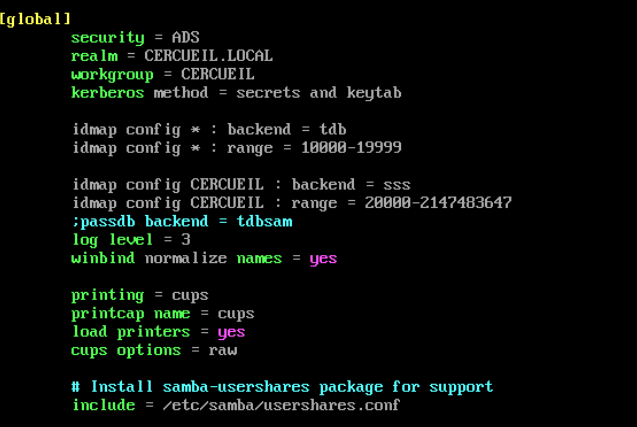
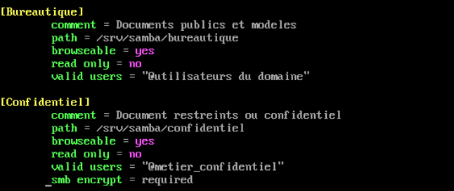

# Serveur de fichiers (Samba)

Serveur de partage de fichiers metiers du SI cercueil.fun, construit avec Samba en mode
membre de domaine Active Directory. Il fournit aux postes du domaine deux espaces SMB
distincts, un espace bureautique ouvert a tous les utilisateurs du domaine et un espace
confidentiel reserve a un groupe metier. Toute l'authentification et la gestion des droits
reposent sur l'annuaire AD : le serveur ne porte aucun compte local de service de fichiers.

## Role dans l'infrastructure

- Partage de fichiers metiers pour l'entreprise (documents publics, modeles, documents restreints).
- Point d'application de la segmentation des acces par groupes AD : l'appartenance a un groupe
  de l'annuaire determine directement l'acces aux partages.
- Brique consommatrice des services d'infrastructure : Active Directory (authentification
  Kerberos), DNS interne (resolution du domaine) et PKI interne (chaine de confiance).

## Machine

| VM | IP | VLAN |
|---|---|---|
| Serveur de fichiers (Linux, Samba + sssd/winbind) | Non figee dans la documentation | Zone serveurs interne |

Le serveur est integre au domaine `cercueil.local` (realm Kerberos `CERCUEIL.LOCAL`) et utilise
le resolveur DNS interne `10.0.60.2` (VLAN 60). Le controleur de domaine se trouve en `10.0.70.5`
(VLAN 70). Referent du service : Nicolas.

## Architecture et fonctionnement

Samba est deploye en membre de domaine (`security = ADS`), avec `sssd` et `winbind` pour la
resolution des identites AD (paquets `sssd`, `samba`, `samba-winbind`, `samba-common-tools`).
Deux partages sont exposes sous `/srv/samba` :

| Partage | Chemin | Acces (valid users) | Proprietaire Unix | Droits |
|---|---|---|---|---|
| Bureautique | /srv/samba/bureautique | @utilisateurs du domaine | root:utilisateurs du domaine | 2775 |
| Confidentiel | /srv/samba/confidentiel | @metier_confidentiel | root:metier_confidentiel | 2770 |

Les droits Unix portent le bit setgid (2xxx) : les fichiers crees heritent du groupe AD
proprietaire du repertoire, ce qui maintient la coherence entre droits POSIX et acces SMB.
Le partage Confidentiel est en 2770 (aucun acces pour les autres utilisateurs) et impose en
plus le chiffrement du trafic SMB (`smb encrypt = required`). Le groupe `metier_confidentiel`
a ete cree dans l'AD et comptait un seul compte T2 au moment de la redaction.



*Section `[global]` de `/etc/samba/smb.conf` : jonction au domaine en mode ADS, Kerberos via secrets et keytab, mappage des identites du domaine delegue a sssd.*



*Definition des deux partages : Bureautique ouvert aux utilisateurs du domaine, Confidentiel restreint au groupe metier_confidentiel avec chiffrement SMB obligatoire.*

## Configuration notable

La configuration complete transcrite est disponible dans [`config/smb.conf`](config/smb.conf).
Points structurants de la section `[global]` :

```ini
security = ADS                                  ; membre de domaine, authentification Kerberos
realm = CERCUEIL.LOCAL
workgroup = CERCUEIL
kerberos method = secrets and keytab            ; keytab machine gere par la jonction au domaine

idmap config * : backend = tdb                  ; plage locale par defaut
idmap config * : range = 10000-19999
idmap config CERCUEIL : backend = sss           ; identites du domaine resolues par sssd
idmap config CERCUEIL : range = 20000-2147483647

winbind normalize names = yes                   ; noms de comptes normalises (espaces, casse)
```

Cote `sssd`, une option est modifiee dans `/etc/sssd/sssd.conf` pour contourner des bugs Samba
lies aux noms de groupes AD contenant des espaces (par exemple "utilisateurs du domaine") :

```ini
use_fully_qualified_names = False   ; groupes utilisables sans suffixe @cercueil.local
```

## Interactions avec les autres briques

- **Active Directory** : la machine est jointe au domaine selon la procedure commune du projet
  (compte de service `svc_domain_join`, placement dans l'OU du modele d'administration en tiers
  `TieredAdministration`). L'acces aux partages est authentifie par Kerberos et arbitre par les
  groupes AD ; aucune base de comptes locale n'est utilisee (`passdb backend` desactive).
- **DNS** : resolution du domaine `cercueil.local` et localisation du DC via le resolveur
  interne `10.0.60.2`.
- **PKI** : la chaine de certification interne (CA Root `10.0.70.3`, CA intermediaire `10.0.70.4`)
  est approuvee sur la machine, comme sur tout hote integre au domaine.
- **Pare-feux** : les flux Kerberos, LDAP et SMB entre la zone serveurs interne, le VLAN AD
  (VLAN 70) et les VLAN clients sont soumis aux regles des pare-feux internes ; leur ouverture
  a ete traitee lors de l'integration au domaine.

## Etat et limites

- La tache "Serveurs Samba" etait encore a l'etat "En cours" dans la planification du projet
  (echeance 22/06/2026) ; l'adresse IP et le nom d'hote definitifs du serveur ne sont pas
  figes dans la documentation.
- Le chiffrement SMB n'est impose que sur le partage Confidentiel ; Bureautique accepte des
  sessions non chiffrees.
- Le bloc d'impression CUPS present dans `smb.conf` provient de la configuration par defaut,
  aucun service d'impression n'est documente.
- Un seul serveur de fichiers est deploye ; aucune redondance ni sauvegarde dediee des partages
  n'est documentee (l'infrastructure de backup VEEAM en VLAN 40 est prevue au niveau global).
