# Supervision et journalisation : SIEM Graylog

## Rôle dans l'infrastructure

Le serveur Graylog est le SIEM du SI cercueil.fun : il centralise les journaux du parc (postes Windows, serveurs Linux) pour la détection d'incidents et l'investigation. Il est placé dans le VLAN 50, la zone Sécurité du LAN, aux côtés du serveur ESET Protect, derrière le pare-feu interne FW_2. Ce positionnement isole les outils de sécurité des VLAN qu'ils surveillent.

La plateforme est Graylog 6.0.14 (avec le plugin Enterprise) sur Fedora, exposée par son interface web et son API sur le port 9000.

## VM, adressage et VLAN

| VM | FQDN | IP | VLAN | Rôle |
|---|---|---|---|---|
| Graylog | graylog.cercueil.fun | 10.0.50.20 | 50 (zone Sécurité) | SIEM : réception, indexation et recherche des journaux |

Les sources de journaux se répartissent sur le reste du parc : postes utilisateurs Windows du VLAN 13 (10.0.13.0/24), serveurs Linux (passerelle mail notamment), le RODC01 (VLAN 70) servant en outre de point de distribution du paquet Sidecar.

## Architecture et fonctionnement

Trois entrées (inputs) reçoivent les journaux, chacune associée à un canal de collecte :

| Entrée Graylog | Protocole / port | Sources |
|---|---|---|
| Syslog UDP | 1514/udp | Serveurs Linux via rsyslog |
| Sidecar Beats | 5044/tcp | Postes Windows via Graylog Sidecar + winlogbeat |
| Windows UDP NXLogs (GELF UDP) | 12201/udp | Machines Windows via NXLog (canal alternatif) |

### Collecte Linux : rsyslog

Chaque serveur Linux transfère ses journaux via un fichier `/etc/rsyslog.d/99-graylog.conf` déployé et maintenu par Ansible, au format RFC 5424 (`RSYSLOG_SyslogProtocol23Format`) vers 10.0.50.20:1514 en UDP. Le sélecteur est ajusté par hôte : la passerelle mail remonte `mail.*`, `authpriv.*` et `*.err`, la version générique transfère tout (`*.*`). Fichier : [config/99-graylog.conf](config/99-graylog.conf).

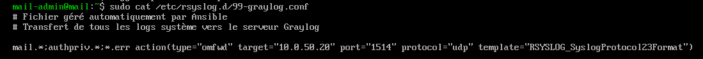
*Fichier rsyslog déployé par Ansible sur la passerelle mail : transfert vers Graylog en UDP 1514, format RFC 5424.*

### Collecte Windows : Sidecar et winlogbeat

Le canal principal pour les postes Windows repose sur Graylog Sidecar, qui pilote localement le collecteur winlogbeat. Côté serveur, une entrée Beats écoute sur le port 5044.

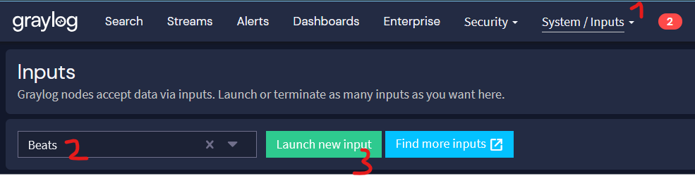
*Création de l'entrée Beats dans System / Inputs.*

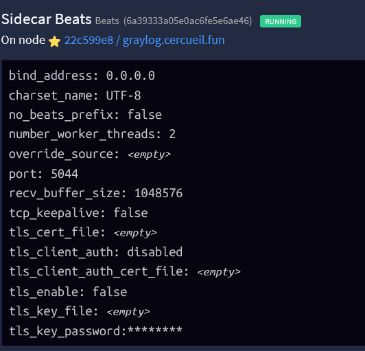
*Entrée « Sidecar Beats » active sur graylog.cercueil.fun : écoute sur 0.0.0.0:5044, TLS désactivé.*

L'authentification des Sidecars auprès de l'API se fait par un token généré pour l'utilisateur système `graylog-sidecar` ; un même token est réutilisable par plusieurs machines, chacune étant identifiée par son `node_name`.

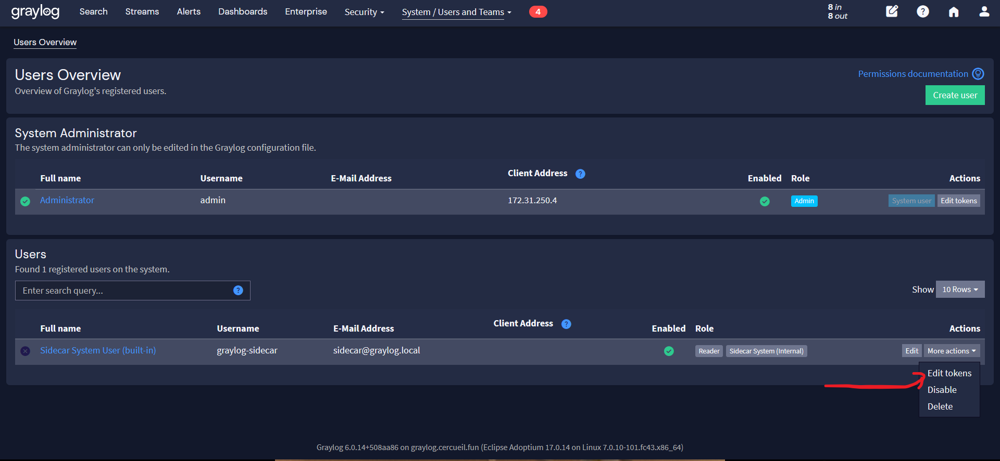
*Utilisateur intégré « Sidecar System User » (rôle Reader) depuis lequel le token API est généré.*

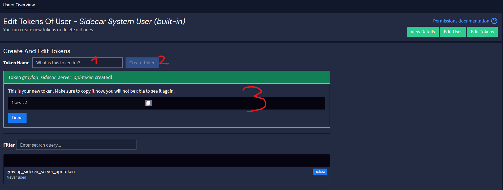
*Création du token `graylog_sidecar_server_api_token` (valeur masquée), copié ensuite dans le sidecar.yml des postes.*

Sur le poste, le fichier `sidecar.yml` ([config/sidecar.yml](config/sidecar.yml)) référence l'URL de l'API (`http://10.0.50.20:9000/api/`), le token et le nom du nœud. La configuration de winlogbeat n'est en revanche jamais éditée localement : elle est définie côté serveur (« Winlogbeat workstation ») et poussée périodiquement aux Sidecars, qui écrasent le fichier local à chaque synchronisation.

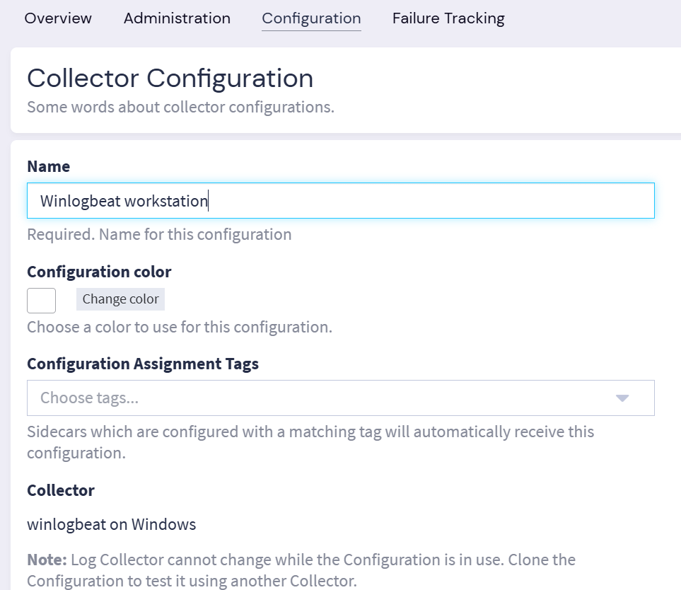
*Configuration de collecteur « Winlogbeat workstation » gérée dans System / Sidecars / Configuration.*

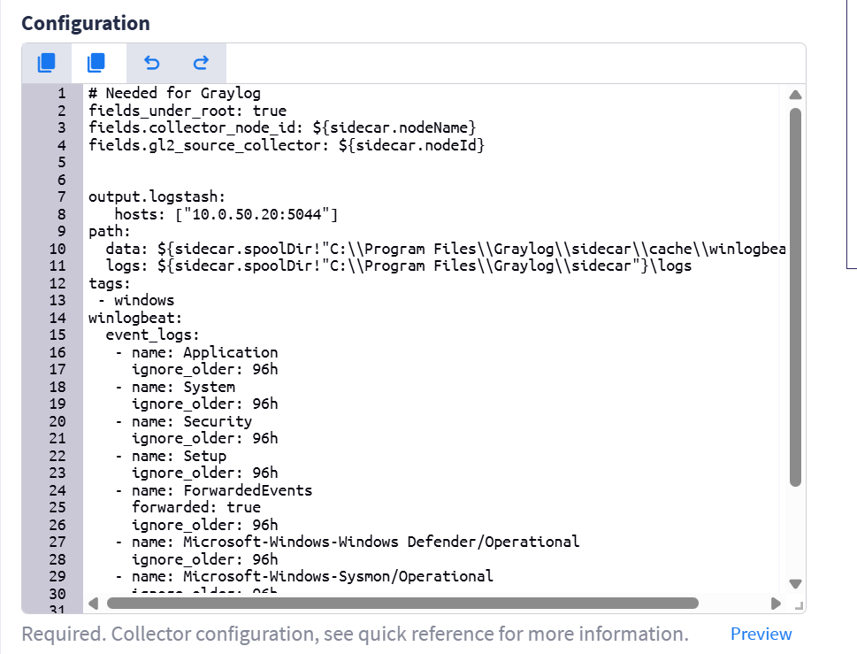
*Journaux collectés : Application, System, Security, Setup, ForwardedEvents, Windows Defender et Sysmon, avec fenêtre de rattrapage de 96 h ([config/winlogbeat.conf](config/winlogbeat.conf)).*

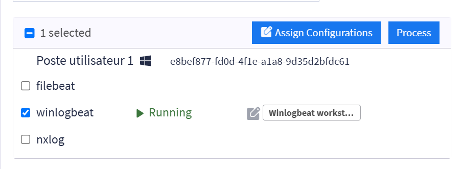
*Poste utilisateur enregistré dans System / Sidecars / Administration : collecteur winlogbeat en état Running avec la configuration « Winlogbeat workstation ».*

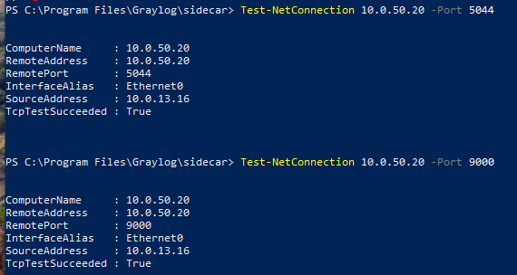
*Contrôle des flux depuis un poste du VLAN utilisateurs (10.0.13.16) : TCP 5044 (envoi Beats) et TCP 9000 (API Sidecar) joignables à travers le pare-feu.*

### Déploiement du Sidecar par GPO

L'enrôlement du parc Windows est automatisé par une GPO « Stratégie SIEM deploy Graylog Sidecar » exécutant un script PowerShell au démarrage des postes ([config/deploy-graylog-sidecar.ps1](config/deploy-graylog-sidecar.ps1)). Le script installe silencieusement le MSI depuis le partage `\\RODC01\PublicDrop\SIEM`, génère `sidecar.yml` (token, nom du poste), passe le service en démarrage automatique et le relance. Il est idempotent et journalise son déroulement dans `C:\Windows\Temp\graylog-sidecar-deploy.log`.

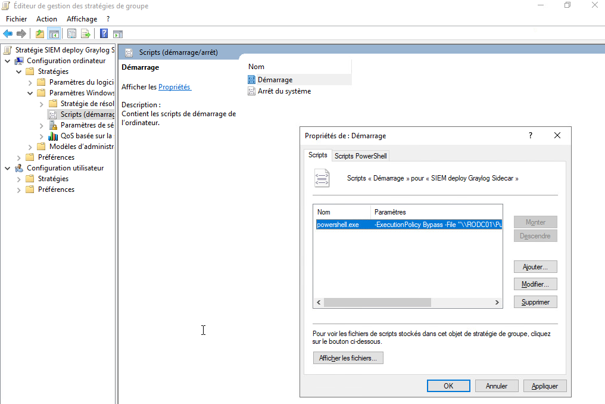
*Script de démarrage de la GPO : powershell.exe -ExecutionPolicy Bypass -File \\RODC01\... .*

Deux paramètres de stratégie garantissent l'exécution fiable du script : les scripts de démarrage restent synchrones (exécution asynchrone désactivée) et le poste attend le réseau avant l'ouverture de session, afin que le partage du RODC soit joignable.

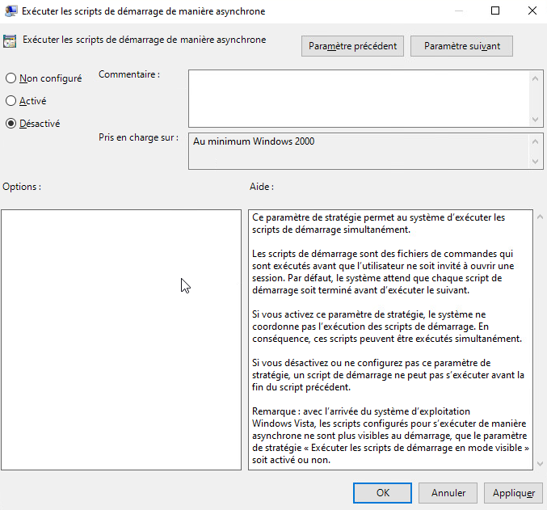
*Paramètre « Exécuter les scripts de démarrage de manière asynchrone » positionné sur Désactivé.*

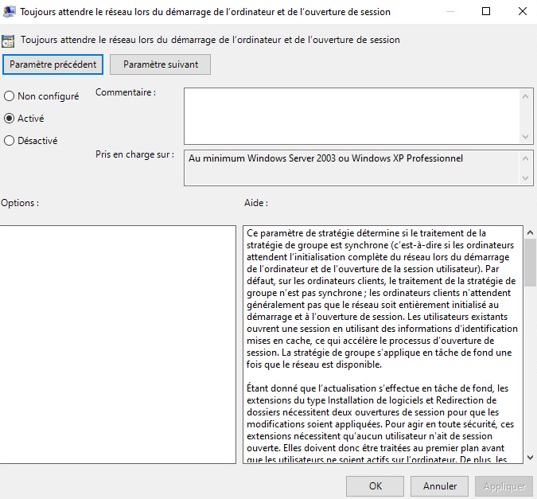
*Paramètre « Toujours attendre le réseau lors du démarrage de l'ordinateur et de l'ouverture de session ».*

### Canal alternatif : NXLog

Un second canal de collecte Windows a été mis en place avec NXLog : le module `im_msvistalog` lit l'observateur d'événements et la sortie `om_udp` émet en GELF vers l'entrée dédiée sur le port 12201 ([config/nxlog.conf](config/nxlog.conf)). Ce canal, plus simple (pas de token ni de configuration centralisée), a servi de solution de repli ; le Sidecar reste le canal retenu pour le parc car la sélection des journaux y est administrée depuis le serveur.

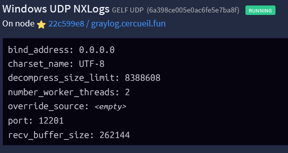
*Entrée « Windows UDP NXLogs » (GELF UDP) active sur le port 12201.*

## Interactions avec les autres briques

- **Pare-feux OPNsense** : les flux TCP 5044 et TCP 9000 sont ouverts des VLAN sources vers 10.0.50.20 à travers FW_2, de même que les ports UDP des entrées syslog et GELF. L'export syslog des pare-feux eux-mêmes vers le SIEM a été identifié comme prérequis du durcissement mais n'a pas été raccordé (voir la brique pare-feux).
- **Active Directory** : la GPO de déploiement du Sidecar est portée par le domaine ; le RODC01 héberge le partage `PublicDrop\SIEM` distribuant le MSI.
- **Ansible** : les fichiers rsyslog des serveurs Linux sont générés et maintenus par le control node Ansible (10.0.70.6).
- **EPP** : Graylog partage le VLAN 50 avec le serveur ESET Protect, conformément au découpage par criticité (zone Sécurité regroupant SIEM et EPP/EDR).
- **DNS** : le serveur est joignable sous le nom graylog.cercueil.fun via la zone interne.

## État et limites

- Les transports ne sont pas chiffrés : entrée Beats sans TLS, syslog et GELF en UDP, API Sidecar en HTTP. Les journaux transitent en clair sur le réseau interne, cloisonné par les pare-feux.
- Un token API unique est partagé par l'ensemble des Sidecars via le script GPO ; sa compromission sur un poste vaut pour tout le parc et sa rotation impose un redéploiement.
- L'export des journaux des pare-feux OPNsense vers le SIEM restait à raccorder à la fin du projet.
- Les deux canaux Windows (Sidecar/winlogbeat et NXLog) coexistent dans la documentation ; seule la chaîne Sidecar est industrialisée (GPO) et sa configuration NXLog conserve une adresse d'exemple issue de la source documentaire.
