# VPN d'acces distant (OpenVPN)

## Role dans l'infrastructure

Le service VPN fournit l'acces distant nominatif au SI de cercueil.fun. Il repose sur un serveur OpenVPN en mode client-to-site heberge par le pare-feu interne FW_2 (OPNsense), publie sur Internet au travers du pare-feu de bordure RTR_BORDER (pfSense). L'authentification est double : un certificat client emis par la PKI interne (Dogtag) et les credentials du compte Active Directory de l'utilisateur, verifies en LDAPS. Le service est ainsi le point de convergence de trois briques du projet : pare-feux, PKI et AD.

## VM, adressage et VLAN

| Element | Equipement / VM | Adresse | VLAN / zone |
|---|---|---|---|
| Publication du service | RTR_BORDER (pfSense) | 212.83.153.84 (WAN), 10.1.103.1 | VLAN 103 (DMZ VPN) |
| Serveur OpenVPN | FW_2 (OPNsense), interface VPN | 10.1.103.2, UDP 46742 | VLAN 103 (DMZ VPN) |
| Reseau tunnel | attribue aux clients connectes | 172.31.250.0/24 (serveur 172.31.250.1) | - |
| Annuaire d'authentification | DC01 puis RODC (cercueil.local) | LDAPS 636 | VLAN ADDS / RODC |
| Machine d'administration PKI | ica01 | 10.0.30.19 | VLAN 30 (Services Core) |

## Architecture et fonctionnement

### Chaine de publication

Le nom public `vpn.cercueil.fun` est declare en record A sur le DNS maitre et pointe vers l'adresse WAN de RTR_BORDER.

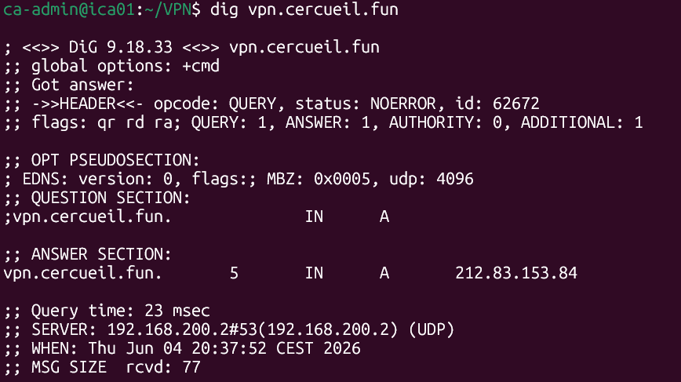

*Le record A vpn.cercueil.fun resout vers 212.83.153.84, l'adresse publique de la maquette.*

Sur pfSense, une regle NAT redirige le port UDP/TCP 46742 de la WAN vers l'interface VPN de FW_2 (10.1.103.2), et une regle de filtrage sur la DMZ VPN autorise ce seul flux.

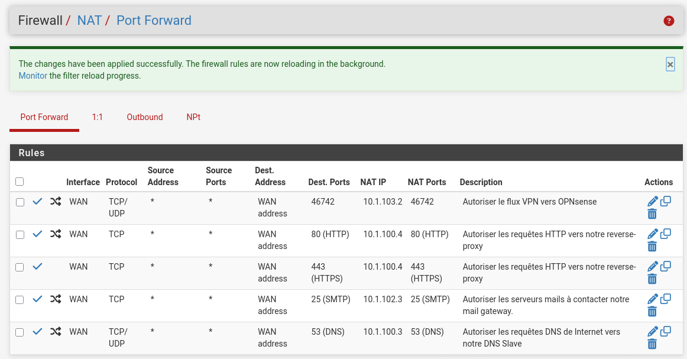

*NAT de RTR_BORDER : le flux VPN (46742) est redirige vers 10.1.103.2, aux cotes des publications HTTP/HTTPS, SMTP et DNS.*

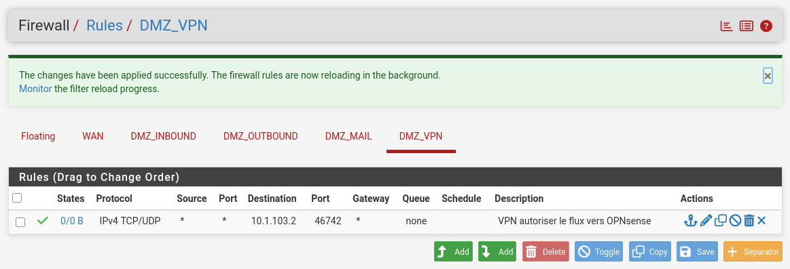

*Regle pfSense associee : seul le port 46742 vers 10.1.103.2 est admis sur la DMZ VPN.*

Cote OPNsense, l'interface VPN porte 10.1.103.2/24 avec RTR_BORDER (10.1.103.1) en passerelle, et une regle entrante accepte le flux 46742.

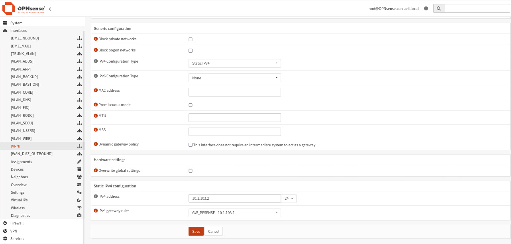

*Interface [VPN] de FW_2 : IPv4 statique 10.1.103.2/24, passerelle GW_PFSENSE 10.1.103.1.*

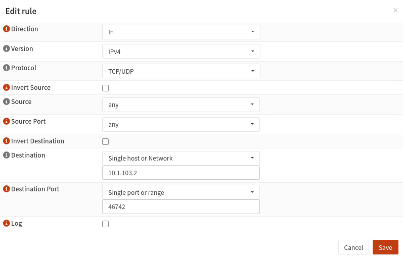

*Regle d'entree sur OPNsense : TCP/UDP depuis toute source vers 10.1.103.2:46742.*

### Instance OpenVPN

L'instance est declaree en role Server sur FW_2 : protocole UDP, port 46742, interface TUN, reseau tunnel 172.31.250.0/24 en topologie subnet.

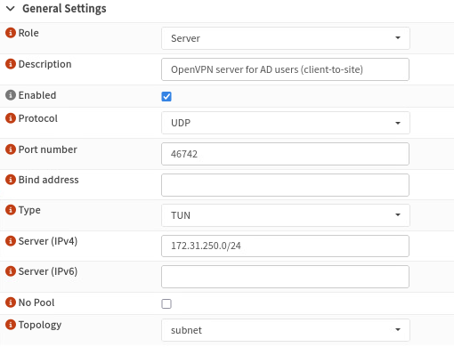

*Instance "OpenVPN server for AD users (client-to-site)" : UDP 46742, TUN, tunnel 172.31.250.0/24.*

La section Trust impose la presentation d'un certificat client valide et verifie la chaine sur deux niveaux (client, CA intermediaire, serveur). Le certificat serveur provient d'une CSR generee sur OPNsense puis signee par la CA intermediaire.

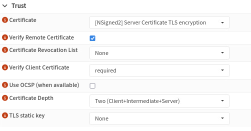

*Verification du certificat client obligatoire (required), profondeur de chaine Two (Client+Intermediate+Server).*

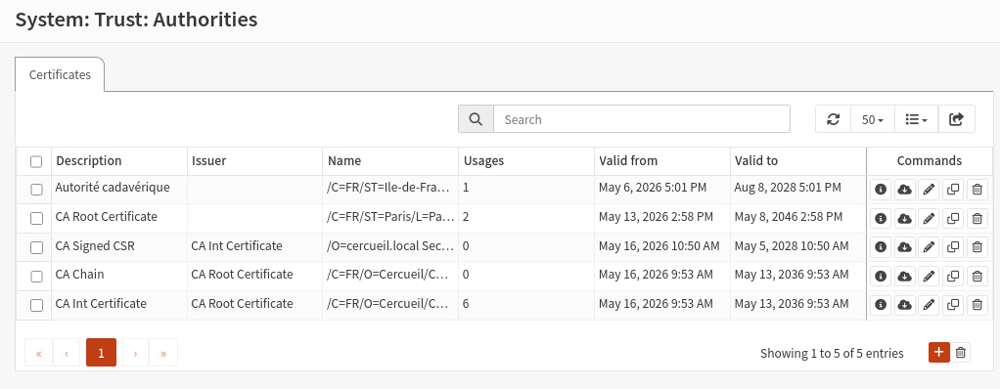

*Magasin System > Trust > Authorities de FW_2 : CA Root et CA Int de la PKI Dogtag importees pour valider la chaine.*

### Authentification Active Directory

Le second facteur s'appuie sur l'annuaire cercueil.local. OPNsense est declare comme client LDAP du controleur de domaine (initialement DC01, puis bascule sur le RODC), en LDAPS sur le port 636, avec un compte de service dedie `svc_opnsense_ldap` en lecture seule. Seul le conteneur des comptes T2 est interroge, et l'appartenance au groupe AD `vpn_users` conditionne l'acces.

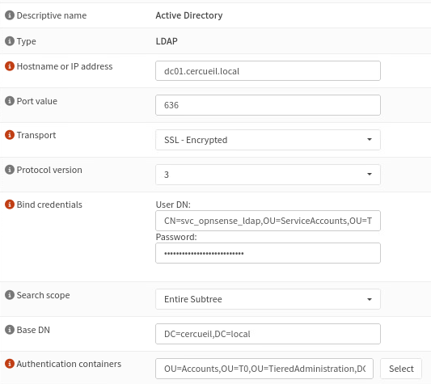

*Declaration de l'annuaire dans OPNsense : LDAPS 636 vers le DC, bind par le compte de service, base DC=cercueil,DC=local.*

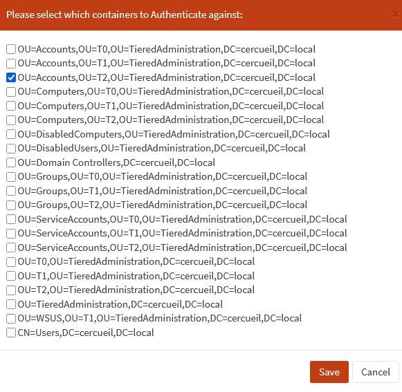

*Seul le conteneur OU=Accounts,OU=T2 de l'administration en tiers est retenu comme source d'authentification.*

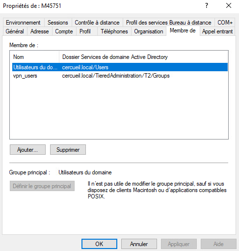

*Compte utilisateur M45751 membre du groupe vpn_users (TieredAdministration/T2/Groups).*

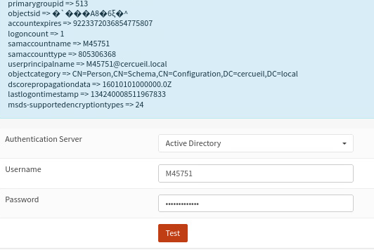

*Testeur integre d'OPNsense : authentification reussie du compte M45751 avec retour des attributs AD.*

Pour resoudre le controleur de domaine, FW_2 utilise les resolveurs internes et un domain override Unbound vers cercueil.local ; le domaine par defaut du pare-feu a ete aligne sur cercueil.local.

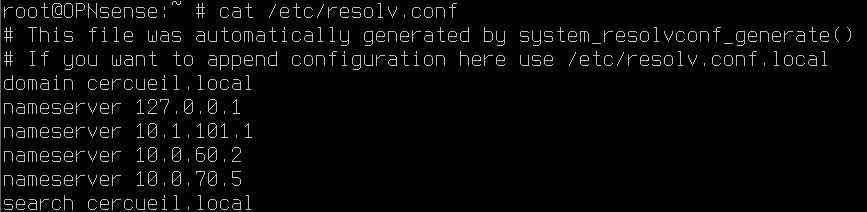

*resolv.conf de FW_2 : domaine cercueil.local et resolveurs internes 10.0.60.2 et 10.0.70.5 en complement de 10.1.101.1.*

### Certificats clients (PKI Dogtag)

Un profil d'enrolement dedie `vpnUserCert` a ete ajoute sur la CA intermediaire (fichier [config/vpnUserCert.cfg](config/vpnUserCert.cfg)) : cles RSA 2048 ou 4096, validite 365 jours, certificat d'entite finale (basicConstraints CA=false), key usage limite a digitalSignature et keyEncipherment, extended key usage clientAuth uniquement. Le CN du certificat reprend le login AD de l'utilisateur, ce qui lie le certificat au compte utilise pour le second facteur.

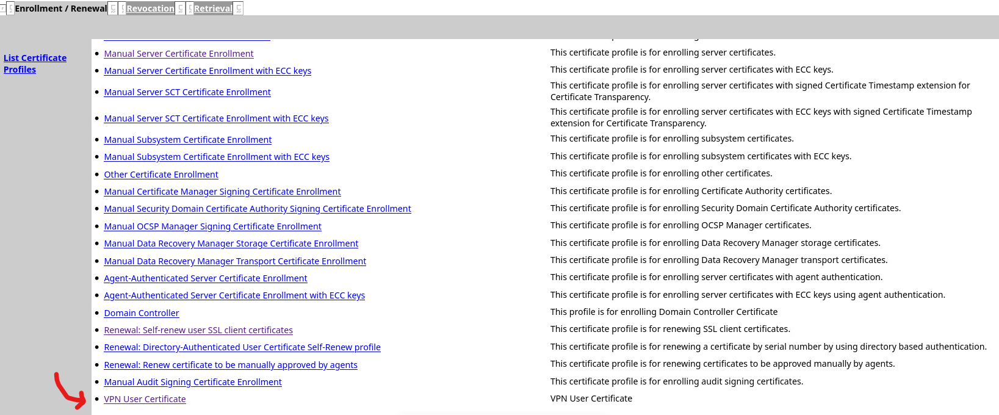

*Le profil VPN User Certificate publie parmi les profils d'enrolement de la CA Dogtag.*

L'utilisateur genere sa cle privee et sa CSR localement (la cle ne quitte pas son poste), soumet la CSR sur l'interface end-users de Dogtag depuis la machine d'administration ica01, et un agent PKI approuve la demande avant recuperation du certificat en base 64.

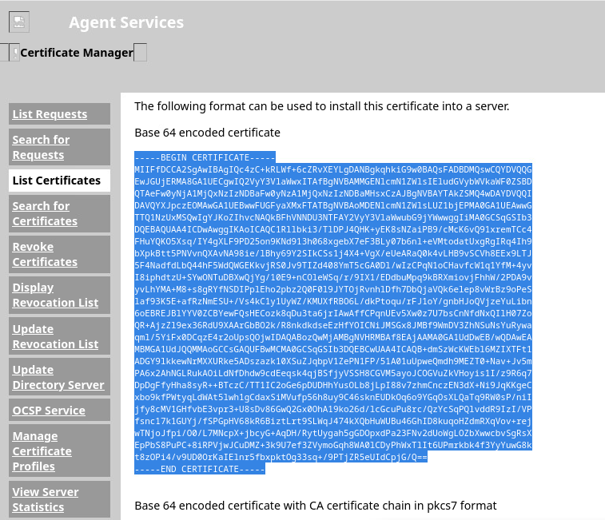

*Interface Agent Services de Dogtag : certificat client signe, exporte en base 64.*

### Cote client

Le client (Windows avec OpenVPN Connect, ou Linux avec le paquet openvpn) dispose de quatre fichiers : sa cle privee, son certificat signe, la chaine de la PKI (`ca.cert.pem`) et le profil de connexion [config/client.ovpn](config/client.ovpn). Extrait commente :

```text
remote vpn.cercueil.fun 46742   # point d'entree public (RTR_BORDER)
proto udp
dev tun
remote-cert-tls server          # refuse un serveur sans EKU serverAuth
auth-user-pass                  # credentials AD T2 demandes a la connexion
ca ca.cert.pem                  # chaine de confiance Dogtag
cert M45751.crt                 # certificat client (CN = login AD)
key M45751.key
```

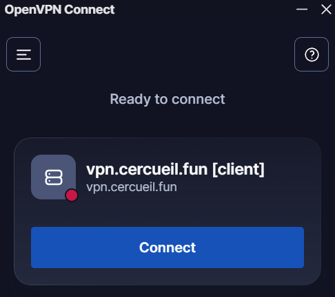

*Profil vpn.cercueil.fun importe dans OpenVPN Connect sous Windows.*

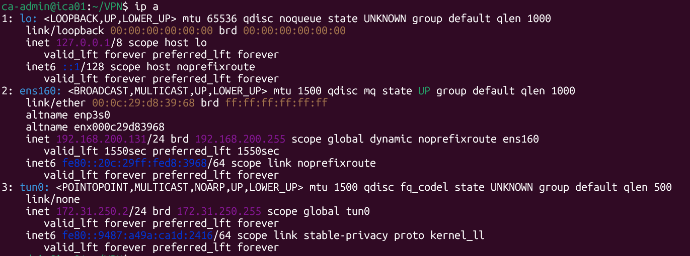

*Apres connexion, le client recoit 172.31.250.2/24 sur l'interface tun0.*

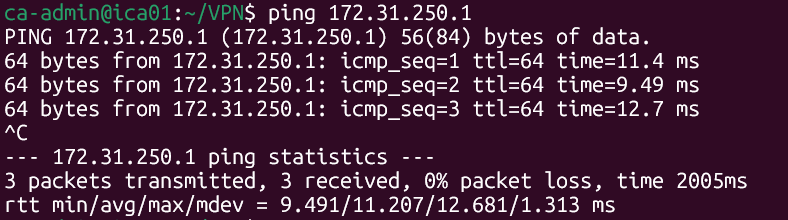

*Ping de l'extremite serveur du tunnel (172.31.250.1) depuis le client connecte.*

## Interactions avec les autres briques

- **Pare-feux** : le service est porte par FW_2 et publie par RTR_BORDER (NAT 46742) ; les regles de part et d'autre limitent le flux entrant a ce seul port.
- **PKI** : certificat serveur signe par la CA intermediaire, profil d'enrolement vpnUserCert pour les clients, chaine CA Root / CA Int importee dans OPNsense et distribuee aux clients.
- **Active Directory** : authentification LDAPS des utilisateurs (compte de service en lecture, conteneur T2, groupe vpn_users), d'abord sur DC01 puis sur le RODC.
- **DNS** : record A public vpn.cercueil.fun sur le DNS maitre ; resolveurs internes et domain override cercueil.local pour que FW_2 resolve le controleur de domaine.

## Etat et limites

- La regle de filtrage des clients connectes, nommee "TEMPORAIRE - OpenVPN --> any", autorise toute destination depuis le reseau tunnel ; le cloisonnement par profil d'utilisateur n'a pas ete realise.

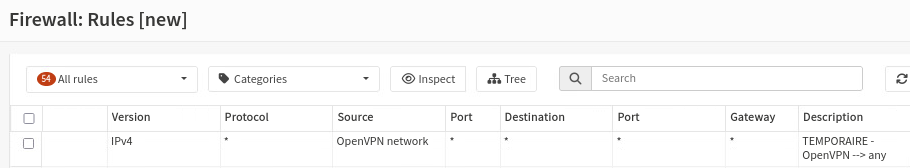

*Regle OPNsense laissee en l'etat : le reseau OpenVPN peut joindre toute destination.*

- La revocation n'est pas verifiee par l'instance OpenVPN (Certificate Revocation List a None, OCSP desactive) : un certificat compromis reste utilisable jusqu'a expiration (365 jours).
- L'enrolement des certificats clients est entierement manuel (transfert de CSR via un drive en ligne, approbation par un agent PKI).
- La connexion depuis WSL n'est pas possible (pas de creation d'interface TUN) ; l'usage d'une VM cliente est documente comme solution.
- La premiere machine d'administration de la CA intermediaire a ete remplacee par ica01 (10.0.30.19) ; les secrets associes releves dans la documentation interne ont ete retires du present depot ([REDACTED]).
