# Serveur Web et ERP (Odoo)

Cette brique regroupe le site vitrine public de l'entreprise cercueil.fun et le volet ERP (Odoo). Le site, de type CMS, presente le catalogue de cercueils et offre aux administrateurs une interface d'ajout et de suppression de produits. Referents : Adele et Nicolas.

## Role dans l'infrastructure

Le serveur web heberge l'ensemble de la pile applicative du site : frontend Vue.js compile servi par un Nginx local, API backend Node.js maintenue par PM2 et base MySQL. Il reside dans le VLAN des serveurs internes et n'est jamais expose directement : la publication vers Internet passe par le reverse proxy Nginx de la DMZ, qui porte le nom public cercueil.fun et la terminaison TLS.

| Machine | IP | VLAN | Role |
|---|---|---|---|
| Serveur web | 10.0.32.5 | 32 (serveurs internes) | Nginx local, frontend Vue.js, API Node.js, MySQL |
| Reverse proxy | 10.1.100.4 | 100 (DMZ) | Publication de cercueil.fun, terminaison TLS |

## Architecture et fonctionnement

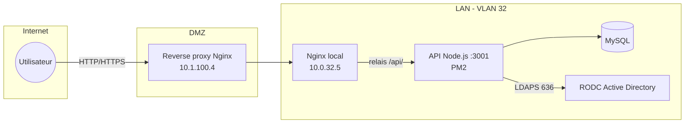

La requete d'un visiteur traverse le reverse proxy puis atteint le Nginx local du serveur web. Celui-ci sert directement les fichiers statiques du frontend (dossier `dist/` issu de la compilation Vue.js) et relaie les appels `/api/` vers le backend Node.js qui ecoute sur le port 3001 en local uniquement. Le backend interroge la base MySQL `cercueil_fun` pour le catalogue et authentifie les administrateurs contre le RODC Active Directory en LDAPS, avant d'emettre un jeton de session JWT signe.

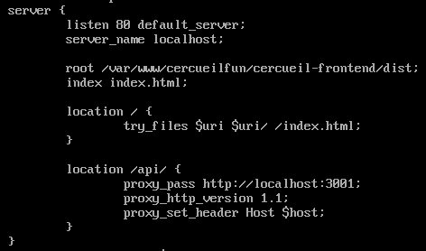

*Configuration Nginx du serveur web : service du frontend compile et relais des appels API vers le port 3001 local.*

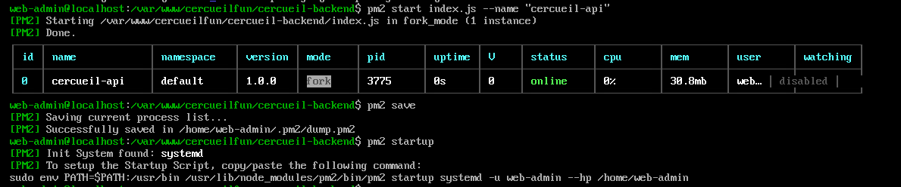

*Le backend est enregistre sous PM2 (processus cercueil-api), qui le supervise et le relance en cas d'arret.*

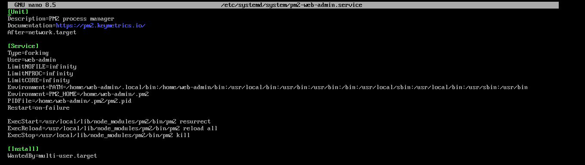

*Unite systemd qui restaure les processus PM2 au demarrage, sous le compte de service non privilegie web-admin.*

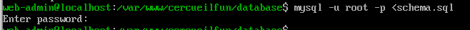

*Le schema de la base cercueil_fun est versionne dans un fichier schema.sql et importe dans MySQL.*

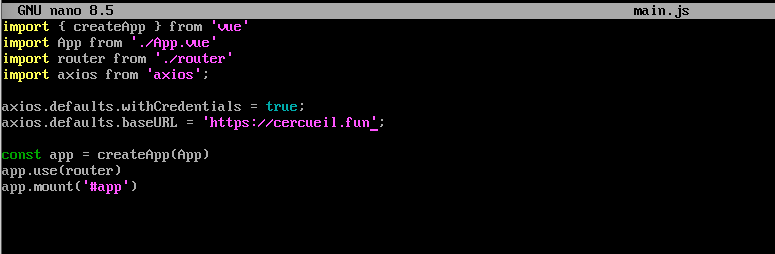

*En production, le frontend adresse l'API via le nom public https://cercueil.fun, et non via localhost, pour que les appels transitent par le reverse proxy.*

## Configuration notable

Les fichiers de configuration epures sont disponibles dans [`config/`](config/) :

- [`config/cercueil.conf`](config/cercueil.conf) : virtual host Nginx du serveur web (statique + relais API) ;
- [`config/backend.env`](config/backend.env) : variables d'environnement du backend (identifiants MySQL, URL LDAPS du RODC, secret JWT), secrets remplaces par `[REDACTED]` ;
- [`config/pm2-web-admin.service`](config/pm2-web-admin.service) : unite systemd de persistance des processus PM2.

Le secret de signature des JWT est genere aleatoirement (32 octets via `crypto.randomBytes`) et stocke uniquement dans le `.env` du backend. La resolution du RODC repose sur une entree dans `/etc/hosts` du serveur web, le controleur n'etant pas publie dans la zone DNS publique.

## Durcissement

SELinux reste en mode enforcing sur la machine. Le contexte `httpd_sys_content_t` est applique au seul dossier `dist/` du frontend, et non a l'arborescence `node_modules`, afin de limiter ce que Nginx peut lire ; le booleen `httpd_can_network_connect` autorise le relais vers le backend local.

```bash
# Contexte SELinux restreint au frontend compile
semanage fcontext -a -t httpd_sys_content_t "/var/www/cercueilfun/cercueil-frontend/dist(/.*)?"
restorecon -Rv /var/www/cercueilfun/cercueil-frontend/dist
# Autorise Nginx a ouvrir des connexions reseau (proxy_pass vers :3001)
setsebool -P httpd_can_network_connect 1
```

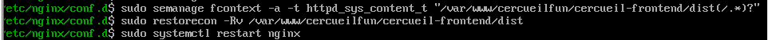

*Etiquetage SELinux du dossier dist servi par Nginx.*

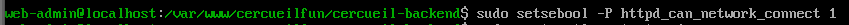

*Booleen SELinux autorisant Nginx a joindre le backend Node.js.*

Le pare-feu local (firewalld) ne laisse passer que les flux necessaires, en particulier ceux en provenance du reverse proxy. Les en-tetes de securite HTTP du site publie ont ete controles via securityheaders.com.

## ERP Odoo : analyse de l'image Docker

L'ERP repose sur l'image Docker officielle `odoo:18` (base Ubuntu 24.04). Avant deploiement, l'image a ete analysee avec Trivy (analyse de composition logicielle, SCA) execute lui-meme en conteneur (`aquasec/trivy image odoo:18`).

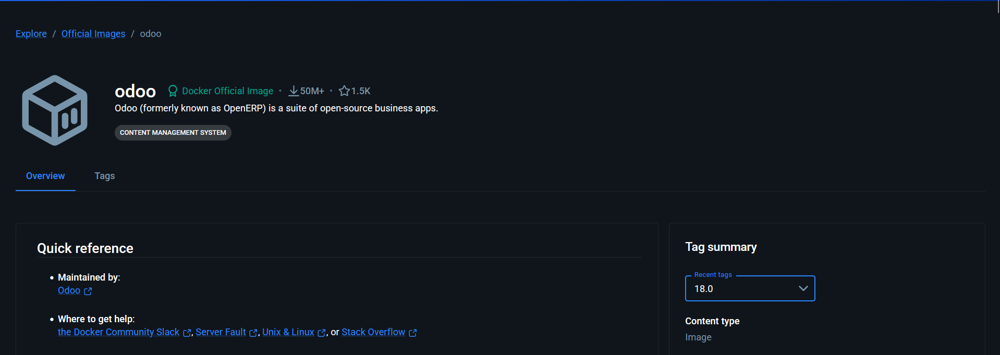

*L'image retenue est l'image officielle Odoo publiee sur Docker Hub (tag 18.0).*

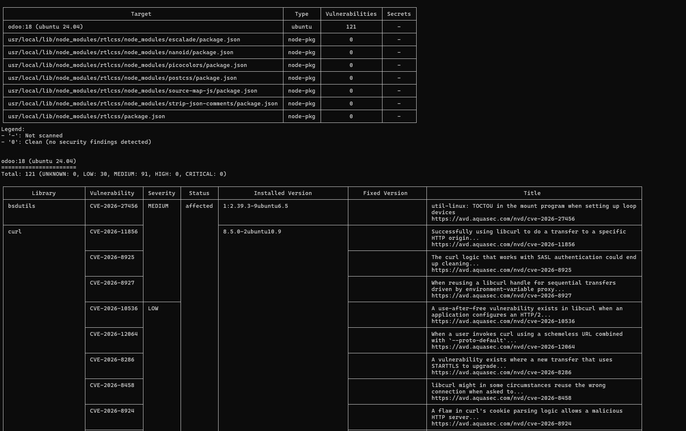

*Resultat global du scan : 121 vulnerabilites (91 Medium, 30 Low), aucune High ni Critical ; les modules Node embarques sont sains.*

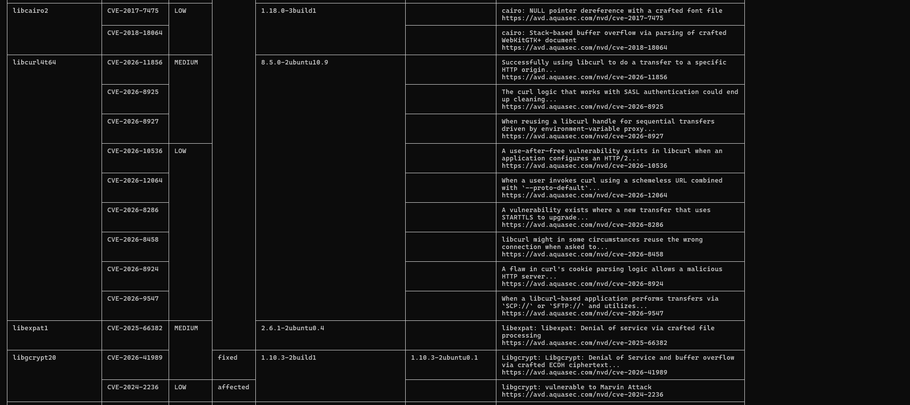

*Detail des CVE : elles concernent les paquets systeme de la base Ubuntu (curl, libcairo, libexpat, libgcrypt...), la plupart sans correctif disponible au moment du scan.*

L'absence de vulnerabilite High ou Critical a valide l'utilisation de l'image officielle telle quelle, les findings residuels relevant de la distribution de base et non d'Odoo.

## Interactions avec les autres briques

- **Reverse proxy (10.1.100.4, VLAN 100)** : seul point de publication du site ; il porte le certificat TLS de cercueil.fun et relaie vers 10.0.32.5.
- **Pare-feux** : les regles inter-VLAN n'autorisent vers le serveur web que le flux issu du reverse proxy ; sans cette regle, le site n'est pas joignable depuis la DMZ.
- **Active Directory** : l'espace admin du CMS s'authentifie en LDAPS (port 636) aupres du RODC `rodc01.cercueil.local`, ce qui evite un lien direct avec les controleurs de domaine principaux.
- **DNS** : la zone publique cercueil.fun pointe vers le reverse proxy ; le RODC est resolu localement via `/etc/hosts`.
- **PKI** : le chiffrement TLS cote client est assure par le certificat porte par le reverse proxy ; le lien LDAPS s'appuie sur le certificat du RODC.

## Etat et limites

- Le site vitrine est fonctionnel derriere le reverse proxy, avec supervision PM2 et persistance systemd.
- Le flux reverse proxy vers serveur web reste en HTTP interne (port 80), la terminaison TLS etant assuree en DMZ ; le backend n'ecoute qu'en local.
- Le scan Trivy d'Odoo est une analyse ponctuelle de l'image ; les vulnerabilites Medium et Low identifiees dependent des mises a jour de la base Ubuntu de l'image officielle.
- La brique Odoo est documentee principalement sous l'angle de la validation de son image ; sa configuration applicative n'est pas detaillee dans les sources.
